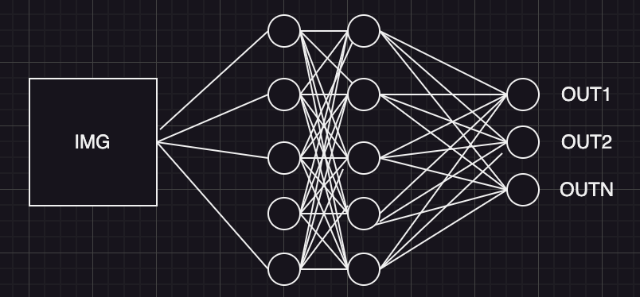

The content is also available as [video](https://youtu.be/aHCFjFs_sec)  

## Cross Entropy, or Log Loss
In the last post, we've talked about training a simple neural network to classify digits in a dataset. We used `crossentropy` as our loss function.  
I've been a machine learning engineer for almost 10 years now, and I can say that for most of industrial applications, you don't really need to understand the logic behind this loss, and can simply google the final formula or use an existing implementation. In addition, there aren't many losses out there, and most ML engineers are able to make a simple connection. Do we need to predict a floating point number? Use MSE. Do we need to predict probabilities? Use CrossEntropy.

However, there is an easy-to-understand fundamental explanation behind this loss, which makes understanding and remembering it much simpler. In addition, you might get asked about this in an interview (I was!).
### Likelihood
Likelihood is the concept from probability theory.  
Let's say we have 5 balls, some of them white, some of them black:  

  
Let's say they are all "equal", generated by some generator that outputs a black ball with probability *p* and a white one with probability 1 - p.  
In such a case, what is the probability of getting the result we see, i.e., white-black-white-black-black?
Probability of the first ball being white is $(1 - p)$. Probability of the second ball being black is $p$. Probability of the first ball being white AND the second one being black is $p * (1 - p)$ - probability of the union of events is the multiplication of probabilities. Full probability of w-b-w-b-b is $(1 - p) * p * (1 - p) * p * p$, or $p^3 * (1-p)^2$. This probability is called `likelihood`.  

We can solve reverse problem as well. Let's say that we don't know *p*. We see w-b-w-b-b, and we need to guess *p* - what was the `generator` behind the picture that we see? Of course, we cannot know that `exactly`. But we can take our best guess - find a generator for which the `likelihood` of the picture that we see is maximal. We can do it analytically for the probability formula that we got above:  
$$p^3 * (1-p)^2 -> MAX$$
Taking the derivation of p and equating that to zero, we get:  
$$3p^2(1-p)^2 - 2p^3(1-p) = 0$$
$$3p^2(1-p)^2 = 2p^3(1-p)$$
$$3(1-p) = 2p$$
$$3 - 3p = 2p$$
$$5p = 3$$
$$p = 3/5$$  
$$p = 0.6$$  
So, *most likely* the generator behind the picture used the probability of 60%, which we can simply get by dividing the number of black balls on the total number of balls, of course :)  

### Log Likelihood
So, likelihood can be used as a measure of adequacy of predicted probabilities. Maximisation of likelihood should lead to better probability estimates. This is actually really important - it allows us to use a continuous function (likelihood) to assess the quality of something descrete (a ball being either black or white).  

However, we still can't use it as a loss function, because likelihood itself is not *additive*. If we have an example E1 with likelihood L1 in our training dataset, and example E2 with likelihood L2, total likelihood of both examples is L1 * L2, because likelihood, like probabilities, is multiplicative. We can turn it into *additive* loss just by putting *log* in front of it:  
$$log(likelihood(E1)) + log(likelihood(L2)) = log(likelihood(L1\,and\,L2))$$
Since logarithm is monotonous, max of this function will correspond to the max of the likelihood itself.  
However, sicne optimisation methods *minimise* the loss, we also need to put "minus" in front of it.
### Log Likelihood in neural nertworks
For binary classification, the network outputs just one number. In our case of multilabel classification, the network outputs N numbers - 1 for each class. In either case, network output lies in an arbitrary range $-Inf; +Inf$  
  
We then apply an activation function to turn those arbitrary numbers into probabilities - something in the range [0, 1]. For binary classification, we use sigmoid activation function:
  
$$sig(t) = \frac{1}{1 + e^{-t}}$$
Here, $t$ is a single output of the network.  
Sigmoid activation turns an arbitrary number in $(-Inf; +Inf)$ range into something that can be interpreted as probability - a number in $(0; 1)$ range. I don't have a simple explanation for its origins or why it looks the way it is. It is used in a lot of places in machine learning because of several important properties:  
- it is monotonous
- it is continuous
- it is differentiable in every point
- it is symmetric relative to [0; 0.5] point  

For multilabel classification, we use softmax activation, which is just multi-label generalization of logloss:
$$softmax(\overrightarrow{t})_i = \frac{e^{t_i}}{\sum{e^{t_j}}}$$
Here, $\overrightarrow{t}$ is the vector of network outputs.   
Softmax turns an arbitrary vector into a vector of numbers in $[0, 1]$ range that also sum to exactly 1.
### Taking another look at cross entropy during MNIST training
In the last post, we were training a simple dense neural network on MNIST digits classification dataset. Since we now know a bit more about CrossEntropy loss, let's take another look at how it was calculated. Before the model was trained, we saw this as the model predictions:
```python
pred = model(x)
print(pred, pred.shape)
```
```
tensor([[ 0.0297, -0.0440, -0.0442,  0.0194,  0.0293,  0.0036, -0.0047,  0.0073,
          0.0407, -0.0544]], device='mps:0', grad_fn=<LinearBackward0>) torch.Size([1, 10])
```
And the loss looked like this:
```python
loss_fn(model(x), y[:1].to(device))
```
```
tensor(2.2604, device='mps:0', grad_fn=<NllLossBackward0>)
```
Where is this 2.26 coming from?
[torch.nn.CrossEntropyLoss](https://pytorch.org/docs/stable/generated/torch.nn.CrossEntropyLoss.html) is the combination of SoftMax + Log Likelihood Loss we discussed above. Let's see how the SoftMax from our predictions look like:
```python
nn.Softmax(dim=1)(pred)
```
```
tensor([[0.1031, 0.0958, 0.0958, 0.1021, 0.1031, 0.1005, 0.0996, 0.1009, 0.1043,
         0.0948]], device='mps:0', grad_fn=<SoftmaxBackward0>)
```
Our model predictions (sometimes called "logits") were all pretty similar and close to zero. After SoftMax, we get roughly 10% probability for each of 10 classes - which correspond to random predictions. The `predicted class` of the model is the one with maximum probability, in our case, "8". But to get the loss, we need to look at the probability of the `true class` - "7":
```python
from math import log
-log(0.1009)
```
```
2.2936
```
After some training, the model becomes more confident with its predictions:
```python
preds = model(X[0].to(device))
preds
```
```
tensor([[ 0.7090, -5.7430,  2.7101,  4.5032, -4.2269,  0.7165, -9.6999, 10.0532,
         -0.4749,  2.4612]], device='mps:0', grad_fn=<LinearBackward0>)
```
```python
nn.Softmax(dim=1)(preds[:1])
```
```
tensor([[    0.0001,     0.0000,     0.0006,     0.0039,     0.0000,     0.0001,
             0.0000,     0.9948,     0.0000,     0.0005]], device='mps:0',
       grad_fn=<SoftmaxBackward0>)
```
The probability of "7" is now 99.5%, with probabilities of other classes being close to zero.
```python
loss_fn(model(X[0].to(device)), y[:1].to(device))
```
```
tensor(0.0053, device='mps:0', grad_fn=<NllLossBackward0>)
```
And the loss is close to zero as well!