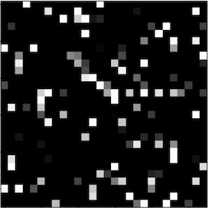
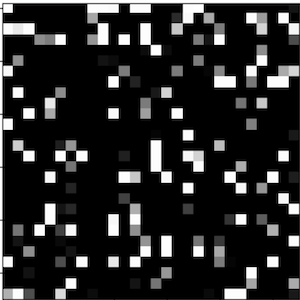
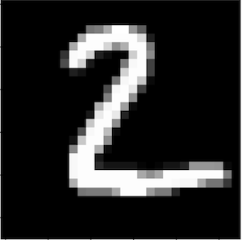
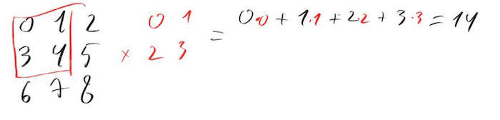
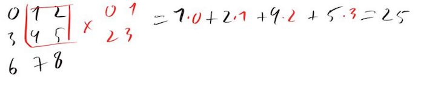
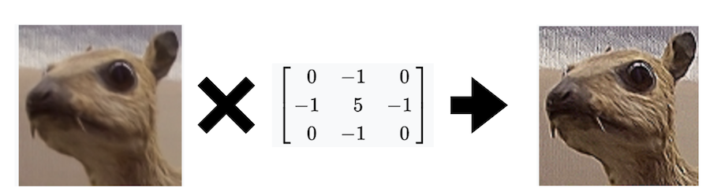
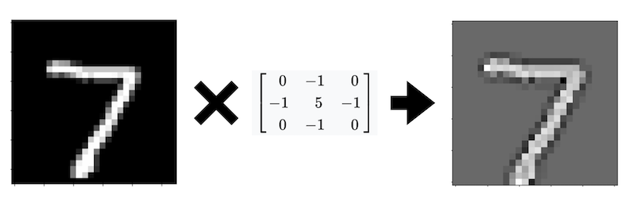
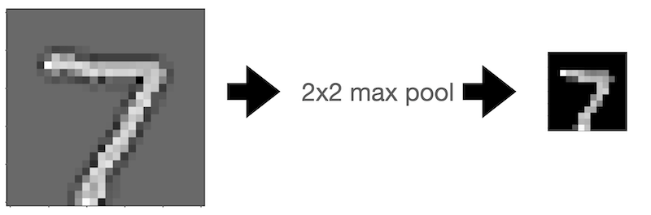

The content is also available as [video](https://youtu.be/78JYJ6qpk_A)  

In the last video, we've trained a simple dense neural network to classify hand-written digits on MNIST dataset. We've got a marginally decent accuracy of 94.2%. How can we improve it? And what if we wanted to scale it up, from low-res 28 * 28 black-and-white images of just digits, to HD images with a wide selection of objects?  
Our current approach has the following problems:  
- Problem 1: parameter matrix size  

To *project* an image of size 28 * 28 that we've flattened into a single vector with length 784 into inner representation vector of size 512, we need a matrix with 512 * 784 = 401408 parameters ~ 400k parameters. This is already bad, since MNIST only has 60k examples - ideally, number of parameters needs to be smaller than the number of training examples. If we were to train on higher resolution images, 1024 * 768, for example, we will need 1024 * 768 * 512 = 402653184 ~ 400m parameters. And we don't have nearly enough data to train so many parameters efficiently
- Problem 2: we completely ignore information from 2d representation of the image  

We flatten the input before passing it into the network. The concept of the digit "7" is much easier represented in 2d - one horizontal line and one diagonal line - than in 1d, with a random set of pixels firing up. It will certainly be very hard for humans to recognize the digit "7" in such a flattened form.
- Problem 3: we don't use information about pixel proximity  

Humans are mainly capable of recognizing patterns of closely connected parts. It's hard to differentiate one scatter cloud of dust from another, for example. Yet, in our network, we don't use any pixel proximity information - we basically pass an independent set of pixels in. Try distinguishing these pictures:  


  
These were number 7 and number 2, with pixels reshuffled in a random, but consistent way. It's quite hard to imagine that you can at least *learn* how to recognize these, right?  


  

- Problem 4: Spatial awareness  

If we have a network that can recognize a digit "7" from a specific image, shifting the image by just 1 pixel will result in the activation of completely different parameters. Every parameter is responsible for just 1 pixel! This is why we need so many of them. Again, this is not how humans recognize images. Due to how our eyes "slide over" the image, we can recognize a pattern, like number 7, no matter where within the image it is located. We should expect that a succesful pattern recognition system will have the same property.
## Convolutions
Convolutions solve all 3 of these.  
Convolutions are defined like this [(wiki)](https://en.wikipedia.org/wiki/Kernel_(image_processing)):
$$g(x, y) = w * f(x, y) = \sum_{i=-a}^{a} \sum_{j=-b}^{b}w(i, j)f(x-i, y-j)$$

Here, f is the original image - an $a * b$ matrix; w is the so called "kernel matrix" that parametrizes the convolution.  
Let's demonstrate by taking a simple 3x3 matrix/image:
$$\begin{bmatrix}
0 & 1 & 2\\ 
3 & 4 & 5\\ 
6 & 7 & 8
\end{bmatrix}$$
And applying this 2x2 convolution to it:
$$\begin{bmatrix}
0 & 1\\ 
2 & 3
\end{bmatrix}$$
First, we "place" the kernel matrix in the upper left corner of the image, and multiply corresponding numbers - top left on the image with top left of the kernel, top middle of the image with the top right of the kernel and so on:  



We get 
$0 * 0 + 1 * 1 + 2 * 2 + 3 * 3 = 14$  
Next, we "shift" the kernel 1 pixel to the right:  
  

We get  
$$1 * 0 + 2 * 1 + 4 * 2 + 5 * 3 = 25$$  
We continue "sliding" the kernel along the image. Bottom left will yield:  
$$3*0 + 4*1 + 6*2 + 7*3 = 37$$  
And bottom right:  
$$4*0 + 5 * 1 + 7 * 2 + 8*3 = 43$$  
And final result:  
$$\begin{bmatrix}
14 & 25\\ 
37 & 43
\end{bmatrix}$$
Note that this is not *matrix multiplication*. The actual formula is completely different.  

Convolutions were a thing way before neural networks, and they were used to apply various "effects" to the image: blur, sharpen, edge detection and so on. Here is the example of sharpening:  
  

And here are some links that show more examples and interactive demos:  
- https://setosa.io/ev/image-kernels/  
- https://www.math.utah.edu/~gustafso/s2017/2270/projects-2017/asherSorensen/AsherSorensenLinear.pdf  
- https://homepages.inf.ed.ac.uk/rbf/HIPR2/sobel.htm  
- https://www.websupergoo.com/helpie/default.htm?page=source%2F2-effects%2Fconvolution.htm  
### Convolutions and dimensionality
In our first example, with 3x3 input image and 2x2 kernel, we got a 2x2 result. More generally, applying a $W*H$ kernel as convolution reduces image size by (W-1, H-1). For example, applying a 7x7 kernel to a 640*480 image will yield 634 * 474 image. In addition to these, there are some convolution parameters that let us control it further:  
- Stride: instead of sliding the kernel along the input by shifting by 1 pixel on each step, we can shift the kernel by *stride* pixels at once. This will reduce the output size roughly in *stride* times.
- Padding: we can pad initial image with zeroes. This technique is mostly used to preserve original image size after applying a convolution  

Final formula: $outputSize = \frac{inputSize - kernelSize +2*padding}{stride} + 1$
### Pooling
Pooling works similarly to convolutions, but instead of elementwise multiplication by a kernel matrix, we simply perform a reduction operation, like "max". Let's demonstrate by applying max 2x2 pooling to the following image:  
$$\begin{bmatrix}
0 & 1 & 2\\ 
3 & 4 & 5\\ 
6 & 7 & 8
\end{bmatrix}$$
$$output00 = max(0, 1, 3, 4) = 4$$
$$output10 = max(1, 2, 4, 5) = 5$$
$$output01 = max(3, 4, 6, 7) = 7$$
$$output11 = max(4, 5, 7, 8) = 8$$
So in the result, we get:
$$\begin{bmatrix}
4 & 5\\ 
7 & 8
\end{bmatrix}$$
Pooling operations can also be parametrized with stride and padding, just like convolutions.  

Here is the example of applying an edge detecting kernel, followed by 2x2 max pooling:  

  

  

This allowed us to reduce image size from $28*28$ to $13*13$ without much loss of understandability.

## Convolutions in neural networks
In neural networks, instead of trying to preprocess images using predefined convolutions (like edge detection o sharpen), we define convolutions with random, trainable parameters, and let the network figure it out for itself. We start with input image, apply a set of such convolutions intermixed with pooling operations with dimensionality reduction; then, we apply a bunch of dense layers to do our actual classification task.  

Note that the problems that we've discussed in the beginning are solved with convolutions:  
- Problem 1: parameter matrix size  

We use the same kernel (typically rather small, 3x3 or 7x7) to process an entire image, so the number of parameters is much smaller
- Problems 2 and 3: 2d information and pixel proximity  

Convolutions completely rely on pixel proximity in 2d space. 

- Problem 4: spatial awareness  

Convolution kernel "sliding" along the image is pretty similar to human eyes sliding along the image. We should expect similar properties from such a network.

## MNIST digits classification with convolutions
Dataset fetching and device setup is the same as for dense neural network from previous [post](https://github.com/adensur/blog/tree/main/computer_vision_zero_to_hero/01_simple_classification).  
Here is the model architecture:
```python
import torch.nn.functional as F
# Define model
class NeuralNetwork(nn.Module):
    def __init__(self):
        super().__init__()
        self.conv1 = nn.Conv2d(in_channels=1, out_channels=6, kernel_size=5, stride=1)
        self.pool = nn.MaxPool2d(kernel_size=2, stride=2)
        self.conv2 = nn.Conv2d(in_channels=6, out_channels=16, kernel_size=5, stride=1)
        # input: 28 * 28
        # after first conv with kernel size 5: 24 * 24
        # after first pool: 12 * 12
        # after second conv with kernel size 5: 8 * 8
        # after second pool: 4 * 4
        self.fc1 = nn.Linear(16 * 4 * 4, 120)
        self.fc2 = nn.Linear(120, 84)
        self.fc3 = nn.Linear(84, 10)

    def forward(self, x):
        x = self.pool(F.relu(self.conv1(x)))
        x = self.pool(F.relu(self.conv2(x)))
        x = torch.flatten(x, 1) # flatten all dimensions except batch
        x = F.relu(self.fc1(x))
        x = F.relu(self.fc2(x))
        x = self.fc3(x)
        return x


model = NeuralNetwork().to(device)
print(model)
X = X.to(device)
x = X[0].to(device)
model(X)
```
`nn.Conv2d` defines a *convolution layer* - kernel matrix with weights and biases, and an operation to apply this kernel as a convolution.   
`in_channels` give us a way to pass an extra dimension as the input. For the first convolution, this just corresponds to colour; later layers use previous convolutions `out_channels` as the corresponding `in_channels`. With 3 input (colour) channels, to apply a convolution, we need to initialize 3 independant kernel matrices, and then *sum* the result.
`out_channels` can be viewed as a way to stack several convolutions together. Having `out_channels=6` is the same as applying 6 independent convolutions to the same input image. Another way of looking of this is as literal channels for information - the more channels the network has, the more information it can pass between layers; but for that, we also need 6 times more parameters.  

Let's print out the number of parameters in each the model:
```python
import numpy as np
total_params = 0
for params in model.parameters():
    current_layer_size = np.prod(params.shape)
    print("Current layer size: ", current_layer_size)
    total_params += current_layer_size
total_params
```
```
Current layer size:  150
Current layer size:  6
Current layer size:  2400
Current layer size:  16
Current layer size:  30720
Current layer size:  120
Current layer size:  10080
Current layer size:  84
Current layer size:  840
Current layer size:  10
44426
```
First convolution kernel has 150 paramters (+6 biases): 1 input channel, 5x5 kernel, and 6 outputs channels: $1 * 5 * 5 * 6 = 150$.  

Second convolution kernel has 2400 parameters: $6 * 5 * 5 * 16 = 2400$.  

First dense layer is the biggest in the network in terms of parameters count; the input image by now is only 4x4 pixels, but each pixel now has 16 channels. Total size results in $4 * 4 * 16 * 120 = 30720$.  

Total network size is 44k - compare that with 670k for our previous, dense network, with 400k parameters being on the first layer!  

We use the same loss and train/test functions. Training for first 5 epochs:
```python
import time
start = time.time()
epochs = 5
test(test_dataloader, model, loss_fn)
for t in range(epochs):
    print(f"Epoch {t+1}\n-------------------------------")
    train(train_dataloader, model, loss_fn, optimizer)
    test(test_dataloader, model, loss_fn)
print("Done in ", time.time() - start, " seconds")
```
```
Test Error: 
 Accuracy: 9.1%, Avg loss: 2.305011 

Epoch 1
-------------------------------
loss: 2.303705  [   64/60000]
loss: 2.311559  [ 6464/60000]
loss: 2.305902  [12864/60000]
loss: 2.299397  [19264/60000]
loss: 2.290324  [25664/60000]
loss: 2.305754  [32064/60000]
loss: 2.310317  [38464/60000]
loss: 2.308900  [44864/60000]
loss: 2.301286  [51264/60000]
loss: 2.296918  [57664/60000]
Test Error: 
 Accuracy: 13.5%, Avg loss: 2.300978 

Epoch 2
-------------------------------
loss: 2.299212  [   64/60000]
loss: 2.306777  [ 6464/60000]
loss: 2.302367  [12864/60000]
loss: 2.295259  [19264/60000]
loss: 2.288781  [25664/60000]
loss: 2.302387  [32064/60000]
loss: 2.305556  [38464/60000]
loss: 2.305829  [44864/60000]
loss: 2.297535  [51264/60000]
loss: 2.293281  [57664/60000]
Test Error: 
 Accuracy: 15.5%, Avg loss: 2.296882 

Epoch 3
-------------------------------
loss: 2.294836  [   64/60000]
loss: 2.301764  [ 6464/60000]
loss: 2.298210  [12864/60000]
loss: 2.291070  [19264/60000]
loss: 2.285635  [25664/60000]
loss: 2.298275  [32064/60000]
loss: 2.300344  [38464/60000]
loss: 2.301706  [44864/60000]
loss: 2.292941  [51264/60000]
loss: 2.289218  [57664/60000]
Test Error: 
 Accuracy: 17.2%, Avg loss: 2.291994 

Epoch 4
-------------------------------
loss: 2.289567  [   64/60000]
loss: 2.296031  [ 6464/60000]
loss: 2.293120  [12864/60000]
loss: 2.285848  [19264/60000]
loss: 2.280973  [25664/60000]
loss: 2.292863  [32064/60000]
loss: 2.294056  [38464/60000]
loss: 2.296172  [44864/60000]
loss: 2.286303  [51264/60000]
loss: 2.283457  [57664/60000]
Test Error: 
 Accuracy: 22.9%, Avg loss: 2.284943 

Epoch 5
-------------------------------
loss: 2.282317  [   64/60000]
loss: 2.288400  [ 6464/60000]
loss: 2.285686  [12864/60000]
loss: 2.277971  [19264/60000]
loss: 2.272663  [25664/60000]
loss: 2.284197  [32064/60000]
loss: 2.285191  [38464/60000]
loss: 2.287791  [44864/60000]
loss: 2.275401  [51264/60000]
loss: 2.274047  [57664/60000]
Test Error: 
 Accuracy: 30.1%, Avg loss: 2.273697 
```
And another 95:
```
Epoch 95
-------------------------------
loss: 0.031940  [   64/60000]
loss: 0.112048  [ 6464/60000]
loss: 0.086053  [12864/60000]
loss: 0.108770  [19264/60000]
loss: 0.016465  [25664/60000]
loss: 0.037474  [32064/60000]
loss: 0.095925  [38464/60000]
loss: 0.138252  [44864/60000]
loss: 0.183775  [51264/60000]
loss: 0.139375  [57664/60000]
Test Error: 
 Accuracy: 97.8%, Avg loss: 0.070034 
```
Dense network had 82.5% accuracy after 5 epochs, and 94.2% accuracy after another 5 epochs. Convolution-based network has 30.1% accuracy after first 5 epochs, but then 97.8% after another 95 - so it takes a bit longer to start up, but then achieves much better accuracy. At this point it is still undertrained though.  

Full code is available [here](convolutions.ipynb)