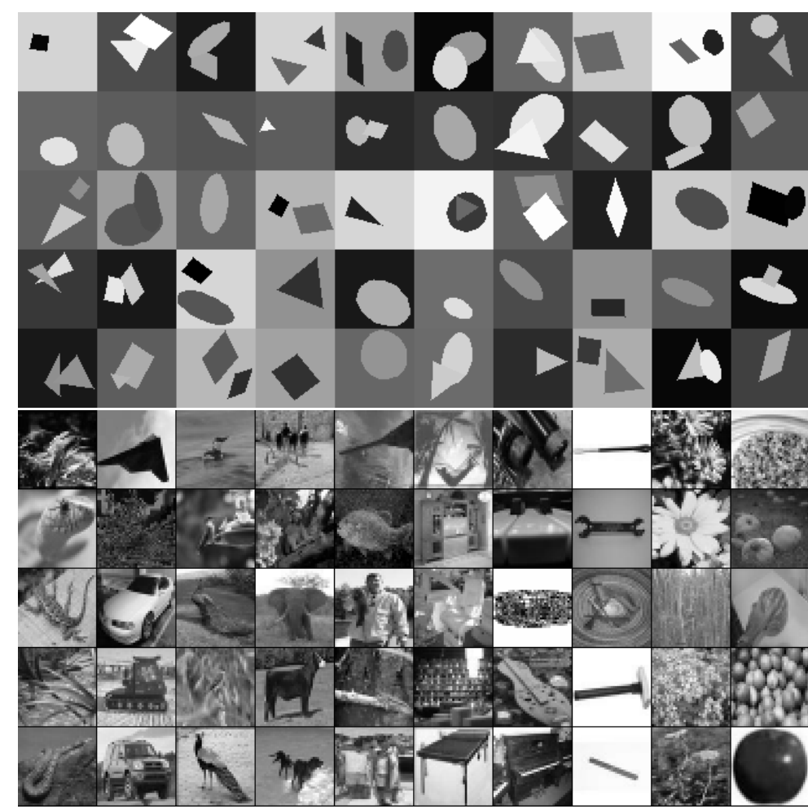
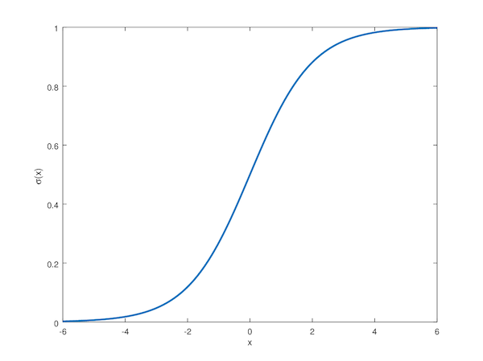
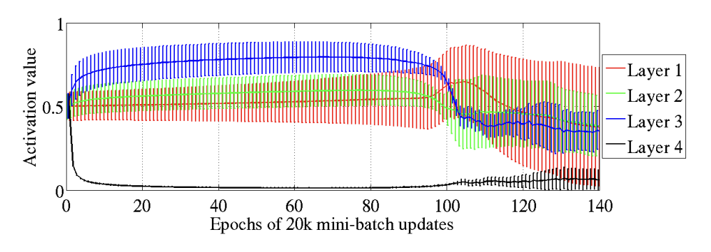
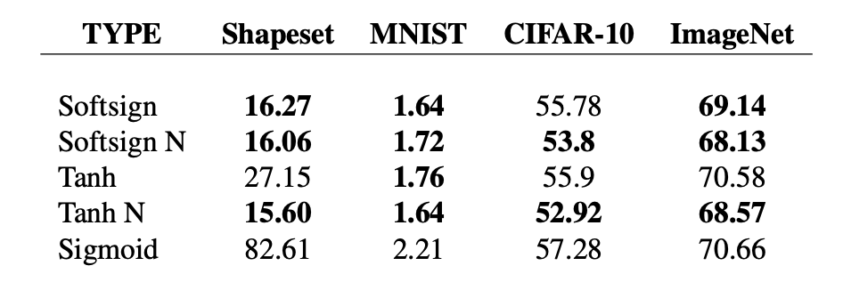

Original paper: https://proceedings.mlr.press/v9/glorot10a/glorot10a.pdf
Authored by Xavier Glorot and Yoshua Bengio back in 2010. We know Xavier Glorot from Glorot initialisation (sometimes called Xavier initialisation) that is now an industry standard.
### Dataset and research setup
  

For the experiments, the authors chose a bunch of well-known labeled image recognition datasets:
- MNIST: low-res handwritten digits
- CIFAR: low-res images from 10 classes: dog, car, frog etc
- images from ImageNet - large (1m) collection of images of a broad (~1000) set of classes, small subset of which were selected and converted to low resolution  

In addition, there is a synthetic dataset - generated images of simple shapes (triangle, cirlce, rectangle), rotated and sometimes overlapping. This is an infinite dataset of decent complexity.
### Activation functions
First of all, why do we need activation functions at all?
The answer is simple. Without activation functions, neural networks will only be able to approximate *linear function*.
Consider a neural network with input features $x_i$ and one layer, producting vector output $layerOutput^0_i$. A dense layer is basically multiplication of input vector with parameter matrix:  
$$firstLayerOutput_i = \sum a_{ij}x_j$$
Or, in a more simple form:
$$firstLayerOutput_0 = a_{00} * x_0 + a_{01}x_1 + ...$$
$$firstLayerOutput_1 = a_{10} * x_0 + a_{11}x_1 + ...$$
$$...$$
If we add one more layer, its output can be represented through $layerOutput$:
$$secondLayerOutput_0 = b_{00} * firstLayerOutput_0 + b_{01}firstLayerOutput_1 + ...$$
Or, if we insert known values for $layerOutput^0$ coordinates:
$$secondLayerOutput_0 = b_{00} * (a_{00} * x_0 + a_{01}x_1 + ...) + b_{01}(a_{10} * x_0 + a_{11}x_1 + ...) + ...$$
We can move $x_00$, $x_1$ etc outside of the parenthesis:
$$secondLayerOutput_0 = x_0 * (b_{00} * a_{00} + b_{01} * a{10} + ...) + x_1(...) + ...$$
We can add more and more layers. But the output will still look like $x_0 * (...)$. The complexity of the expression inside the parenthesis will grow, but that only depends on the parameters of the network, not on the input $x$ itself. So, such a network will never be able to approximate the dependency that looks like $x^2$, for example, or $sin(x)$.   
Activation functions come to the rescue! It was mathematically proven that with a non-linear activation function and a network with at least 2 layers, the network can approximate *any dependency*. Provided it is big enough and you can efficiently optimise the parameters, that is :)
### Sigmoid activation function and the study of gradient flow
Here is the sigmoid activation function:  
  

Main problem with it is that it is not *symmetrical* around 0. In fact, the output is always greater than zero. This might lead to a problem called *saturation*. Here is the picture that demonstrates it:  
   
If we look at the last layer activations (black line), it goes down to 0 in the beginning of the training, and slowly recovers.  
This happens because the network starts in a random state, at which point initial layers, responsible for proper representation of the image, are not very effective. The output of the network is the function of this representation plus bias; since representation is useless, the network tries to "zero it out", and rely exclusively on bias for prediction (i.e, initial prier for class probabilities).  

As the output of the sigmoid approaches zero, so does its gradient (the long asymptotic tail to the left), which, in turn, stifles the gradient flow backwards from the last layer, thus preventing first layers from training proper representation. Thats a vicious circle that could be avoided in the first place by using a different activation function. Final results for loss confirm that on all the datasets:  
  
Performance of the network with sigmoid activation is absolutely the worst.
### Parameter initialisation
Another interesting discovery is how the gradient flow can be stifled with improper initialisation. I won't repeat the math from the paper here, and will present an intuitive, dumped down version of it instead.  
The network can be represented as a series of operations:   
   

Where an operation is either a dense layer (multiplication by a set of parameters), an activation function, or a final loss function. The actual gradients will be computed from the loss function.  
It can be represented as a series of nested functions:  
$$f5(w5, f4(w4, f3(w3, f2(w2, f1(w1, x)))))$$  

Where $f1(w1, x)$ corresponds to operation1, and depends on input $x$ and a set of parameters $w1$, and so on. $f5$ is actually the loss and it doesn't have any parameters to speak of, but it depends on the actual target. We don't change the target though, so we can just omit it in the formula. So lets write it as:  
$$loss(f4(w4, f3(w3, f2(w2, f1(w1, x)))))$$

To optimise the parameters of the network, we need to compute the gradients. I'll repeat the explanation of how that is done, which set the foundation of the backprop algorithm.   

When computing gradients (aka, partial derivatives) with respect to these parameters, we basically use the "derivation of compount" rule from calculus. To compute the derivative from $f(g(x))$, we use:
$$f(g(x))' = f'(g(x)) * g'(x)$$   
Partial derivatives for the last function, $f4$, are the easiest, because it is directly adjacent to the loss:
$$\frac{\partial loss}{\partial w_4} = loss'(f_4(x)) * \frac{\partial f_4}{\partial w_4}$$
Here, $loss'(f4(x))$ is the value of the derivative of loss, computed for the value $f_4(x)$. During optimisation, we would first compute the output of the network (forward prop), so we will already know this value. And, for a dense layer, $\frac{\partial f_4}{\partial w_4}$ is just the value of the $x$ - input for this layer.  

For $w_3$:  
$$\frac{\partial loss}{\partial w_3} = loss'(f_4(x)) * f_4'(f_3(x)) * \frac{\partial f_3}{\partial w_3}$$  
And so on.  
Basically, as we go backwards, the value of the gradient is a multiplication of all the gradients that we had along the way.  

Now lets look at the variances. If the variance of every parameter is $Var$, the variance of the first layer is going to be $n_1*Var$ - variance is additive. Here, $n_1$ is the size of the input of the first layer. For k'th layer, the variance is $n_1 * Var_1 * n_2 * Var_2 * n_3 * Var_3 * ... * n_k * Var_k$.  

This is precisely why we wanted to have $Var = \frac{1}{n}$, or $standardDeviation = \frac{1}{\sqrt n}$. That way, every member in this multiplication is precisely 1, and the entire product is also 1. Otherwise, if we have a network with 1000 layers, and every member is $0.99$, the product ends up being $0.000001$; and if every member is $1.01$, the product ends up being $20000$! This is why we need to keep this thing under control.  

However, if we now look at the variance od the gradients, the result is slightly different. For the last layer (provided we have $k$ layers):  
$$Var(grad_k) = n_{k+1} * Var_k$$
$$Var(grad_{k-1}) = n_{k+1} * n_k * Var_{k-1}$$  
And so on. Here, $n_{k + 1}$ is the size of the output of the last layer. We get a similar product of members, but now starting from the end. To get the same condition for every member being $1$, we would need to have $Var_i = \frac{1}{n_{i+1}}$ - which conflicts with the condition for the forward pass! Unless, of course, all layers are of equal size.  

As a compromise between two conditions, Xavier proposes $Var_i = \frac{2}{n_i + n_{i+1}}$. This is what is called Xavier initialization. Without it, with the default square-root initialization we've discussed before, the variances will be fine during forward pass, but will vanish to zero for gradients during backwards pass.  

Note that although such initialization helps, it certainly doesn't solve all gradient propagation problems. First of all, the math only checks out for activation functions with derivatives being equal to $1$, which is not usually the case. Second, with a really deep network (1000 layers), even after proper initialization, the entire system might be unstable. As the training goes, the actual parameter values will change, which can throw off this precise calibration of variances, causing vanishing or exploding gradients. In the later posts, we will discuss modern methods on how to deal with that - residual connections and batch normalisation, for example.

