The content is also available as [video](https://youtu.be/8Cn4lkzub-A)  

In the last [post](https://github.com/adensur/blog/blob/main/computer_vision_zero_to_hero/04_xavier_glorot_paper_read/Readme.md), we have looked at the paper dedicated to studying the effects of activation functions and their saturation, and parameter initialization on the training of a neural network: 
- How Sigmoid activation function is bad, by not having zero mean, and by saturating at 0, thus stifling the gradient flow backwards
- How variance during random parameter initialization might cause the varience of the activations during forward prop, or of gradients during backward prop to explode or vanish to zero, and how to do parameter initialization to counter that.  

Now, we will take another look at all these concepts, this time from a practical perspective - trying out different initializations, activation functions, and comparing the models using Tensorboard. We will look at Sigmoid, Hyperbolic Tangent (Tanh), Softsign, and ReLU activations; default pytorch initialization as well as Xavier initialization.   
The code used in this post is available [here](tensorboard.ipynb)

### Setting up the Tensorboard
The last time, the only "visibility" we had of what is happening during training is just by printing out to the console. That worked, in a way. Potential problems are:
- Data is not entirely persistent. Restarting a cell, or code throwing an exception, can cause you to lose the data.
- It becomes impossible to read for really long launches - think of datasets with million immages, for example!
- It is not convenient to visualise.  

Tensorboard is a tool to publish incremental statistics during model training. It helps persist important stats (like model accuracy) to disk, as well as visualise them.  
For our current needs, Tensorboard has 2 parts: the python library to publish the stats and the command line utility with web UI to visualise the data. The library already comes preinstalled with PyTorch. The command line tool can be installed through pip:
```bash
pip install tensorboard
```
We start with the [code](https://github.com/adensur/blog/blob/main/computer_vision_zero_to_hero/03_convolutions/convolutions.ipynb) from one of our previous [posts](https://github.com/adensur/blog/blob/main/computer_vision_zero_to_hero/03_convolutions/Readme.md). We change the dataset to FashionMNIST, because it is a little bit more challenging:
```python
# Download training data from open datasets.
training_data = datasets.FashionMNIST(
    root="data",
    train=True,
    download=True,
    transform=ToTensor(),
)

# Download test data from open datasets.
test_data = datasets.FashionMNIST(
    root="data",
    train=False,
    download=True,
    transform=ToTensor(),
)
```   

To start publishing to tensorboard, we initialize the writer:
```
from torch.utils.tensorboard import SummaryWriter
writer = SummaryWriter('runs/sigmoid_1')
```
Initializing a writer will create a file looking somewhat like this:  
```
runs/sigmoid_1/events.out.tfevents.1701085072.MTPL-10306.local.13768.0
```
We put all our stats for current project in the `runs` directory. Next, we create a subfolder `sigmoid_1` for our current network configuration. It is important to name this subfolder properly. Tensorboard is like a lab journal: you should be able to tell how the training was done based on this name. Do not forget to change the folder name after changing configuration! Altough reinitializing the writer will not delete any old data and you will be able to just change the names on disk if you want, if you don't spot the error in time you will just not know which of the stats you can trust.   
For our current run, the relevant part we have to change is the "forward pass" of the model. We make it use Sigmoid activation function:
```python
def forward(self, x):
    x = nn.Sigmoid()(self.conv1(x))
    x = self.pool(x)
    x = nn.Sigmoid()(self.conv2(x))
    x = self.pool(act2)
    x = torch.flatten(x, 1) # flatten all dimensions except batch
    x = nn.Sigmoid()(self.fc1(x))
    x = nn.Sigmoid()(self.fc2(x))
    x = self.fc3(act4)
    return x
```
Then, we add the stat publishing code to our train loop. This is our new "train" function that performs training on one epoch:  
```python
def train(dataloader, model, loss_fn, optimizer, epoch, writer=None):
    size = len(dataloader.dataset)
    model.train()
    for batch, (X, y) in enumerate(dataloader):
        X, y = X.to(device), y.to(device)

        # Compute prediction error
        pred = model(X)
        loss = loss_fn(pred, y)

        # Backpropagation
        loss.backward()
        optimizer.step()
        optimizer.zero_grad()

        if batch % 100 == 0:
            step = epoch * len(dataloader.dataset) + batch
            if writer != None:
                writer.add_scalar('training loss',
                                loss,
                                step)
            loss, current = loss.item(), (batch + 1) * len(X)
            print(f"loss: {loss:>7f}  [{current:>5d}/{size:>5d}]")
```
Similar to how we reported our training loss to the console before, we publish the loss to our tensorboard writer once every 100 batches. We send out the actual value for the signal - `loss`, the name for it - `training loss`. We also tell it current `step` - this will be used later on as an X-axis to our plots, allowing us to compare training speeds for different models. It is important that by `step` we mean the actual number of images the network has seen - because batch size, or the total dataset size, might differ from launch to launch.  
Now the same for out `test` function that calculates loss and accuracy on the test dataset:   
```python
def test(dataloader, model, loss_fn, epoch, writer=None):
    size = len(dataloader.dataset)
    num_batches = len(dataloader)
    model.eval()
    test_loss, correct = 0, 0
    with torch.no_grad():
        for X, y in dataloader:
            X, y = X.to(device), y.to(device)
            pred = model(X)
            test_loss += loss_fn(pred, y).item()
            correct += (pred.argmax(1) == y).type(torch.float).sum().item()
    test_loss /= num_batches
    step = epoch * len(test_dataloader)
    if writer != None:
        writer.add_scalar('test loss',
                            test_loss,
                            step)
    correct /= size
    if writer != None:
        writer.add_scalar('test accuracy',
                            100*correct,
                            step)
    print(f"Test Error: \n Accuracy: {(100*correct):>0.1f}%, Avg loss: {test_loss:>8f} \n")
```
Now let's rerun our training over 200 epochs:
```python
import time
start = time.time()
epoch = 0
epochs = 200
test(test_dataloader, model, loss_fn, epoch)
for t in range(epochs):
    epoch += 1
    print(f"Epoch {t+1}\n-------------------------------")
    train(train_dataloader, model, loss_fn, optimizer, epoch, writer=writer)
    test(test_dataloader, model, loss_fn, epoch, writer=writer)
print("Done in ", time.time() - start, " seconds")
```
After the training is done, we can see that the train and test loss is stuck somewhere around 2.3, and accuracy is still at 10%. To launch tensorboard, go to the console and run:  
```
tensorboard --logdir=runs
```
It will launch a WebUI, usually available at `http://localhost:6006/`. We can access it with our browser, and then go to the "Scalars" tab.  
This is what tensorboard is showing us:   
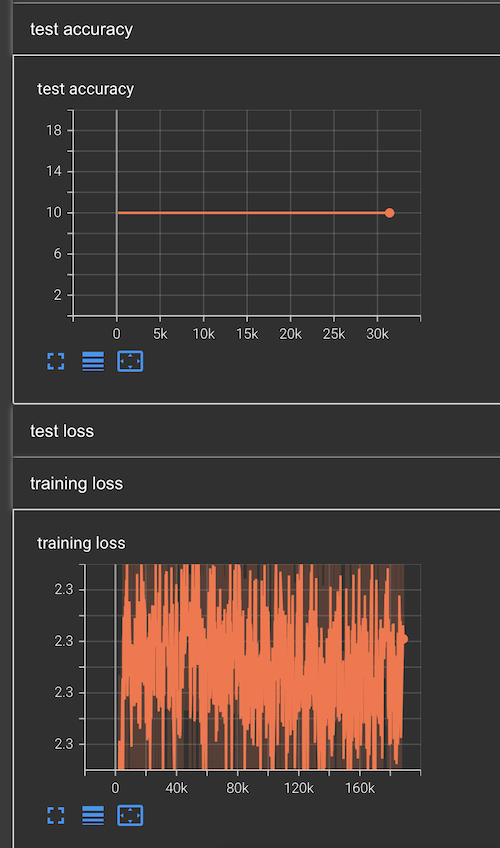  

This is the same we saw in our console printing, but now represented as a plot against the number of steps. The accuracy for test dataset is stuck around 10%, and training loss oscillates around 2.3, not making any progress.  

Now let's try to repeat it for hyperbolic tangent activation. First, change the run name:  
```python
writer = SummaryWriter('runs/tanh_1')
```
Then, change all the activation functions to `Tanh`:  
```python
def forward(self, x):
    x = nn.Tanh()(self.conv1(x))
    x = self.pool(x)
    x = nn.Tanh()(self.conv2(x))
    x = self.pool(x)
    x = torch.flatten(x, 1) # flatten all dimensions except batch
    x = nn.Tanh()(self.fc1(x))
    x = nn.Tanh()(self.fc2(x))
    x = self.fc3(x)
    return x
```
We run it for 200 epochs, and this is what we see in the tensorboard:  

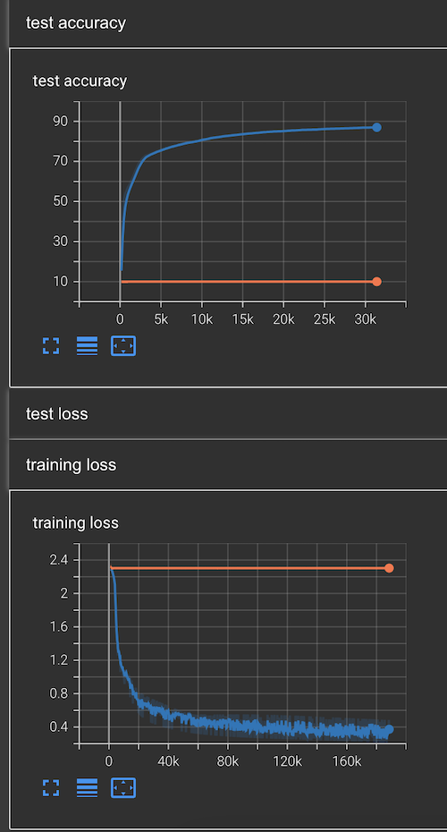  
Now it looks much better. The accuracy went over 50% in the first couple of epochs, and reached almost 87% towards the end of epoch 200. From the look of this graph, we can say that the model is *undertrained* - the accuracy didn't yet *plateau* or go down, so we can probably improve it by running for more epochs.   
### Plotting activations and gradients
Now, to undertand what happened to Sigmoid, and why is Tanh so different, let's add some more metrics. In the "Xavier initialization" paper, the authors plotted different aggregation values (like mean and standard deviation) for the value of activations as well as the gradients. So let's do that.  
First, let's take another look at our forward pass:  
```python
def forward(self, x):
    x = nn.Tanh()(self.conv1(x))
    x = self.pool(x)
    x = nn.Tanh()(self.conv2(x))
    x = self.pool(x)
    x = torch.flatten(x, 1) # flatten all dimensions except batch
    x = nn.Tanh()(self.fc1(x))
    x = nn.Tanh()(self.fc2(x))
    x = self.fc3(x)
    return x
```
We do compute all intermediate activations at some point, but then we put it to the same variable `x` that is being overwritten each time, and the only thing getting returned is the actual output of the network. We can rewrite this a little bit to output every intermediate activation as well:  
```python
def forward(self, x):
    act1 = nn.Tanh()(self.conv1(x))
    x = self.pool(act1)
    act2 = nn.Tanh()(self.conv2(x))
    x = self.pool(act2)
    x = torch.flatten(x, 1) # flatten all dimensions except batch
    act3 = nn.Tanh()(self.fc1(x))
    act4 = nn.Tanh()(self.fc2(act3))
    x = self.fc3(act4)
    return x, act1, act2, act3, act4
```
Now our model can be called like this:  
```python
pred, act1, act2, act3, act4 = model(X)
```
And we can inspect what we get here. Here is the shape of act1, for example:  
```python
act1.shape
```
```
torch.Size([64, 6, 24, 24])
```
So we started with a 28x28 image, and after applying a 5x5 convolution, with no stride or padding, the image "shrunk" to 24x24. But we now have 6 channels.  
Let's write a function to report various statistics for an arbitrary tensor:  
```python
def report(t, writer, step, name):
    writer.add_scalar(f'{name}_mean',
                                t.mean(),
                                step)
    writer.add_scalar(f'{name}_std',
                                t.std(),
                                step)
    writer.add_scalar(f'{name}_p98',
                                t.quantile(0.98),
                                step)
```
Actual tensor objects already have methods to compute different statistics, like mean or standard deviation. We call this function in our training loop:  
```python
def train(dataloader, model, loss_fn, optimizer, epoch, writer=None):
    size = len(dataloader.dataset)
    model.train()
    for batch, (X, y) in enumerate(dataloader):
        X, y = X.to(device), y.to(device)

        # Compute prediction error
        pred, act1, act2, act3, act4 = model(X)
        loss = loss_fn(pred, y)

        # Backpropagation
        loss.backward()
        optimizer.step()
        optimizer.zero_grad()

        if batch % 100 == 0:
            step = epoch * len(dataloader.dataset) + batch
            if writer != None:
                writer.add_scalar('training loss',
                                loss,
                                step)
                report(act1, writer, step, "act1")
                report(act2, writer, step, "act2")
                report(act3, writer, step, "act3")
                report(act4, writer, step, "act4")
            loss, current = loss.item(), (batch + 1) * len(X)
            print(f"loss: {loss:>7f}  [{current:>5d}/{size:>5d}]")
```
Now, let's do the same for the gradients. The gradients should be available for any layer of the model like this:
```python
print(model.conv1.weight.grad)
```
However, it will probably be `None` at this point, because the last time we computed the gradient we called `optimizer.zero_grad()` afterward. We can fix that for our debug purposes by just computing the loss and gradients once:  
```python
loss = loss_fn(pred.to(device), y.to(device))

# Backpropagation
loss.backward()
optimizer.step()
```
Now the gradients are there:  
```python
grad = model.conv1.weight.grad
grad.shape
```
```
torch.Size([6, 1, 5, 5])
```
We can simply pass them to our `report` function. We just need to rearrange the code a bit, so that gradients are zeroed out after the reporting is done, not before:  
```python
def train(dataloader, model, loss_fn, optimizer, epoch, writer=None):
    size = len(dataloader.dataset)
    model.train()
    for batch, (X, y) in enumerate(dataloader):
        X, y = X.to(device), y.to(device)

        # Compute prediction error
        pred, act1, act2, act3, act4 = model(X)
        loss = loss_fn(pred, y)

        # Backpropagation
        loss.backward()
        optimizer.step()

        if batch % 100 == 0:
            step = epoch * len(dataloader.dataset) + batch
            if writer != None:
                writer.add_scalar('training loss',
                                loss,
                                step)
                report(act1, writer, step, "act1")
                report(act2, writer, step, "act2")
                report(act3, writer, step, "act3")
                report(act4, writer, step, "act4")
                report(model.conv1.weight.grad, writer, step, "conv1_grad")
                report(model.conv2.weight.grad, writer, step, "conv2_grad")
                report(model.fc1.weight.grad, writer, step, "fc1_grad")
                report(model.fc2.weight.grad, writer, step, "fc2_grad")
                report(model.fc3.weight.grad, writer, step, "fc3_grad")
            loss, current = loss.item(), (batch + 1) * len(X)
            print(f"loss: {loss:>7f}  [{current:>5d}/{size:>5d}]")
        optimizer.zero_grad()
```
I've moved `optimizer.zero_grad()` to the very end.  
Now let's rerun the training for Tanh and Sigmoid for 200 epochs, and see what happens to activations and gradients!
### Analysing sigmoid activations
First, a reminder of how Sigmoid and Tanh activation functions look like.  
Sigmoid:  

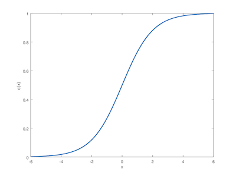  
Tanh:  

  

Both of them look like an "S" shape. For Sigmoid, left tail "saturates" at 0, and right tail "saturates" at 1. Tanh is symmetric, with tails saturating at +-1.

This is what we get for mean activation values for first layer for sigmoid and tanh:  

  

And standard deviation:  

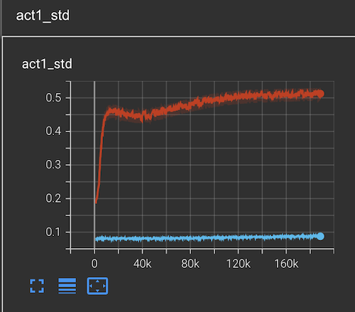  

The picture looks pretty similar for all layers.  
It was expected to have zero mean for Tanh activation, because it is symmetric. Standard deviation is around 0.5 - this means that the actual activations are all over the place, both positive and negative values.   

For Sigmoid, on the other hand, standard deviation is around zero - so all of the activations are stuck in the linear mode around 0.5. We can understand why by looking at the gradients:  
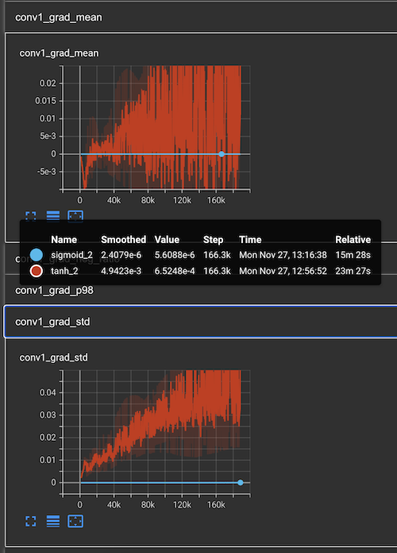  

Both mean and standard deviation of the gradients in the first layers is around zero for Sigmoid, 6 orders of magnitude smaller than for Tanh. This looks like an initialization problem - variances for the parameters are such that the variance of the gradients are vanishing when approaching first layers of the model.  

Now let's repeat the same for ReLU and SoftSign
### Relu and Softsign performance
Once again, a reminder on how Softsign and Relu activation functions look like:  
Softsign:  
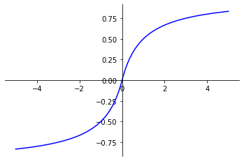   

Relu:  
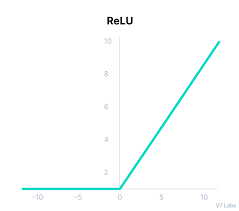   
Softsign looks similar to Tanh - symmetric, with saturating tails; but the asymptotics are different. Softsign approaches the saturation much slower, which is supposed to prevent gradients diminishing as the function approaches saturation.  
Relu is completely different. It is always zero in the negative part, and linear in the positive part. It does not saturate - positive predictions of Relu can go up to infinity. The "nonlinearity" is achieved around zero; in the right tail, the gradient is always 1, so there is no "diminishing gradient" effect.  
Relu might have a different sort of problem, however. First of all, if all of the predictions are strictly positive, the activation function becomes linear, and the network loses its expressivity in terms of approximating nonlinear dependencies. Another potential problem is "dead neurons". The gradient in the left tail of Relu is always zero. If a neuron input is negative on *all training examples*, the neuron gets stuck there, because the gradient is not propagated backwards.   
So let's add some code to explicitly track those things. "Nonlinearity" can be measured as a number of zero activations:  
```python
(t == 0).float().mean()
```
We compute that by comparing a tensor to `0`. The comparison operator uses the *broadcasting* rule, expanding `0` to dimensions of the tensor. We get a boolean tensor of true/false values as the result; we convert that back to `float` and compute `.mean()` to get the ratio of zeroes.
If it is 1.0, this means that the activation function is completely linear.  
"dead neurons" can be measured as the number of neurons that output only `0`. We can track this over a batch, as an approximation:  
```python
per_neuron_averages = (t == 0).float().mean(dim=0)
(per_neuron_averages == 0).float().mean()
```
We compute that by getting the ratio of zeroes over first dimension - per-neuron zero ratio, aggregated over input batch. Then we count the ratio of neurons for which all outputs in a batch were zeroes.  
We add this to our report function to publish these stats to tensorboard:
```python
def report(t, writer, step, name):
    writer.add_scalar(f'{name}_mean',
                                t.mean(),
                                step)
    writer.add_scalar(f'{name}_std',
                                t.std(),
                                step)
    writer.add_scalar(f'{name}_p98',
                                t.quantile(0.98),
                                step)
    writer.add_scalar(f'{name}_neg_ratio',
                                (t == 0).float().mean(),
                                step)
    res = (t == 0).float().mean(dim=0)
    writer.add_scalar(f'{name}_dead_neurons',
                                (res == 0).float().mean(),
                                step)
```
After training for 200 epochs, this is what we see:  
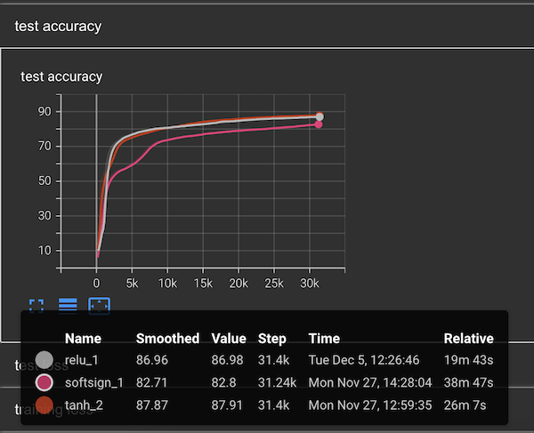  

We compare Softsign and Relu to Tanh, which was the best so far. We first look at the test accuracy to determine if changing activations actually helped - and it didn't. Softsign is just bad, not able to catch up to Tanh at all. Relu started out slightly better, but then slowed down, and stopped at a lower point than Tanh.  

And these are the gradients for one of the layers - the first linear layer (deeper layers look similar):   
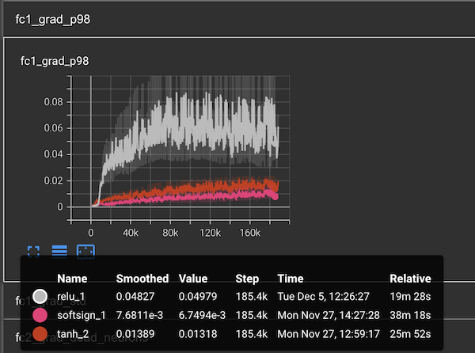   

Despite our expectations, Softsign gradients are not bigger than Tanh. Perhaps because in our case, Tanh doesn't quite saturate yet. Relu gradients are clearly bigger, especially for lower layers; but the overall performance is still worse than for Tanh. So clearly, gradients are not everything, and there is something that we don't understand about this just yet.  
### Xavier initialization
Now let's try to add xavier initialization to parameters, and see if it helps. I am doing it for Tanh activation, because it is a winner so far, but similar results can be observed for other activation functions as well.   
First, recall that as a compromise between scaling factor for variance of the activations during forward prop, and variance of the gradients during back prop, we want to initialize our parameter with the following variance:
$$Var_i = \frac{2}{n_i + n_{i+1}}$$  
So it depends on the size of the input as well as output of the layer. Luckily, all of that information is part of the layer itself, so we can just pass the layer to a special parameter initialization function:  
```python
nn.init.xavier_uniform_(self.conv1.weight)
```
We do that for all our layers, so this is how the code for our network looks like:
```python
class NeuralNetwork(nn.Module):
    def __init__(self):
        super().__init__()
        self.conv1 = nn.Conv2d(in_channels=1, out_channels=6, kernel_size=5, stride=1)
        nn.init.xavier_uniform_(self.conv1.weight)
        self.pool = nn.MaxPool2d(kernel_size=2, stride=2)
        self.conv2 = nn.Conv2d(in_channels=6, out_channels=16, kernel_size=3, stride=1)
        nn.init.xavier_uniform_(self.conv2.weight)
        # input: 28 * 28
        # after first conv with kernel size 5: 24 * 24
        # after first pool: 12 * 12
        # after second conv with kernel size 5: 10 * 10
        # after second pool: 5 * 5
        self.fc1 = nn.Linear(16 * 5 * 5, 120)
        nn.init.xavier_uniform_(self.fc1.weight)
        self.fc2 = nn.Linear(120, 84)
        nn.init.xavier_uniform_(self.fc2.weight)
        self.fc3 = nn.Linear(84, 10)
        nn.init.xavier_uniform_(self.fc3.weight)
```
Apart from the parameters, there is an optional parameter "gain" that let's us take activation function into consideration. It can be used like this:   
```python
nn.init.xavier_uniform_(self.conv1.weight, gain=nn.init.calculate_gain('relu'))
```
In the original Xavier paper, activation function was considering to be in the "linear mode", having gradient of 1. `gain` lets us add activation function to consideration, getting us closer to the desired variance scaling factor. This is also sometimes called "kaiming initialization".   

This is what we see for test accuracy after training for 200 epochs:   
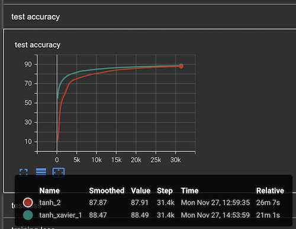  
The network improved much quicker, getting 70%+ accuracy from the very first epoch, and the final accuracy is also better than for default initialization.   

And this is how the gradients for the first layer look like for xavier-initialized model, as compared to default initialized one:   
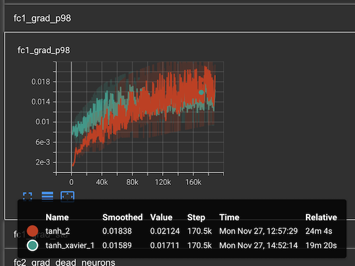   
So for default-initialized model, in the beggining of the training the gradients of the deeper layers are much smaller, almost zero, and it takes some time for the model to overcome that; but eventually even the default-initialized model catches up, and gradients towards the end of the training are similar. For xavier-initialized model, the gradient is quite big and more or less constant throughout the training.  
### Adam optimizer
Finally, I wanted to show the potential effect of just changing the optimizer. Let's change our SGD optimizer to this:  
```python
optimizer = torch.optim.Adam(model.parameters(), lr=1e-3)
```
Here is what we see for test accuracy:  
   

Adam achieves the accuracy of `88.68` after just a few epochs, and then accuracy starts to go down. SGD achieves `88.47` after 200 epochs.  

So the network converged much quicker, and to a better optimum, at least as compared to our other, 200-epoch launches. Probably we could've get even more accuracy for SGD if we were to train it further.  

Choosing proper optimizer can have a drastic effect on speed and quality of training. Adam is considered the industry default - always start with that one if you are experimenting on something new. SGD is more popular in CV applications, but it is usually used with some modifications - momentum, weight decay, and learning rate scheduling. We will talk about these in our next post.  
