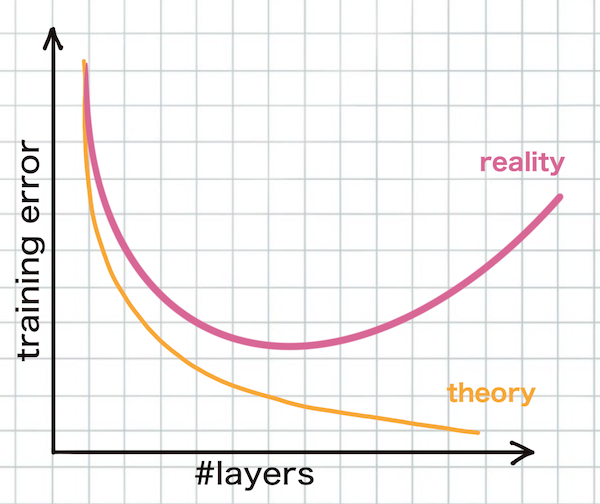
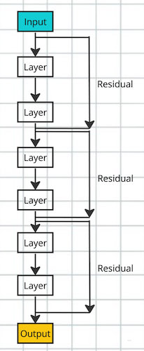
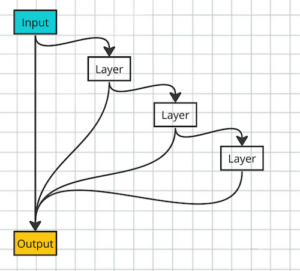
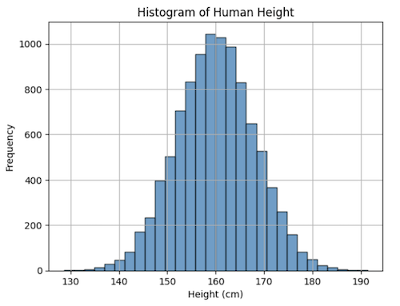
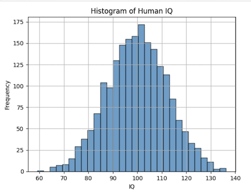
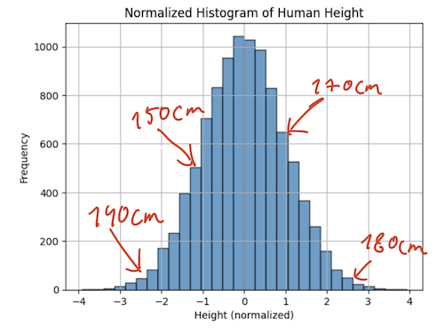
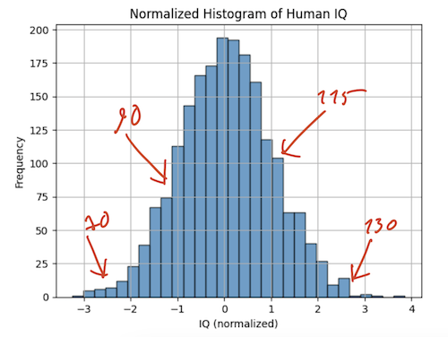
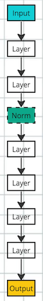
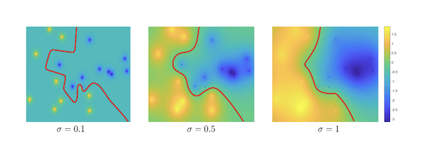

This post talks about 3 specific things:  
- Residual connections
- Batch Normalization
- Kaiming Initialization  

That are needed to "unlock" deeper models. Before these techniques were invented, attempts at increasing the network depth beyond 20-30 layers, when trying to solve [ImageNet](https://www.image-net.org/) challenge, for example, lead to worse performance only. First, let's discuss the problems preventing us from training good, deep models.  
## Vanishing gradients and the Degradation problem
One problem that we discussed a lot in our previous posts, like [this](https://github.com/adensur/blog/blob/main/computer_vision_zero_to_hero/04_xavier_glorot_paper_read/Readme.md) one, is Vanishing Gradients. It can be briefly described as follows: during backprop, the variance of the gradients being passed backwards from layer to layer gets multiplied by a certain factor:  
$$factor = paramVar * n_{i+1}$$  
Where $paramVar$ stands for parameter variance, and $n_{i+1}$ is the size of the next layer. This conflicts slightly with a similar condition for the variance of the output of the layer during forward prop:  
$$factor = paramVar * n_{i}$$  
That depends on $n_{i}$, size of the current layer. On practice, layer sizes will often be different. For example, ResNet starts with 3 channels for R,G,B, and then projects that up to 64, 128, 256, 512, 1024 and 2048 channels step by step before collapsing into 1000 output predictions. Not being careful with parameter initialization might cause either output values of the network, or gradients being passed around, to either explode to infinity or vanish to zero.  

Apart from that, some activation functions "saturate", which may cause the network to enter in a mode where gradients will vanish because of this. For example, here is the graph of hyperbolic tangent activation function:  
  
If input values to this activation function are either too large or too small (+10, for example), the gradient from this function becomes increasingly small as well, which prevents the gradient to be passed backward during backprop, and causes the network to get "stuck" in this position. Note that ReLU activation function doesn't suffer from this problem:  
  
It's gradient is always either 1 or 0.  
As we'll see later, the vanishing gradients problem is solved by using ReLU activation function, proper parameter initialization, and BatchNorm.  

But apart from that, there is also a so-called "degradation" problem:  
   
It has been observed that beyond a certain point, increasing the number of layeres in the network causes the train accuracy to go down, even with BatchNorm, proper initialization and ReLU activation function. This problem is different from the "vanishing gradients" problem, as can be verified by measurements of actual gradient values during training. This is also not the same as overfitting - overfitting usually involves low train error, but higher test error.  
## Residual Connections 
How can train error go down with increasing model complexity? Let's say we are in the optimal point at the moment. We should expect train error to go down after adding another layer (because the expressivity of the network increases), or at least to stay constant. In fact, we can construct a solution to the parameter optimization problem like this: take previous network, with 1 less layer, as weights for the first $N-1$ layers of the current network; and set the weights in such a way so the last layer performs "identity transform" - simply copying input to the output without modifications. This new network with 1 extra layer will perform exactly as good as the previous one. The fact that our gradient descent algorithm fails to find this solution indicates the problem with optimizers.  

However, we can also "solve" this by adding an explicit "identity transform" on top of our added layer:  
   
This how it can look like in code:  
```python
def forward(self, input):
    out = self.pool(nn.Tanh()(self.conv1(input)))
    out += input
    return out
```
Let's say that our "block" performs a convolution operation, activation and pooling. We simply "add" a tensor of input to the output - this is what a Residual Connection is, in essence. It also doesn't add any training parameters, and almost no computational complexity, so a "residual connection" is really lightweight.  
Another way to think about "residuals" is as a direct connection from the input to the output:  
   
Which lets the network first "predict" the output using really simple functions; then "fix" the error of such prediction with an added complexity of another layer; then fix the error of this system with another layer, and so on. In such a case, every new layer is effectively "improving upon" existing prediction by trying to learn to fix only the errors, instead of trying to construct the entire prediction by itself. Such approach is expected to not degrade in train quality from adding new layers by design.   

A good indication of the success of this approach is to just quote results from two papers. [Kaiming Initialization](https://arxiv.org/pdf/1502.01852.pdf) paper from 2015 reports top-5 error of 7.0% on ImageNet dataset from a model with roughly 20 layers, mentioning that increasing the depths further only lead to worse performance. [ResNet](https://arxiv.org/pdf/1512.03385.pdf) paper from December same year, done by the same group of researchers, which originally introduced the Residual Connections, managed to train a model with 150 layers, improving error to 5.0%. Since then, Residual Connections became omnipresent in the industry. They are a part of all deep networks: conv nets, transformers, LLMs, and so on.  
## Batch Norm
Normalization is a term coming from data analysis and statistics - it's a process of "whitening" the data, by applying a linear transformation to every data point to map all data points into a specific range. For example, let's say that we have the following histogram of human height:  
   
The mean is around 160cm; most of the data points lie in the range of $[140; 180]$, though rare examples can go much beyond that.   
And here is the histogram of human iq:  
   
The shape of the curve is almost the same; the actual numbers, as well as units of measurement, are, of course, different. Now the mean is around 100 and the range is from 60 to 140 for most of the points.  
We can "normalize" the data the following way:  
$$normalizedHeight = \frac {height - mean}{stdDev}$$
We subtract the mean and divide by variance. For height, we now get the following histogram:  
   
And for the IQ:  
   
The picture is now more "neat". Mean is 0, variance is 1; curve is symmetric around 0; we can directly compare these two histograms - to answer a question like "are you as tall as you are smart", for example. The shape of the curve didn't change a bit, because the transformation applied was the same for all the points. Such "whitening" of data is useful for a lot of practical applications - computing correlation, analysing the data, or training models on top of it.  
### Normalization of model inputs
Neural Networks implicitly prefer the input data to be normalized. Look at the hyperbolic tangent activation again:  
  
Imagine that we feed raw pixel values with range from 0 to 255 into it. For most of the values, the activation function will be oversaturated from the very start! `Tanh` implicitly requires that input values should have zero mean and, ideally, unit variance to make sure that extreme data points do not oversaturate the activation function.  
ReLU is slightly better:  
  
It will not oversaturate, but it will lose almost all nonlinearity, because most of the data points are now positive and ReLU just becomes linear. ReLU doesn't require unit variance, but implicitly prefers zero mean in the input data.  
In practice, actual pixel values are normalized before being fed into the network. 
### Normalization of intermediate layer inputs
It is also expected to be useful to insert normalization before intermediate layers as well. It was shown that models train faster if input data is normalized; intermediate layer can be viewed as an intermediate model that receives output of the previous layer as an input. During training, it tries to get used to the distribution of the input data; however, after every batch gradient descent step, previous layers also change, shifting the distribution. In such a mode, current layer has to continuously adapt to shifting distribution in the input data.  
   
We can fix this by injecting a "normalization" layer before current layer input. But how will that work, exactly? In the examples above, we used this formula: 
$$normalizedValue = \frac {value - mean}{stdDev}$$
Here, both mean and variance are some statistics calculated over a certain set of data. For example, mean:  
$$mean = \frac{1}{N} {\sum_{i=1}^{N} value_i}$$   
Over which data should we calculate this?   

We can calculate these statistics over the entire dataset. However, after one batch gradient descent step, layer weights will change, and input data distribution will shift. In order to restore our normalization, we will have to recalculate the statistic again, which is computationally unfeasible.   
Another challenge is that this "norm layer", whatever it is, has to be differentiable. We will need to be able to compute gradients of its outputs with respect to inputs in order to perform back prop step through this layer.  

BatchNorm solves these 2 problems. It proposes calculating the statistics of the values over the current batch. For every coordinate in the output of the layer, we compute:
$$mean = \frac{1}{m} {\sum_{i=0}^{m} value_i}$$  
$$var = \frac{1}{m} \sum_{i=1}^{m} (value_i - mean)^2$$  
Where $m$ is the size of the batch. This is easy to compute; in addition, since we calculate the gradients for the loss function, and the loss depends on the entire batch, we can compute all the partial derivatives of these statistics with respect to the inputs. So these 2 equations take part in the backprop.  
We do the normalization like this:  
$$value_i \leftarrow \frac {value_i - mean}{\sqrt {var + \epsilon}}$$
We need $\epsilon$ - a small parameter - for numerical stability.  

In addition, we don't really want to "limit" the range of the network predictions. For example, when prediction bounding boxes, we legitimely might need the network to predict a number in the range of, say,  `[0; 1920]`. To make sure that the model doesn't lose its expressivity, we also add scale and shift factor:  
$$value_i \leftarrow \gamma * value_i + \beta$$
Here, $\gamma$ and $\beta$ are trainable parameters, one per layer. This means that having them allows the network to "train" to keep the expressivity it needs. They don't add much complexity to training, because it's just 2 parameters per layer (compare that to millions of parameters in the layer itself).
### During inference
Computing statistics over current batch means that the prediction of the model depends on the content of the batch; it will change if the batch size is changed, or if the data is reshuffled. This behaviour is not desirable during inference, where we need deterministic prediction. Because of that, during inference, we will instead use the statistics calculated over the entire dataset. PyTorch implementation of BatchNorm does this by default. It tracks running statistics during training, and then uses those statistics during inference in the "validation" mode. Once training is done, those running statistics are "frozen" and are baked into the model itself, thus making sure that they are saved and loaded along the weights of the model itself.
### BatchNorm as a regularizer. Momentum
Another curious side effect of batch normalization is that it acts as a regularizer. "Regularization" is a process of penalizing the complexity of the model, thus hurting performance on the train dataset, but improving generalizability and performance on the test dataset. In batch norm, since statistics are calculated over a small batch, computed mean and variance will be slightly different from batch to batch, thus adding a certain "noise" to the outputs of the layer. In practice, BatchNorm gives sufficient regularization, making use of other regularisation methods like Dropout unnecessary.  
[This](https://www.ecva.net/papers/eccv_2020/papers_ECCV/papers/123570222.pdf) paper from 2020 explores the regularization effects of BatchNorm a bit deeper. Here is an interesting picture demonstrating it:  
  
It shows activation values of the network, projected into 2d space, and the actual classes of the examples. Blue dots correspond to images of one class; yellow dots - to images of another class. Red curves show the "hyperplane" separating the classes in the network. Cross entropy loss effectively tries to "push" the curve away from every point. Because of the sparsity of the examples, we can see that in some places this seperation curve is unnecessary complex, with bends inward in places where there is no points of a certain class. This "inward bending" probably hurts performance on the test set, where the points are located slightly differently.  

Adding a little bit of noise to the classes causes the separation hyperplane to become smoother, thus improving the generalizability and accuracy on the test set. When the noise is too big, however, the line becomes too blurry and loses test accuracy as well.  

Another result from the same paper is that this noise, as well as the level of achieved regularisation, depends on the batch size. This can be undesirable, because we might want to change batch size for technical reasons (big batch doesn't fit into gpu memory, for example), which will cause a shift in regularization properties and model quality. The paper proposes to use "momentum" of the statistics instead of the statistics themselves:
$$meanMomentum_{i+1} = \lambda * meanMomentum_i + (1-\lambda) mean$$
$$varMomentum_{i+1} = \lambda * varMomentum_i + (1-\lambda) var$$
Which effectively means that we use a moving average over a certain number of steps in the past instead of just the current value for the statistic.   
Momentum statistic calculation for batchnorm is currently an industry standard, and PyTorch BatchNorm normalization uses momentum by default.
## Kaiming Initialization
In our previous [post](https://github.com/adensur/blog/tree/main/computer_vision_zero_to_hero/04_xavier_glorot_paper_read), also mentioned above, we use the following esimation for the variance of layer outputs during forward prop, and gradients during backprop:
$$varOut = n_i * paramVar * varIn$$
$$gradVarOut = n_{i+1} * paramVar * gradVarIn$$
They come from [Xavier Initialization](https://proceedings.mlr.press/v9/glorot10a/glorot10a.pdf) paper, from 2010.  

In the same paper, authors propose the following initialization method to help with the "vanishing gradients" problem, as a compromise between these 2 conditions during back and forward prop:  
$$paramVar = \frac{2}{n_i+n_{i+1}}$$  
This is called "Xavier Initialization".  

However, this calculation doesn't take activation function into effect.  
[Kaiming Initialization](https://arxiv.org/pdf/1502.01852.pdf) paper from 2015 analyses the effect from the activation functions on the variance of outputs and gradients, and proposes alternative parameter initialization method called "Kaiming Initialization":  
$$paramVar = \frac{gain^2}{n_{i+1}}$$
It uses extra $gain$ value that adjusts the value of the variance based on the actual activation function. For ReLU, $gain=\sqrt2$; gain values for other common activation functions are known and can be accessed in PyTorch like this:
```python
nn.init.calculate_gain('tanh')
```
Authors also argue that it makes little sense to "compromise" between back prop and forward prop, and instead suggest to choose either one or the other.  

In practice, all the options are available. We can go for either modified "Xavier" initialization, with added gain from the activation function; or for Kaiming initialization for forward prop (fan_in) or back prop (fan_out):
```python
nn.init.xavier_uniform_(w, gain=nn.init.calculate_gain('relu')) # xavier initialization, compromise between forward prop and back prop
nn.init.kaiming_uniform_(w, mode='fan_in', nonlinearity='relu') # kaiming initialization, tuned for forward prop
nn.init.kaiming_uniform_(w, mode='fan_out', nonlinearity='relu') # kaining initialization, tuned for back prop
```
Results are actually not that different. As mentioned before, the [Kaiming Initialization paper](https://proceedings.mlr.press/v9/glorot10a/glorot10a.pdf) from Dec 2015, that introduces Kaiming initalization, could achieve accuracy of about 7.0% on ImageNet with a network with about 20 layers, mentioning slight gain in performance and training speed from using this new initialization. [ResNet](https://arxiv.org/pdf/1512.03385.pdf) paper by the same authors, published in February same year, reports 5.0% accuracy with a model with 150 layers. This means that Residual Connections are so strong that they make parameter initialization practically unimportant.
## Extra
One of the opinions within the industry is that BatchNorm and Residual Connections are "hacks" that try to solve our limiting optimization abilities by making our networks easier to optimize. This [video](https://www.youtube.com/watch?v=kVU8zTI-Od0&list=PLqYmG7hTraZCDxZ44o4p3N5Anz3lLRVZF&index=5) talks about promising second-order optimization methods like k-FAC ([link](https://arxiv.org/abs/1503.05671)) that can successfully optimize networks similar to a ResNet in terms of depth and number of parameters, but without BatchNorm or Residuals, achieving similar accuracy results. This is currently an open field of study, but due to many factors (computational complexity, not enough research) the industry just sticks to BatchNorm + Residuals instead.
### Next Up
In out next post, we will put all the tools learned in this and previous posts into practice, by training an actual ResNet152 model on our own computer, on the original ImageNet dataset. We will see how much complexity that adds as compared to just learning the concepts by themselves.