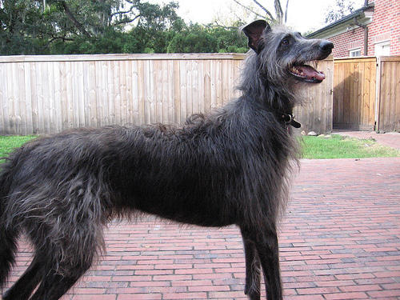
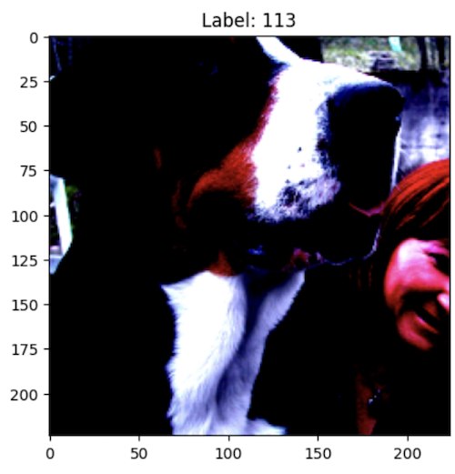
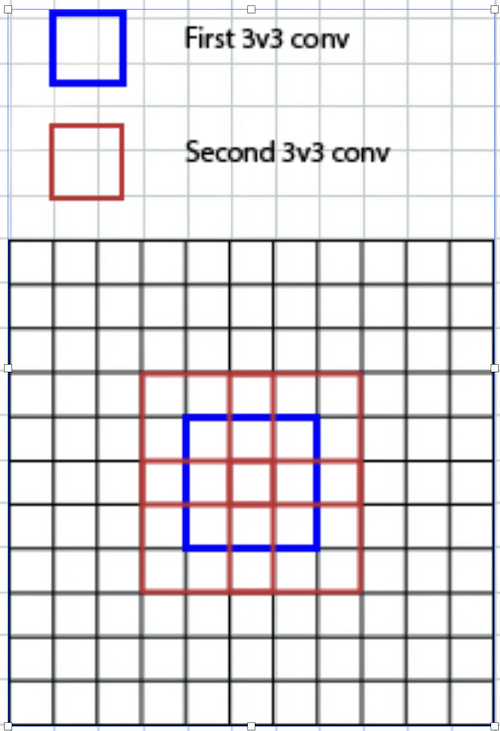
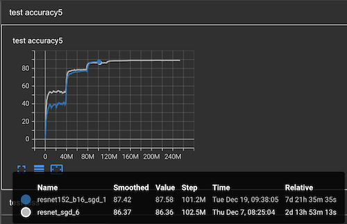
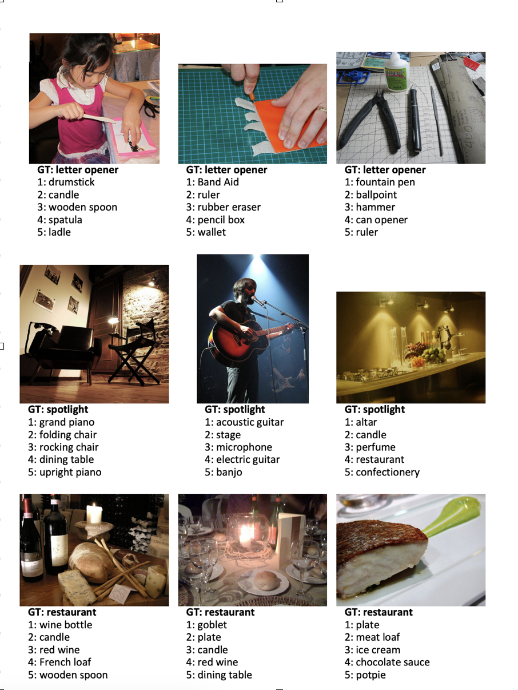
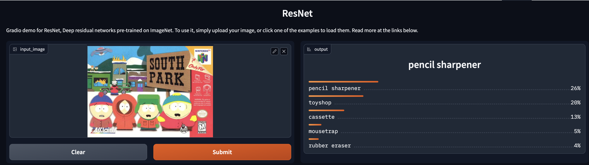
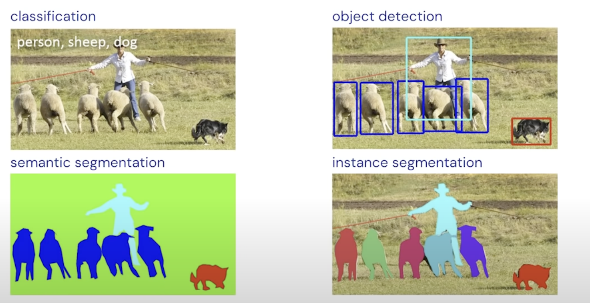

This post describes how to define and train a ResNet model from the [paper](https://arxiv.org/pdf/1512.03385.pdf).  
This famous model was a winner of 2015 ImageNet competition, surpassing human performance on the dataset with around 5% top-5 accuracy.  

The code to train the network is mostly copied from the [model](https://github.com/pytorch/vision/tree/main/references/classification#resnet) and [train](https://github.com/pytorch/vision/tree/main/references/classification#resnet) code in TorchVision repository. Amongst other things, TorchVision developers went through the process of reimplementing popular models in PyTorch, making sure that the quality of the models achieved and the training process is almost the same as in the original papers.   

I did the training on a Desktop PC with a single Nvidia RTX3080 gpu. You will require at least 320gb disk space (160gb dataset size + double that to unpack the initial archive) and ~1 week of training time.
## The challenge and the Dataset
[ImageNet](https://www.image-net.org/) is a database with around 14 mil images (~2tb of data) and 22 thousand classes. Imagenet-1k is a subset of this dataset with 1k classes, 1.2m images. It weighs roughly 160gb.   
The challenge, ILSVRC, to classify images in this imagenet-1k subset, was one of the most popular challenges in deep learning history, and was active in 2010-2017. It was closed in 2017, because models surpassed human-level performance on this dataset, at which point it became less interesting to try and improve the benchmark further.   

Here is an example of an image from this dataset:  
   
Most of the images have quite high resolution, and contain a photo of one object in the center of the image. Some images might have several objects. Because of this, the official metric used for comparison of the models is top-5 accuracy - if at least one out of top 5 predicted classes is correct, the model is considering to perform well on this example.  

It is worth noting that the selection of classes for this 1k subset is quite weird. There is no class for "person", for example, or "horse"; but a few separate classes for different breeds of dogs. 
### The history of the challenge
I am talking about this here because the history of this challenge corrseponds a lot to the history of deep learning itself.  

The challenge started in 2010, being the most difficult image recognition challenge at that time, with huge numbers of classes and high resolution images. This makes the classification task much more difficult compared to other existing challenges at that time, like MNIST, with low-res images of hand-written digits. 

In 2010 and 2011, winner submissions mostly used pre-deeplearning approaches: first extracting hand-crafted features from the images, and then applying other ML frameworks to do the classification. These approaches allowed to reach top-5 accuracy if 74% in 2011.  

In 2012, a famous [AlexNet](https://papers.nips.cc/paper_files/paper/2012/file/c399862d3b9d6b76c8436e924a68c45b-Paper.pdf) model came out, with top-5 accuracy of 84%. It was the first submission to the competition to use convolutions. Although convolutions were invented much earlier, this model was the first one to use them at such scale, and pretty much popularized them for the entire world - all Imagenet submissions, as well as most of the computer vision networks that came out afterwards, used convolutions. AlexNet was also a major milestone in deep learning itself, demonstrating that neural networks can achieve performance much greater than other ML algorithms on some tasks.

In 2013-2014, nothing conceptually intersting came out, but combination of scaling up the training, and reconfiguring existing architectures, allowed to achieve 93% accuracy. Some networks from that period, like [VGGNet](https://arxiv.org/abs/1409.1556), are still used in some computer vision applications.

In 2015, [BatchNorm](https://arxiv.org/pdf/1502.03167.pdf) and [Resnet](https://arxiv.org/pdf/1512.03385.pdf) papers came out. Although they introduced techniques that are useful in all branches of deep learning, not just image recognition, the articles themselves mostly talk about ImageNet challenge. It was simply one of the most challenging and popular tasks at that time. ResNet achieved top-5 accuracy of 95%, surpassing human performance on the same dataset.  

The competition kept running until 2017, altough it is hard to argue about model quality beyond human-level performance. Achieving better accuracy could just mean that the network overfits towards errors that the humans make, not necessarily classifying objects better
### The dataset
Imagenet [website](https://www.image-net.org/) claims that they are ready to provide access to the full 2tb of data to people who ask them, within 5 working days. I've tried that and has been waiting for a month now with no answer.  
Imagenet-1k subset is available on [Kaggle](https://www.kaggle.com/competitions/imagenet-object-localization-challenge/data). This is the one we will use in this post.  
After unpacking it, you will see quite a complex structure of the dataset. Actual images for training are located in `ILSVRC/Data/CLS-LOC/train`. This `train` folder contains a collection of subfolders `n02002556`, `n02074367` and so on. These subfolder names correspond to the actual class labels, and inside these subfolders there are actual images. Images are stored in JPEG format.   

`ILSVRC/Data/CLS-LOC/val` folder contains images for validation set. The format of storage is different, for some reason. Instead of being arranged by subfolders, the images are just located in the common folder, and there is no way to infer the class label from the path. The labels for the images are located at `LOC_val_solution.csv` in the root of the dataset. To simplify the code, I've written a [script](convert_val.py) to move the images into subfolders making sure that validation and training data format is the same. Here is how you can launch it:  
`python3 convert_val.py -d ../imagenet/ILSVRC/Data/CLS-LOC/val -l ../imagenet/LOC_val_solution.csv`  
### Writing the code
I am doing this in a jupyter notebook. First, imports:
```python
import json
import numpy as np
import pandas as pd
import matplotlib.pyplot as plt
import warnings
warnings.filterwarnings('ignore')
import os
import time

# Import PyTorch libraries
import torch
import torchvision
import torchvision.transforms as transforms
import torchvision.datasets as datasets
from torch.utils.data import DataLoader
import torch.nn as nn
import torch.optim as optim
import torch.nn.functional as F

print("Libraries imported - ready to use PyTorch", torch.__version__)

def show_image(image, label):
    image = image.permute(1, 2, 0)
    plt.imshow(image.squeeze())
    plt.title(f'Label: {label}')
    plt.show()
```
I also define a "show_image" helper function to draw contents of a tensor.  
Then, I deal with the devices:  
```python
# device
device = (
    "cuda"
    if torch.cuda.is_available()
    else "mps"
    if torch.backends.mps.is_available()
    else "cpu"
)
```
We specify the device to make sure our training is gpu-accelerated. It's recommended to validate the actual device that got recognized. If you have a cool gpu, but it is not installed properly, you might not notice that, but your training will be 10x slower.
```python
print(f"Using {device} device")

# resume training options
resume_training = True

class Params:
    def __init__(self):
        self.batch_size = 16
        self.name = "resnet_152_sgd1"
        self.workers = 4
        self.lr = 0.1
        self.momentum = 0.9
        self.weight_decay = 1e-4
        self.lr_step_size = 30
        self.lr_gamma = 0.1

    def __repr__(self):
        return str(self.__dict__)
    
    def __eq__(self, other):
        return self.__dict__ == other.__dict__

device = (
    "cuda"
    if torch.cuda.is_available()
    else "mps"
    if torch.backends.mps.is_available()
    else "cpu"
)
params = Params()
params, params.batch_size
```
Now we define params for the training. You can check the actual params used to train the model for the benchmark [here](https://github.com/pytorch/vision/tree/main/references/classification#resnet). I had to reduce batch size slightly because of limited gpu RAM available.  
I define the params in such a peculiar way - as a class with a custom `__repr__` method - so that we can serialize them all later as part of our checkpoints.  

Then, we specify our folder paths and validate that they are correct:  
```python
training_folder_name = '../imagenet/ILSVRC/Data/CLS-LOC/train'
val_folder_name = '../imagenet/ILSVRC/Data/CLS-LOC/val'
os.listdir(training_folder_name)
```
```
['n02795169',
 'n02422699',
 'n02769748',
 'n02319095',
 ...
 ]
```
Then, transforms for the training dataset:
```python
train_transformation = transforms.Compose([
    transforms.ToTensor(),
    transforms.RandomResizedCrop(224, interpolation=transforms.InterpolationMode.BILINEAR, antialias=True),
    transforms.RandomHorizontalFlip(0.5),
    # Normalize the pixel values (in R, G, and B channels)
    transforms.Normalize(mean=[0.485, 0.485, 0.406], std=[0.229, 0.224, 0.225])
])
```
`ToTensor` just converts a default python image class to PyTorch tensor.  
[RandomResizedCrop](https://pytorch.org/vision/main/generated/torchvision.transforms.RandomResizedCrop.html) chooses a random area in the image, crops it out, slightly stretches it along one axis in a randomized way, and results in a 224 by 224 image. This is an augmentation technique: it makes sure that the model does not remember the exact image after training for several epochs; and allows the model to learn some variability in the data. Cropping out a part of image causes model to try to correctly classify an object even if it sees only a part of it. Random stretching and resizing roughly correspond to the sorts of transformations we can expect in real life: viewing an object from a different angles, in different aspect ratios, and from different distance.  
`RandomHorizontalFlip` will "mirror" the image horizontally with a probability of 0.5. This is safe to do for the classes we actually have in ImageNet-1k: a mirrored dog is still a dog; but in general, that might not be the case. Letters and digits might be unrecognizable, or even change meaning after such operation.  
Finally, we normalize the raw pixel values to make sure that they have zero mean and unit variance. The numbers passed in `mean=[0.485, 0.485, 0.406], std=[0.229, 0.224, 0.225]` just correspond to existing, known mean and standard deviations of the 3 color channels within the dataset.  
```python
train_dataset = torchvision.datasets.ImageFolder(
    root=training_folder_name,
    transform=train_transformation
)
train_sampler = torch.utils.data.RandomSampler(train_dataset)
train_loader = torch.utils.data.DataLoader(
    train_dataset,
    batch_size=params.batch_size,
    sampler=train_sampler,
    num_workers = params.workers,
    pin_memory=True,
)
for X, y in train_loader:
    break
print(X.shape)
show_image(X[0], y[0])
```
[ImageFolder](https://pytorch.org/vision/stable/generated/torchvision.datasets.ImageFolder.html) is a torchvision helper class that allows us to load the dataset in the format we have - a folder with subfolders corresponding to class name, and the actual images of the class being inside the subfolder. It knows how to infer the class label from the image path, and automatically converts the label to an index - number from 0 to 1000 that we'll use in training. We can check which index each class label has like this:   
```python
train_dataset.class_to_idx["n02002556"]
```
```
0
```
There is no reverse transformation, unfortunately, but we can just invert this python dict ourselves.  

Dataset API allows you to fetch an example by index:
```python
train_dataset[1337]
```
Note that initializing the dataset doesn't load images into memory. Images will be loaded after you have tried to access them.  

`DataLoader` converts the dataset into an iterable - something we can iterate over using `for loop` - and combines several images into batches. Note that in order to unite several tensors into a batch, they have to have the same shape, whilst the initial images all can have different sizes. `RandomResizedCrop` transform takes care of that.    

We also provide the loader with a `RandomSampler`, meaning that every iteration of the `for loop` will receive random indices. `num_workers` allows us to preload some data in the dataloader, and load and process data in several threads in parallel.   
`num_workers=0` would mean that the main Python process is doing all the work; in the train loop, we will first load the data from disk, apply the transforms, then copy it to gpu memory and start computing the predictions of the model and doing backprop step. After backprop step is done, we will fetch next batch of data by loading it from disk, applying the transforms and so on. So the GPU is not used while we are waiting for the data loading.
`num_workers=1` will crate a thread that loads and transforms the data in the background. While the GPU is busy training, the data loader will keep loading the data and storing it in the buffer. This increases cpu memory consumption, but greatly speed up the training. However, if the transforms are too cpu-intensive, one worker might not be enough to transform the images quickly enough. Having `num_workers` above 1 allows us to do the processing on multiple cpu cores.  

`Pinned Memory` is a special memory that is always used as an intermediate buffer when copying data from cpu to gpu. So to copy something from cpu to gpu, you first have to copy it to pinned memory, and then copy from pinned memory to gpu. `pin_memory=True` makes sure that the first step - copying from cpu to pinned memory - is done in the background during preloading.   
This is how the image looks like after transforms:  
   
The colours look off because of the data normalization. Drawing engine expect pixel values from 0 to 1, while we have them roughly from -1 to 1. Don't worry, this doesn't affect how the network sees the image.  
Here is how we load the validation set:  
```python
val_transformation = transforms.Compose([
        transforms.ToTensor(),
        transforms.Resize(size=256, antialias=True),
        transforms.CenterCrop(224),
        # Normalize the pixel values (in R, G, and B channels)
        transforms.Normalize(mean=[0.485, 0.485, 0.406], std=[0.229, 0.224, 0.225])
    ])
val_dataset = torchvision.datasets.ImageFolder(
    root=val_folder_name,
    transform=val_transformation
)

val_loader = torch.utils.data.DataLoader(
    val_dataset,
    batch_size=64,
    num_workers=params.workers,
    shuffle=False,
    pin_memory=True
)
for X, y in val_loader:
    break
print(X.shape)
show_image(X[0], y[0])
```
For training dataset, we wanted some variability in the images, and wanted to make the task more challenging for the model. For validation, we instead want the least challenging task to maximize accuracy, and we want results to be deterministic. This is why instead of `RandomResizedCrop` we do `Resize` + `Crop` separately. As written here, resize to 256 and crop to 224 will always cut off a bit ouf of the longest dimension of the picture, plus a small 30-pixel area around the edge. After a lot of experimentation, this was concluded to be optimal due to how the images in the dataset look like - in most of them, the object is near the center of the image and such cropping is safe.  
Here is our train function:  
```python
from math import sqrt
def train(dataloader, model, loss_fn, optimizer, epoch, writer):
    size = len(dataloader.dataset)
    model.train()
    start0 = time.time()
    start = time.time()
    for batch, (X, y) in enumerate(dataloader):
        X, y = X.to(device), y.to(device)

        # Compute prediction error
        pred = model(X)
        loss = loss_fn(pred, y)

        # Backpropagation
        loss.backward()
        optimizer.step()
        batch_size = len(X)
        if batch % 100 == 0:
            loss, current = loss.item(), (batch + 1) * batch_size
            print(f"loss: {loss:>7f}  [{current:>5d}/{size:>5d}], {(current/size * 100):>4f}%")
            step = epoch * size + current
            writer.add_scalar('training loss',
                            loss,
                            step)
            new_start = time.time()
            delta = new_start - start
            start = new_start
            if batch != 0:
                print("Done in ", delta, " seconds")
                remaining_steps = size - current
                speed = 100 * batch_size / delta
                remaining_time = remaining_steps / speed
                print("Remaining time (seconds): ", remaining_time)
        optimizer.zero_grad()
    print("Entire epoch done in ", time.time() - start0, " seconds")
```
Nothing new here compared to our previous [post](https://github.com/adensur/blog/blob/main/computer_vision_zero_to_hero/05_tensorboard/Readme.md). This function performs one training epoch, i.e., iterates over the entire training data once. It iterates over the dataloader, getting a batch of images and labels for them. It transfers the data to device (mps/gpu) if necessary, calculates predictions, loss function, computes the gradients, and performs optimizer step, thus updating model parameters. Once every 100 batches we also report some metrics to console and to tensorboard writer (we'll define one later). We also compute the remaining time, based on the current rate of progress.  

Here is the test function:  
```python
def test(dataloader, model, loss_fn, epoch, writer, train_dataloader, calc_acc5=False):
    size = len(dataloader.dataset)
    num_batches = len(dataloader)
    model.eval()
    test_loss, correct, correct_top5 = 0, 0, 0
    with torch.no_grad():
        for X, y in dataloader:
            X, y = X.to(device), y.to(device)
            pred = model(X)
            test_loss += loss_fn(pred, y).item()
            correct += (pred.argmax(1) == y).type(torch.float).sum().item()
            if calc_acc5:
                _, pred_top5 = pred.topk(5, 1, largest=True, sorted=True)
                correct_top5 += pred_top5.eq(y.view(-1, 1).expand_as(pred_top5)).sum().item()
    test_loss /= num_batches
    step = epoch * len(train_dataloader.dataset)
    if writer != None:
        writer.add_scalar('test loss',
                            test_loss,
                            step)
    correct /= size
    correct_top5 /= size
    if writer != None:
        writer.add_scalar('test accuracy',
                            100*correct,
                            step)
        if calc_acc5:
            writer.add_scalar('test accuracy5',
                            100*correct_top5,
                            step)
    print(f"Test Error: \n Accuracy: {(100*correct):>0.1f}%, Avg loss: {test_loss:>8f} \n")
    if calc_acc5:
        print(f"Test Error: \n Accuracy-5: {(100*correct_top5):>0.1f}%, Avg loss: {test_loss:>8f} \n")
```
Compared to our previous [post](https://github.com/adensur/blog/blob/main/computer_vision_zero_to_hero/05_tensorboard/Readme.md), this function has 1 change - we compute top-5 accuracy in addition to top-1 accuracy. This function iterates over the entire validation data, computes some metrics, and reports them to the console and to tensorboard.  
Now, it will be good to check the correctness of our code so far. Did we download the proper dataset? Did we do image transforms correctly? Is our metric calculation code correct? To do that, I load a smaller, pretrained model called ResNet18, evaluate it on my data, and confirm that the numbers are similar to the ones reported in pytorch [hub](https://pytorch.org/hub/pytorch_vision_resnet/) for top-5 accuracy (~11% error rate).
```python
## testing a pretrained model to validate correctness of our dataset, transform and metrics code
pretrained_model = torchvision.models.resnet18(weights='ResNet18_Weights.DEFAULT').to(device)
start = time.time()
loss_fn = nn.CrossEntropyLoss()
test(val_loader, pretrained_model, loss_fn, epoch=0, writer=None, train_dataloader=train_loader, calc_acc5=True)
print("Elapsed: ", time.time() - start)
```
```
Test Error: 
 Accuracy: 69.5%, Avg loss: 1.254691 

Test Error: 
 Accuracy-5: 88.9%, Avg loss: 1.254691 

Elapsed:  158.88616609573364
```
Next, we define the actual model.
```python
def conv3x3(in_planes: int, out_planes: int, stride: int = 1, groups: int = 1) -> nn.Conv2d:
    """3x3 convolution with padding"""
    return nn.Conv2d(
        in_planes,
        out_planes,
        kernel_size=3,
        stride=stride,
        padding=1,
        groups=groups,
        bias=False,
    )


def conv1x1(in_planes: int, out_planes: int, stride: int = 1) -> nn.Conv2d:
    """1x1 convolution"""
    return nn.Conv2d(in_planes, out_planes, kernel_size=1, stride=stride, bias=False)
```
These sorts of convolutions are not new in ResNet, they were introduced in earlier models, but they are worth discussing.  
Before, many researchers experimented with various kinds of convolutions - 3v3, 5v5, 7v7, etc. It was believed that convolutions with bigger receptive fields are necessary to capture features in the images that span many pixels. Later it was shown that several 3v3 convolutions stacked on top of each other will also have big "effective" receptive field, in addition to having fewer parameters and being able to approximate more complex dependencies thanks to the depth:  
   

Now let's discuss 1v1 convolutions and why are they needed. Aren't they just similar to identity transform?  
   
Here is a typical representation of a 3v3 convolution with 6 input channels and 16 output channels.  
And here is the same layer viewed "from above":  
   
3v3 conv can be seen as serving 2 roles. It propagates "spatial information" by connecting the signal from pixels in the neighbouring area to current pixel, and applies something analogous to "fully connected layer" within this area by connecting every input channel to every output channel.  
1v1 conv doesn't propagate spatial information, but still serves as a within-pixel fully connected layer, thus applying some sort of transformation on the data. ResNet152 has more 1v1 convs than 3v3 convs.  
This idea is taken further in [MobileNet](https://arxiv.org/pdf/1704.04861.pdf), where a classical convolution was split into so-called "depthwise separable convolution": one convolution that propagates spatial information within channels, but doesn't connect channels to each other; one convolution analogous to 1v1 convolution that connects the channels. This approach allowed to reduce total number of connections, trainable parameters and greatly speed up the inference time of the network while maintaining similar quality.  
ResNet still uses one 7v7 convolution in the very beginning to shrink the initial image.  
Now we define the main block of the network called Bottleneck:  
```python
from functools import partial
from typing import Any, Callable, List, Optional, Type, Union
from torch import Tensor
class Bottleneck(nn.Module):
    # Bottleneck in torchvision places the stride for downsampling at 3x3 convolution(self.conv2)
    # while original implementation places the stride at the first 1x1 convolution(self.conv1)
    # according to "Deep residual learning for image recognition" https://arxiv.org/abs/1512.03385.
    # This variant is also known as ResNet V1.5 and improves accuracy according to
    # https://ngc.nvidia.com/catalog/model-scripts/nvidia:resnet_50_v1_5_for_pytorch.

    expansion: int = 4

    def __init__(
        self,
        inplanes: int,
        planes: int,
        stride: int = 1,
        downsample: Optional[nn.Module] = None,
        base_width: int = 64,
        norm_layer: Optional[Callable[..., nn.Module]] = None,
    ) -> None:
        super().__init__()
        if norm_layer is None:
            norm_layer = nn.BatchNorm2d
        width = int(planes * (base_width / 64.0))
        # Both self.conv2 and self.downsample layers downsample the input when stride != 1
        self.conv1 = conv1x1(inplanes, width)
        self.bn1 = norm_layer(width)
        self.conv2 = conv3x3(width, width, stride)
        self.bn2 = norm_layer(width)
        self.conv3 = conv1x1(width, planes * self.expansion)
        self.bn3 = norm_layer(planes * self.expansion)
        self.relu = nn.ReLU(inplace=True)
        self.downsample = downsample
        self.stride = stride

    def forward(self, x: Tensor) -> Tensor:
        identity = x

        out = self.conv1(x)
        out = self.bn1(out)
        out = self.relu(out)

        out = self.conv2(out)
        out = self.bn2(out)
        out = self.relu(out)

        out = self.conv3(out)
        out = self.bn3(out)

        if self.downsample is not None:
            identity = self.downsample(x)

        out += identity
        out = self.relu(out)

        return out
```
It can be seen as 3 convolutional layers stacked on top of each other, and a skip connection that connects input directly to the output. Every convolution is followed by batch normalization and ReLU activation function. ResNet152 will have roughly 50 of those blocks. Sometimes, such a block will have inputs and outputs with different shapes. Usually, we start with a big image with small number of channels (3 channels, 224x224 image) and gradually reduce image size while increasing the number of channels:  
224x224x3 -> 112x112x64 -> 56x56x64 -> 56x56x256 -> 28x28x512 -> 14x14x1024 -> 7x7x2048.  
In this case, we can't have a "residual connection" from the input directly to the output because of different shape. So, we add an extra "downsample" layer (usually, a convolution with 2x2 stride) to perform this skip connection. Here is the code that adds the residual itself:  
```python
out += identity
```
Here is the code for the actual model:  
```python
class ResNet(nn.Module):
    def __init__(
        self,
        block: Type[Bottleneck],
        layers: List[int],
        num_classes: int = 1000,
        width_per_group: int = 64,
        norm_layer: Optional[Callable[..., nn.Module]] = None,
    ) -> None:
        super().__init__()
        if norm_layer is None:
            norm_layer = nn.BatchNorm2d
        self._norm_layer = norm_layer

        self.inplanes = 64
        self.base_width = width_per_group
        self.conv1 = nn.Conv2d(3, self.inplanes, kernel_size=7, stride=2, padding=3, bias=False)
        self.bn1 = norm_layer(self.inplanes)
        self.relu = nn.ReLU(inplace=True)
        self.maxpool = nn.MaxPool2d(kernel_size=3, stride=2, padding=1)
        self.layer1 = self._make_layer(block, 64, layers[0])
        self.layer2 = self._make_layer(block, 128, layers[1], stride=2)
        self.layer3 = self._make_layer(block, 256, layers[2], stride=2)
        self.layer4 = self._make_layer(block, 512, layers[3], stride=2)
        self.avgpool = nn.AdaptiveAvgPool2d((1, 1))
        self.fc = nn.Linear(512 * block.expansion, num_classes)

        for m in self.modules():
            if isinstance(m, nn.Conv2d):
                nn.init.kaiming_normal_(m.weight, mode="fan_out", nonlinearity="relu")
            elif isinstance(m, (nn.BatchNorm2d, nn.GroupNorm)):
                nn.init.constant_(m.weight, 1)
                nn.init.constant_(m.bias, 0)

    def _make_layer(
        self,
        block: Type[Union[Bottleneck]],
        planes: int,
        blocks: int,
        stride: int = 1,
    ) -> nn.Sequential:
        norm_layer = self._norm_layer
        downsample = None
        if stride != 1 or self.inplanes != planes * block.expansion:
            downsample = nn.Sequential(
                conv1x1(self.inplanes, planes * block.expansion, stride),
                norm_layer(planes * block.expansion),
            )

        layers = []
        layers.append(
            block(
                self.inplanes, planes, stride, downsample, self.base_width, norm_layer
            )
        )
        self.inplanes = planes * block.expansion
        for _ in range(1, blocks):
            layers.append(
                block(
                    self.inplanes,
                    planes,
                    base_width=self.base_width,
                    norm_layer=norm_layer,
                )
            )

        return nn.Sequential(*layers)

    def _forward_impl(self, x: Tensor) -> Tensor:
        # See note [TorchScript super()]
        x = self.conv1(x)
        
        x = self.bn1(x)
        x = self.relu(x)
        x = self.maxpool(x)

        x = self.layer1(x)
        x = self.layer2(x)
        x = self.layer3(x)
        x = self.layer4(x)

        x = self.avgpool(x)
        x = torch.flatten(x, 1)
        x = self.fc(x)

        return x

    def forward(self, x: Tensor) -> Tensor:
        return self._forward_impl(x)

model = ResNet(Bottleneck, [3, 8, 36, 3]).to(device)
```
Initially, the model applies 7v7 convolution, followed by batchnorm, ReLU and maxpooling, thus shrinking the size of the input image. Then, we apply 4 layers, one by one. Each "layer" consists of variable number of blocks. For ResNet152, they are [3, 8, 36, 3]. We can check shapes of intermediate outputs like this:  
```python
x1 = model.conv1(X[:2].to(device))
print("after conv1: ", x1.shape)
x2 = model.bn1(x1)
print("After bn1: ", x2.shape)
x3 = model.relu(x2)
print("after relu1: ", x3.shape)
x4 = model.maxpool(x3)
print("after maxpool1: ", x4.shape)
x5 = model.layer1(x4)
print("After layer1: ", x5.shape)
x6 = model.layer2(x5)
print("After layer2: ", x6.shape)
x7 = model.layer3(x6)
print("After layer3: ", x7.shape)
x8 = model.layer4(x7)
print("After layer4: ", x8.shape)
x9 = model.avgpool(x8)
print("after avgpool: ", x9.shape)
x10 = torch.flatten(x9, 1)
print("after flatten: ", x10.shape)
x11 = model.fc(x10)
print("after fc: ", x11.shape)
```
```
after conv1:  torch.Size([2, 64, 112, 112])
After bn1:  torch.Size([2, 64, 112, 112])
after relu1:  torch.Size([2, 64, 112, 112])
after maxpool1:  torch.Size([2, 64, 56, 56])
After layer1:  torch.Size([2, 256, 56, 56])
After layer2:  torch.Size([2, 512, 28, 28])
After layer3:  torch.Size([2, 1024, 14, 14])
After layer4:  torch.Size([2, 2048, 7, 7])
after avgpool:  torch.Size([2, 2048, 1, 1])
after flatten:  torch.Size([2, 2048])
after fc:  torch.Size([2, 1000])
```
So each layer decreases the size of the image and increases the number of channels. Here is how the first layer looks like:
```python
model.layer1
```
```
Sequential(
  (0): Bottleneck(
    (conv1): Conv2d(64, 64, kernel_size=(1, 1), stride=(1, 1), bias=False)
    (bn1): BatchNorm2d(64, eps=1e-05, momentum=0.1, affine=True, track_running_stats=True)
    (conv2): Conv2d(64, 64, kernel_size=(3, 3), stride=(1, 1), padding=(1, 1), bias=False)
    (bn2): BatchNorm2d(64, eps=1e-05, momentum=0.1, affine=True, track_running_stats=True)
    (conv3): Conv2d(64, 256, kernel_size=(1, 1), stride=(1, 1), bias=False)
    (bn3): BatchNorm2d(256, eps=1e-05, momentum=0.1, affine=True, track_running_stats=True)
    (relu): ReLU(inplace=True)
    (downsample): Sequential(
      (0): Conv2d(64, 256, kernel_size=(1, 1), stride=(1, 1), bias=False)
      (1): BatchNorm2d(256, eps=1e-05, momentum=0.1, affine=True, track_running_stats=True)
    )
  )
  (1): Bottleneck(
    (conv1): Conv2d(256, 64, kernel_size=(1, 1), stride=(1, 1), bias=False)
    (bn1): BatchNorm2d(64, eps=1e-05, momentum=0.1, affine=True, track_running_stats=True)
    (conv2): Conv2d(64, 64, kernel_size=(3, 3), stride=(1, 1), padding=(1, 1), bias=False)
    (bn2): BatchNorm2d(64, eps=1e-05, momentum=0.1, affine=True, track_running_stats=True)
    (conv3): Conv2d(64, 256, kernel_size=(1, 1), stride=(1, 1), bias=False)
    (bn3): BatchNorm2d(256, eps=1e-05, momentum=0.1, affine=True, track_running_stats=True)
    (relu): ReLU(inplace=True)
  )
  (2): Bottleneck(
    (conv1): Conv2d(256, 64, kernel_size=(1, 1), stride=(1, 1), bias=False)
    (bn1): BatchNorm2d(64, eps=1e-05, momentum=0.1, affine=True, track_running_stats=True)
    (conv2): Conv2d(64, 64, kernel_size=(3, 3), stride=(1, 1), padding=(1, 1), bias=False)
    (bn2): BatchNorm2d(64, eps=1e-05, momentum=0.1, affine=True, track_running_stats=True)
    (conv3): Conv2d(64, 256, kernel_size=(1, 1), stride=(1, 1), bias=False)
    (bn3): BatchNorm2d(256, eps=1e-05, momentum=0.1, affine=True, track_running_stats=True)
    (relu): ReLU(inplace=True)
  )
)
```
Only first block within the layer will have downsampling. Other blocks have equal input and output shapes, and so they can use a proper direct residual connection with no downsampling.   
Note that we achieve "equal input and output shapes" by using 3v3 convs with `padding=(1,1)`. Normally, applying a convolution would shrink the image a little bit. Padding of (1, 1) adds 1 zero pixel along every edge of the image, thus making sure that input and output shapes are the same. It is much easier to work with such convolutions, because you can stack as many of them as you want on top of each other without having to worry about calculating sizes.   

Finally, we apply average pooling layer, turning 7v7 image into 1v1 with 2048 channels; then flatten the result and feed it into a fully connected layer, turning it into 1000 numbers - predicted class probabilities logits. Note that this is the only fully connected layer in this network.  
Let's do a final check to make sure the model works end-to-end:  
```python
preds = model(X.to(device))
preds.shape
```
```
torch.Size([64, 1000])
```
Then, we define our loss and optimizer:  
```python
loss_fn = nn.CrossEntropyLoss()
optimizer = torch.optim.SGD(model.parameters(), 
                            lr=params.lr, momentum=params.momentum, weight_decay=params.weight_decay)

lr_scheduler = torch.optim.lr_scheduler.StepLR(optimizer, step_size=params.lr_step_size, gamma=params.lr_gamma)
```
We use CrossEntropy loss, classical for multi-class classification problems. We use SGD classifier with momentum, weight decay, and learning rate scheduling - explained in [this](https://github.com/adensur/blog/blob/main/computer_vision_zero_to_hero/07_going_deeper/Readme.md) post.   

The training will last for at least a week, so we better save intermediate progress after every epoch. We'll see the saving code later, but for now, here's the loading code - we have to execute it if the training got interrupted, and we want to restart it:  
```python
start_epoch = 0
checkpoint_path = os.path.join("checkpoints", params.name, f"checkpoint.pth")
if resume_training and os.path.exists(checkpoint_path):
    checkpoint = torch.load(checkpoint_path)
    model.load_state_dict(checkpoint["model"])
    start_epoch = checkpoint["epoch"] + 1
    optimizer.load_state_dict(checkpoint["optimizer"])
    lr_scheduler.load_state_dict(checkpoint["lr_scheduler"])
    assert params == checkpoint["params"]
```
## Training
Now the actual training loop:  
```python
from torch.utils.tensorboard import SummaryWriter
from pathlib import Path
Path(os.path.join("checkpoints", params.name)).mkdir(parents=True, exist_ok=True)
writer = SummaryWriter('runs/' + params.name)
test(val_loader, model, loss_fn, epoch=0, writer=writer, train_dataloader=train_loader, calc_acc5=True)
for epoch in range(start_epoch, 100):
    train(train_loader, model, loss_fn, optimizer, epoch=epoch, writer=writer)
    checkpoint = {
        "model": model.state_dict(),
        "optimizer": optimizer.state_dict(),
        "lr_scheduler": lr_scheduler.state_dict(),
        "epoch": epoch,
        "params": params
    }
    torch.save(checkpoint, os.path.join("checkpoints", params.name, f"model_{epoch}.pth"))
    torch.save(checkpoint, os.path.join("checkpoints", params.name, f"checkpoint.pth"))
    lr_scheduler.step()
    test(val_loader, model, loss_fn, epoch + 1, writer, train_dataloader=train_loader, calc_acc5=True)
```
Compared to previous [post](https://github.com/adensur/blog/blob/main/computer_vision_zero_to_hero/05_tensorboard/Readme.md), these are the new things:  
```python
 checkpoint = {
        "model": model.state_dict(),
        "optimizer": optimizer.state_dict(),
        "lr_scheduler": lr_scheduler.state_dict(),
        "epoch": epoch,
        "params": params
    }
torch.save(checkpoint, os.path.join("checkpoints", params.name, f"model_{epoch}.pth"))
torch.save(checkpoint, os.path.join("checkpoints", params.name, f"checkpoint.pth"))
```
Checkpoints are intermediate results that allow us to save progress to disc in case something goes wrong with the tranining. We need to save:
- model parameters;   
- optimizer state - SGD with momentum keeps a running average of past gradients;   
- lr scheduler state - it keeps track of the number of epochs that has passed
- the epoch itself.   

We also save the hyperparameters - learning rate and so on. This is why they were defined in such a peculiar way, as a class - to be able to save and load them from checkpoints. This simply makes sure that we can always understand what exactly was saved to this checkpoint.  
Note that PyTorch recommends saving just model parameters, not the entire model. This means that we still need to have the source code in order to properly apply this model, and the source code has to be the same as to when the checkpoint was saved. We do this because unexpected problems might arise if we save our entire model - including our own python code with custom logic.   
Also note that we only save intermediate progress after an entire epoch. This saves us the hassle of having to save dataloader state - with random shuffling, it will have to remember which images we have already seen.   
`torch.save()` is very simple: it just saves any python object to disk under specified location. We can than load that with `torch.load()`
```python
lr_scheduler.step()
```
Learning rate scheduler talks to the optimizer behind the scenes, and adjusts learning rate. In our case, learning rate is reduced by 90% every 30 epochs.  
This is how the console output looks like after a few hundred batches:  
```
Test Error: 
 Accuracy: 0.1%, Avg loss: 19.287127 

Test Error: 
 Accuracy-5: 0.5%, Avg loss: 19.287127 

loss: 7.090233  [   16/498723], 0.003208%
loss: 6.562449  [ 1616/498723], 0.324028%
Done in  71.13910913467407  seconds
Remaining time (seconds):  22102.343202881515
loss: 6.653599  [ 3216/498723], 0.644847%
Done in  70.41365575790405  seconds
Remaining time (seconds):  21806.53707726985
loss: 5.387748  [ 4816/498723], 0.965666%
```
We report test accuracy after every epoch, and train loss and approximate time remaining per epoch after every 100 training batches. 20k seconds per epoch results in roughly 4 weeks of training time. This output is from my Mac M1. I did the actual training on desktop pc with a single Nvidia RTX3080 gpu, and it took 1 week. This is how tensorboard looks like:  
   
I've trained a smaller ResNet18 model (here called resnet_sgd_6) for full 90 epochs, achieving top-5 error rate of 11%. ResNet152 training is still ongoing. Note that test accuracy looks like a ladder with approx 30 epochs width - accuracy saturates for a given learning rate, but starts to go up again after lr_scheduler reduces it.   
## Debugging the speed
The first thing to understand is what is the bottleneck. It can be either input data pipeline - loading data from disk (disk io), reading many files per second (lots of syscalls, overloading the operation system), transforming the images (takes some cpu), or the training itself (gpu). One way to determine this is to look at gpu load: if it is close to 100% most of the time, the gpu is probably the bottleneck. If not, then it's the input pipeline.   
We can also perform a "blank train" loop to see how fast it takes to load 100 batches, compared to loading and training at the same time:  
```python
from math import sqrt
def blank_train(dataloader, model, loss_fn, optimizer, epoch, writer):
    size = len(dataloader.dataset)
    start0 = time.time()
    start = time.time()
    for batch, (X, y) in enumerate(dataloader):
        batch_size = len(X)
        if batch % 100 == 0:
            current = (batch + 1) * batch_size
            step = epoch * size + current
            new_start = time.time()
            delta = new_start - start
            start = new_start
            if batch != 0:
                print("Done in ", delta, " seconds")
                remaining_steps = size - current
                speed = 100 * batch_size / delta
                remaining_time = remaining_steps / speed
                print("Remaining time (seconds): ", remaining_time)
                break
        optimizer.zero_grad()
    print("Entire epoch done in ", time.time() - start0, " seconds")
```
If loading data takes the same time as loading and training, then the input pipeline is the bottleneck. Make sure that background preloading is enabled (`num_workers=4` in the dataloader).   

One way to confirm that data loading is limited by the speed of the disk is to check the specs of the disk. In my case, that was 500mb/s for sequential reads, and only 100mb/s for random reads. Since our dataset loads a huge amounts of individual files, we don't have any guarantee about where that data is stored, so we will have to perform random reads. 100mb/s results in roughly 40mins per epoch to read the entire 160gb of data. The "random read" restriction is solvable by using an alternative api - pytorch's DataPipes - to load data sequentially. We will not delve deep into it in this post.  
We can also try to ease the load off the operation system by reading all the data from the tar archive instead of individual files. This will require alternative implementation of the dataset, and we will not delve deep into it here as well.  
[Here](https://pytorch.org/tutorials/recipes/recipes/tuning_guide.html) is the list of advices from PyTorch to tune the performance if the GPU is the bottleneck. 
## Debugging out of memory errors
GPUs are faster than cpus, but usually have much smaller memory. Because of this, you might be getting "gpu ran out of memory" errors or something similar. To better understand this, we can try to calculate memory requirements for our model. They can be split into 2 categories: model parameters themselves and intermediate layer outputs.   

Here is how we can count the total number of model params:  
```python
import numpy as np
total = 0
for layer in model.parameters():
    total += np.prod(layer.shape)
total
```
```
60192808
```
ResNet152 has 60 mil parameters, or about 200mb (4 bytes per floating point parameter). This size can be amplified up to x4 during training: apart from parameters, we also compute gradients of the same shape (thus x2); SGD with momentum keeps track of momentum of every gradient coordinate (thus x3); adam optimizer tracks l1 and l2 momentums (thus x4).  
For a layer with the following output shape: `[64, 256, 56, 56]` we've seen above, we can compute the output size as $64*256*56*56 = 51380224$, or 51 mil floating point numbers, resulting in about 200mb per layer output. 152 such layer outputs will yield 30gb of size in memory (though in reality sizes will be a bit different). Total memory consumption is proportional to batch size (here, 64). We can reduce consumption by reducing batch size, though extremely small batch sizes might hamper the convergence of SGD.  

## Conclusion and next steps
The ImageNet competition was closed in 2017. One of the main reasons is that human performance on the same dataset is lower then 95% - the benchmark achieved in 2015. Optimizing beyond that will mean that the model overfits to human error, not that it becomes better. Also, it is worth taking a look at mistakes that the model makes. Here is the screenshot from [kaiming initialization](https://arxiv.org/pdf/1502.01852.pdf) paper:  
   
Sometimes, it is really hard to see a small object in the picture (letter opener), but the model still gives good guesses (wooden spoon, spatula).  
Other times, the "class" to be predicted is not an object, but rather, description of scene (restaurant, spotlight), while the model correctly predicts the objects that are actually present on the picture. There is no way for the model to provide 2 or more predictions at once.  
PyTorch [hub](https://pytorch.org/hub/pytorch_vision_resnet/) has a link to [model demo](https://huggingface.co/spaces/pytorch/ResNet) on huggingface that allows you to upload some images yourself and check to see what a pretrained model will predict.   
   
I've tried that with a screenshot from a cartoon, and the model incorrectly predicts "pencil sharpener". This may be due to various reasons. First of, the model is trained on a specific style of images - real-world photos taken with high-resolution camera - and can give wildly incorrect results when applied to something different: cartoons, artwork, or even pictures with shifted color scheme. The model also has no way of expressing "I don't know what this is" - it always outputs probabilities of 1000 classes. Also, the class set in the imagenet-1k is rather strange. It doesn't have class for "person", for example. So it can be that there is simply no objects that were present as class labels during training.  
So in next posts, we will be working on these problems.  
Here is the picture from the coco dataset:  
   
We will first look at object detection - predicting the bounding boxes for the objects in the picture. Object detection should also work when there are many objects in the same picture, or no objects at all.   

Then we'll look at object segmentation - predicting which exact pixels belong to each class, and to each individual instance of the object.  

Finally, we will start looking at text. Every picture in the coco dataset has text description, something like "cowboy and 4 sheep and a shephard dog are out on the field". We will be creating a model that will be able to generate such text descriptions - which greatly improves the way of communication with the model, including predicting classes not present explicitly in the training set (this is called "open set object detection"); it is also invaluable for image editing. We would be able to, for example, ask the model to cut out "third sheep from the left". If you think about it, having a model that can generate and understand text is one of the prerequirements for GenAI - because we have to provide a prompt to generate an image, and the model will have to process the text of the prompt somehow.