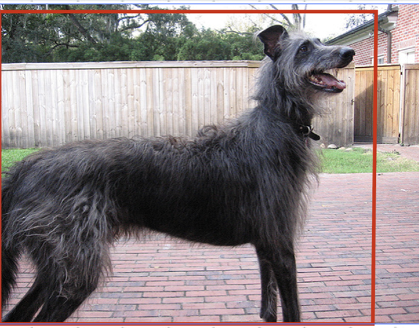
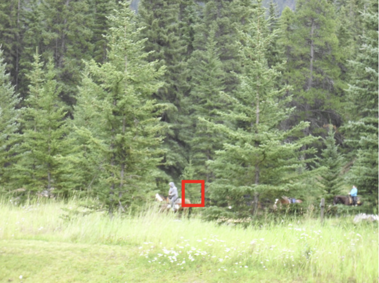
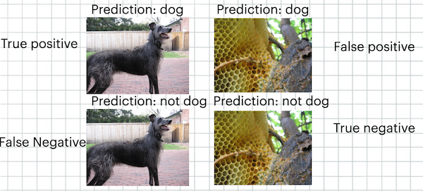
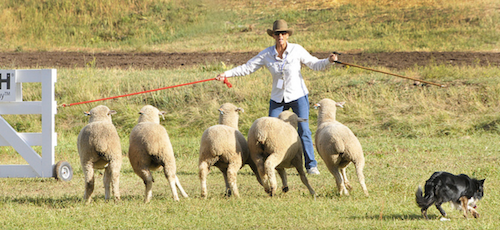
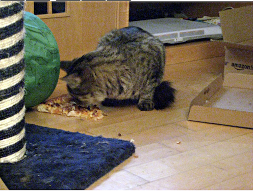
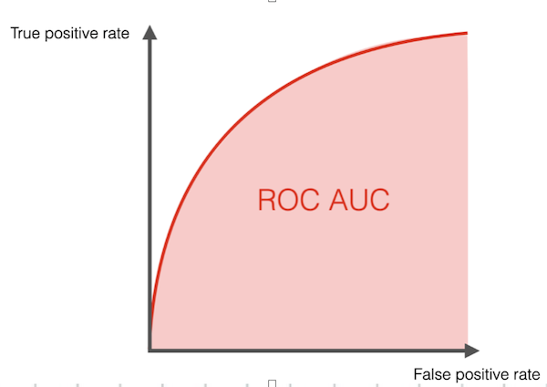
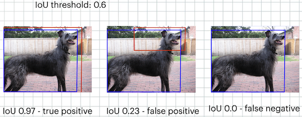

The post is also available as [video](https://youtu.be/fK4liUaT14w)  

This post introduces a new task in computer vision - "object detection". It talks about CoCo dataset, famous object detection dataset that still has an ongoing challenge in 2023; and the mAP metric - the metric used to assess model quality in object detection.
## From object classification to localization
One of the simpler analogues of object detection is called "object localization". That is, given a picture of an object, predict the *bounding box* for this object; but assume that there is always exactly 1 object in the picture. More formally, we want the model to predict 4 numbers: x, y, w, h - corresponding to x,y coords of the upper left corner of the bounding box, and its height and width. Good thing about this is that we can adopt one of our previous models to do that. Before, we had a model that could output 1000 numbers corresponding to class probabilities:  
   
We can simply swap the final layer of the model into something that will output 4 numbers - x, y, w, h:  
   
We'll also need to swap the loss from CrossEntropy - something that can be used for class predictions and probabilities - to MSE, something that can compare any numbers:  
$$MSE = \sum (y_i - y^{pred}_i)^2$$
Here, $y_i$ is the true label (a number for size and coordinates of the bounding box) and $y^{pred}_i$ is the predicted label. We sum over all 4 numbers x, y, w, h and over all image examples.   
Even such a simple solution unlocks a lot of opportunities in CV. We can, for example, predict some important waypoints in human's face instead of bounding box coordinates:  
   
And using them, calculate head orientation and use that to draw something fun on top of the face, for example, a hat. This approach was used in Snapchat Camera - an app that let's you add cool filters and effects to your camera pictures. Sadly, it was discontinued in 2023.  
In the same way, we can do pose estimation:  
   
That might be useful for analysing football statistics, for example. The same approach will work provided that:  
- We need to output a fixed number of predictions. Say, coordinates for 8 points on a face
- We have training data with true labels for these predictions, i.e., data with face or pose coordinates.  
## Object detection. CoCo dataset
In case of object detection, we need to do the same - output bounding box size and coordinates, but now there can be many or no objects in the picture. The most famous dataset for this task is [CoCo](https://cocodataset.org/#home), introduced in [this](https://arxiv.org/pdf/1405.0312.pdf) paper. Main difference with [ImageNet](https://www.image-net.org/) dataset is the style of images themselves. In ImageNet, most of the images have just 1 object in the picture, sometimes 2 or 3. Most of the images contain so called "canonical representations of images" - pictures taken from the front, with the object being in the center and not obstructed by anything.  
   
In constrast, in CoCo there are all sorts of images. You can take a look at examples [here](https://cocodataset.org/#explore). Objects themselves are much simpler - only 80 classes that should be easily understandable by a child: person, car, dog and so on. But they can be taken from unusual angles or partially obstructed. Because of this, it is also much more challenging. [This](https://paperswithcode.com/sota/object-detection-on-coco) website has a graph of all past state of the art models on this dataset. In 2023, the best model called "Co-DETR" achieves 66 mAP (more about the metric later), which roughly corresponds to 2 out of 3 correct predictions with matching bounding box.  
The dataset is also significantly smaller than ImageNet: 120k images weighing around 20gb. It makes it easier to train models on it. Main reason for this is that it is much harder to get labels for it - apart from classes, CoCo has bounding box coordinates, object segmentation data (which pixels belong to which object), text description of every image and sometimes pose estimation coordinates as well.   

The CoCo challenge is still active in 2023, and newer submissions keep drastically improving detection quality every year.  
## mAP metric
mAP metric consists of 2 basic components - IoU and AuC.
### IoU metric
IoU stands for "intersection over union", and it measures the match between predicted and ground truth bounding box. To understand why it is needed, look at these 2 images with roughly equal MSE loss:  
   
   
In the first image, the "error" in bounding box location of about 5% of image size is not that noticable because the object itself is big. In the second image, the same 5% offset means that predicted bounding box doesn't even contain any part of the object.   

IoU calculates intersection between predicted and ground truth bounding box and divides it by a union. Perfect match corresponds to IoU of 1.0; if the predicted bounding box doesn't contain the object, IoU is 0.0.   
### Confusion matrix
When dealing with classification, different sorts of errors and correct results might mean different things.  

   

We speak of 4 outcomes: 
- True positive - there was a dog and we correctly identified that there is a dog
- True negative - there was no dog and we correctly identified that there is no dog
- False positive - these is no dog, but model predicted that there is a dog
- False negative - there is a dog, but the model failed to identify it.   

These outcomes might have different importance in different domains. For example, for a self driving car, a "false positive" in detecting an obstacle in front of the car - detecting something that is not there - will cause "phantom breaking". Inconvenient and dangerous, but not fatal. False negative - not detecting an obstacle - will cause a crash. 
### AuC metric
In reality, models do not predict that "something is definitely there". Instead, they output a probability of detection - a number from 0.0 to 1.0 - and it is up to us to decide on the threshold.  
   
For this picture the model might decide that there is a dog with 64% probability. In some other image, the model might be less sure when detecting a dog, and output something with probability of, say, 35%:  
   
Finally, in this image, the model might be really unsure and predict that it is a dog with 50% probability, even though there is no dog:  
   
 If we choose the "detection threshold" at 60%, we correctly identify dog in the first picture, but not in the second. In this case, "true positive rate" for the class "dog" is 0.5; if we choose the threshold at 30%, we correctly identify both dogs, but generate a false positive in the third picture, leading to false positive rate of 1.0. For a given dataset, we can vary the threshold of the model, and plot the curve of true positive rate vs false positive rate:  
    
 Lower left corner corresponds to a threshold of 100%: we are extremely strict when trusting the model, meaning that we do no "false positive" mistakes, but make fewer positive predictions overall, missing a lot of "real" dogs. Upper right corner corresponds to a 0% threshold: we are extremely trusting with the model; we took for word all its "dog" predictions, leading to a lot of images with phantom dogs appearing in them (high FP rate). But we also haven't missed a single real dog.  

 AuC, or "Area under the Curve", measures how well the model does overall for all possible thresholds. Ideal classifier will have auc of 1, and the "curve" will look just like a straight vertical line. Random classifier will have auc of 0.5, and the "curve" will look like a diagonal line.  
 ### Combining AuC and IoU. mAP metric
   
To combine IoU and AuC, we can choose a certain "threshold" of IoU under which we consider the bounding box prediction to be correct. So now we want the model to predict both the class and the bounding box; if the class is correct, but the bounding box is too sloppy, and resulting IoU is below threshold, we consider it as a false positive prediction. 
mAP metric iterates over several such IoU thresholds, and computes AuC for each such threshold and for every class in the dataset. It is the primary metric used to compare models on CoCo dataset.  
Main reason why we need to have multiple IoU thresholds is to capture improvement in the predictions of real models. Having just one threshold at, say, 0.99, will mean that most of the current models will fail to predict correct bounding boxes, resulting in a score of 0.0. If we had just one threahold at, say, 0.5, then improvement of the actual bounding box prediction will not be captured by the metric - because IoU of "0.5" is still good enough. Having multiple thresholds allows us to capture differences in real, non-perfect models, ranking models with more precise bounding box predictions higher than others. mAP of 1.0 would correspond to 100% correct predictions with exactly matching bounding boxes.
## Up next
In the next post, we are going to discuss YOLO (you only look once) algorithm for object detection. It is currently one of the most performant algorithms, making it really useful in applications requiring real time object detection: self driving cars, robotics and so on. It is not, however, the most precise one.
