The content is also available as [video](https://youtu.be/BIb5xmHmzTw)
## Intro
In the previous [post](https://github.com/adensur/blog/blob/main/computer_vision_zero_to_hero/09_object_detection_task/README.md), we talked about object detection as a task. Today, we will talk about YOLO - one of the most popular algorithms at the moment for object detection.
## Architecture
When we were talking about image recognition, we used network architecture similar to this:  
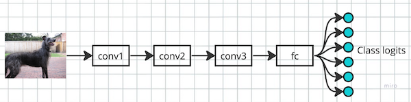   
We take an image, pass it through a bunch of convolutions, and output a fixed number of "logits" that can be then converted to class probabilities. For [coco](https://cocodataset.org/#home), that would be 80 outputs.  
To repeat the same for object localization (i.e., drawing a bounding box, but considering only one object in the picture), we can just "swap" the head of this network to output 4 numbers instead - corresponding to x, y, w, h - coordinates and width+height of the bounding box:  
   
This will work, as long as the number of outputs we require is fixed. We will also need to change the loss from CrossEntropy to MSE to solve regression problem.  
Now, what can we do if there can be a variant number of objects in the picture? One, three, thousand, or no objects at all?   
YOLO solves this in the following way. It outputs a fixed number of "objects", around 10000:  
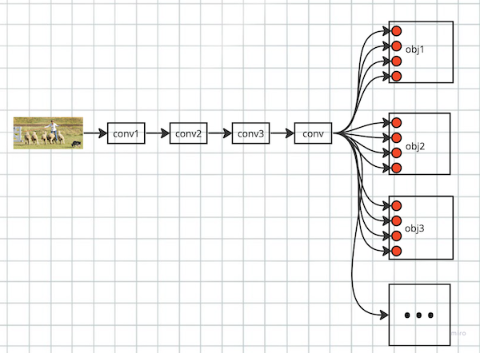  
Now we need to solve 2 problems:  
- How do we tell which output corresponds to which object?
- What do we do if the picture contains less then 10000 objects, say, 1 or 0?
### How do we tell which output corresponds to which object?
YOLO superimposes a grid on top of an image. YOLOv5 uses 80x80 grid. Each output of the network is connected to 1 grid cell, and that grid cell is responsible for detecting just that object whose center (precise center of the bounding box) happens to be in that cell:  
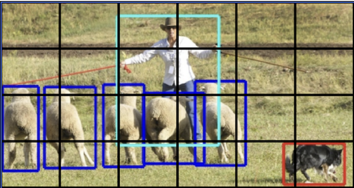  
Each "object output" of the model outputs 85 numbers: 80 class logits, 4 bbox coordinates x, y, w, h, and one "confidence" number (more on that later).   
This is an example of network architecture for this:  
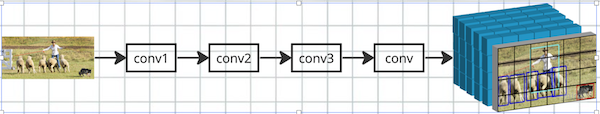  
We take an image, and pass it through a bunch of convolutions. Final output, a cube of 80x80x85 (80x80 grid + 85 predictions per grid cell) is also obtained with convolutions; there is no fully connected layers the network.  
Couple of clarifications about how this works:
- Each grid cell output "sees" the entire image. This is contrary to sliding window approach, for example, where we apply an image recognition model to each of the grid cells to check if there is an object there.  
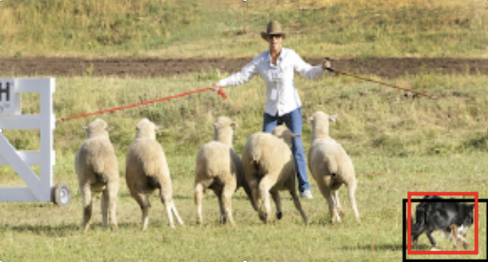  
    In this case, the grid cell output responsible for the bottom right corner, containing "dog", actually sees the entire image and can use its context for the prediction. This is the consequence of using a deep model with convolutions; single 3v3 conv layer has 3x3 receptive field; second 3v3 conv layer on top of that will increase the receptive field to 5v5; after lots of layers, each "pixel" or "grid output" of the layer will effectively "see" the entire input image, thanks to large receptive field
- An object can be bigger than the cell  
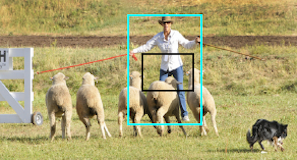  
    We only require that the center of the object lies within the cell; height and width can be arbitrary. Thanks to the fact that each cell output "sees" the entire image, it should have no trouble detecting an object that is bigger than the cell
- YOLO solves regression problem for the bounding boxes  
    This means that bbox prediction doesn't have to align with the grid in any way; the model is able to predict precise coordinates and size of the bbox. This is contrary to "sliding window" approach or the first stage of regional proposal network, that outputs some "crude" discretized bounding boxes.
- YOLO is fully convolutional, meaning that for each output cell, the convolution kernel parameters are reused.
    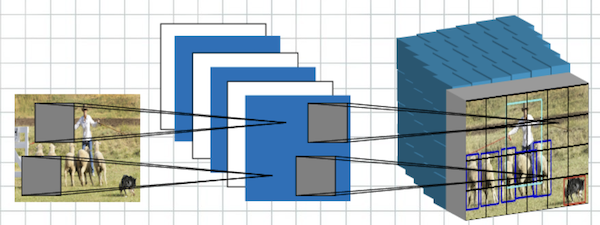  
### What do we do if the picture contains less then 10000 objects, say, 1 or 0?
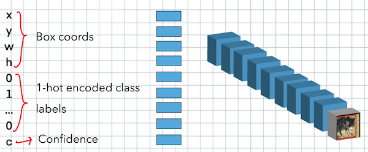  
That's where confidence comes in handy. That final number in the 85 cell output works like this:
- If there is no object in the cell, it has to output 0
- If there is an object in the cell, it has to output the IoU between predicted and ground truth bounding box  

First condition allows the model to say that "there is no object in the cell". So for our image with the cowboy and 5 sheep and a dog, 80x80 grid will have 6400 cells, only 7 of them will have some object; other 6393 will output "no object". Other predictions - class probs and bbox coordinates - don't matter if confidence predicts that there is no object.  

The second condition will help with non-maximum suppression later.  
As the actual loss for this "confidence" prediction, we still use binary cross entropy. Note that it is slightly different to how we used it before. For class logits, the input to "ground truth" targets in BCELoss is a 1-hot encoded vector of zeroes or ones. Now, "ground truth" target is just one number, but it can be non-integer now. The math in [BCELoss](https://pytorch.org/docs/stable/generated/torch.nn.BCELoss.html) still works in such a case.  
## Training and inference
Now lets go one more time through the training and inference process to make sure we understand it.  
### Training
1. Take an image with annotated bounding boxes  
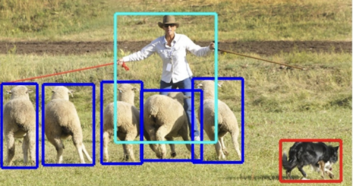  
2. Superimpose a 80x80 grid on top of it:  
  
3. Assign each ground truth object to a cell, based on coordinates of the bbox center  
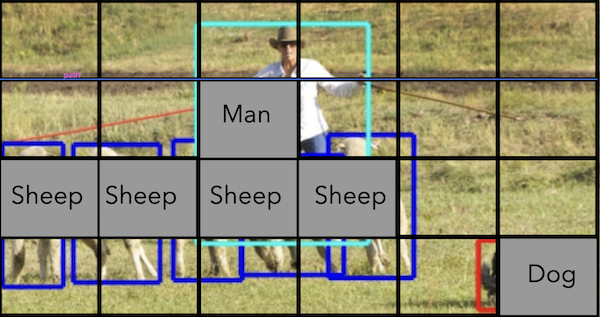  

At step 3, what will happen if two or more objects happened to be in the same cell? The same as passing 2 equal images, but with different labels, to an image classification model. In our case, 2 sheep got into the same cell. They will be passed as 2 separate training examples; the model always outputs 1 bbox per cell; so the first example will tell the model to predict the first sheep, the second example will tell the model to predict the second sheep. So gradient steps on both of these will be a bit conflicting, but it is still fine.  

Also, we want only 1 grid cell, the one that contains the center of the object, to recognize that object. But the object itself can be bigger than this cell. In the image above, we have parts of the human occupying neighbouring cells, but we require those cells to predict that there is no object. This is different to a famous CAPTCHA, for example, where users are asked to mark all cells containing parts of an object. In YOLO case, each cell has to predict IF there is an object in the cell whose center is precisely within the cell; if part of the object is in the cell, but the bbox center is not, the cell has to output "no object". This might be challenging in practice, causing several neighboring cells to generate false-positives.

### Inference
1. Compute 80x80x85 predictions, with class logits, bbox coords, and confidence for each cell  
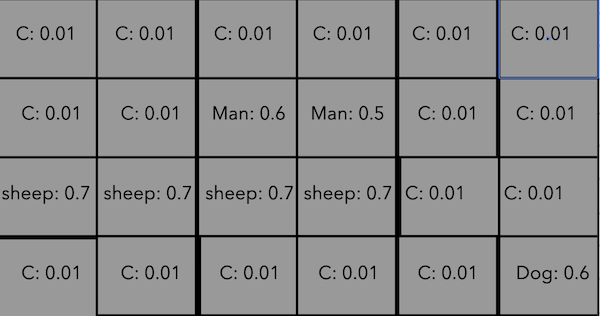  
2. Filter out predictins with confidence below threshold. YOLOv5 uses `0.25`  
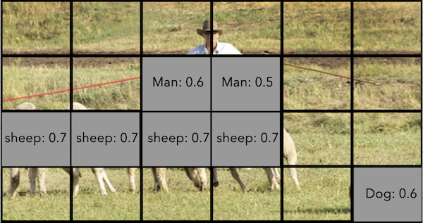  
This is how bbox predictions will look like after filtering:  
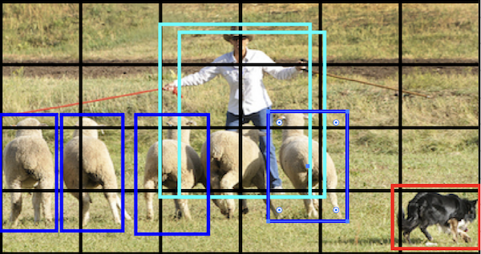  

Note how we couldn't detect one of the sheep, because 2 sheep happened to be in the same grid cell; also, 2 neighboring cells detected the same man with slightly different bounding box, creating a duplicate.  
3. To filter out duplicates, we use non-maximum suppression (NMS): filter out predicted bounding boxes for the same class with IoU more than 0.45
  
To choose which prediction to keep, and which to filter out, we rely on the confidence score: we filter out predictions with lower confidence. This is why our confidence is trained to predict IoU between prediction and ground truth bounding box. This let's us keep the more precise bounding box when filtering out the duplicate.  
However, NMS might have false negatives:  
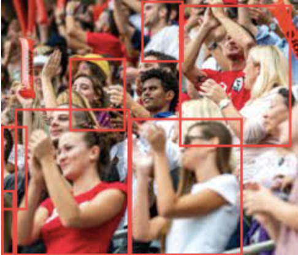  

In this example of a crowd of people, a lof of ground truth objects will have huge overlap between bounding boxes. They will be filtered out by NMS, even if the model was able to correctly identify them. This is one of the major problems with YOLO: it will fail to correctly recognize objects in case there are many of them cramped together in a tight space, with overlapping bounding boxes - think of flocks of birds, crowds of people, etc.  

## Anchor boxes
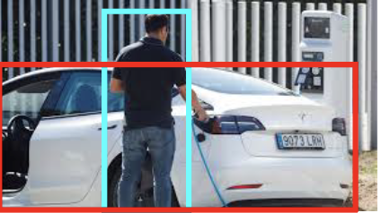   
Sometimes, the image will have 2 or more objects with completely different shapes that would still end up in the same grid cell. To deal with that, YOLO has a concept of "anchor boxes". 
Anchor boxes are priors of a certain scale and aspect ratio that can be represented as just two numbers - $w_a$ and $h_a$, width and height of the anchor. During training, we match ground truth objects to anchor boxes with the following condition:
$$\frac{1}{4}<=\frac{w}{w_a}<=4$$
$$\frac{1}{4}<=\frac{h}{h_a}<=4$$
Here, $w$ and $h$ are height and width of the object, and $w_a$ and $h_a$ are heights and widths of the anchor box. Note that the condition is quite relaxed, allowing x16 variance in the aspect ratio of the objects that are matched to the same anchor. Also note that apart from aspect ratio, the anchor box controls the size of the object: some anchors will only match small objects, while others will only match big objects. The same ground truth object can match to more than 1 anchor boxes at once. In this case, 2 independent training examples will be generated.  

The object might also not match any anchor boxes. This is a huge problem for YOLO. To deal with that in CoCo competition, YOLO does a preliminary data analysis to determine if current set of anchor boxes is able to fit most of the known objects. In real life projects, this creates a potential vulnerability of the algorithm, allowing someone to generate a specific example that will be undetectable by YOLO.  

The model will now output 80x80x3x85 predictions: 3 anchor boxes for each of 80x80 grid cells, 85 numbers per each cell.  
Anchor boxes serve 2 purposes:   
- Allows detecting more than 1 object per grid cell
- Allows detector heads to "specialise", learning to detect only objects of limited shape and scale
## Loss
YOLO has 3 main components in the loss: regression (for bounding box predictions), classification (for object classification), and "objectness"
### Bounding box regression
One way to predict bounding box coordinates x, y, w, h is to use MSE loss. IoU, the metric used to measure accuracy of bbox predictions and described in detail in previous [post](https://github.com/adensur/blog/blob/main/computer_vision_zero_to_hero/09_object_detection_task/README.md), is not differentiable, thus cannot be used as a loss function. YOLOv5 uses the variant of IoU called [CIoU](https://arxiv.org/pdf/2005.03572.pdf), that is differentiable and converges to the same result.
### Object classification
YOLOv5 uses classical Cross Entropy loss between predicted logits (80 numbers) and true labels for each object. Some of YOLO variants also use [Focal Loss](https://arxiv.org/pdf/1708.02002v2.pdf) to give more weight to hard, misclassified examples.
### Objectness
The model predicts confidence score for every grid cell (and every anchor). Confidence of 0 denotes "no object", confidence above 0 should predict the IoU between predicted bounding box and ground truth: how confident the model is in what it is predicting.   
Objectness loss is a [BCELoss](https://pytorch.org/docs/stable/generated/torch.nn.BCELoss.html) (binary cross entropy) between computed IoUs and predicted confidence. As already mentioned above, this is a slight generalization of BCELoss for the case when true labels are not just 0 and 1s, but can be non-integers as well.  
Objectness loss is the only loss that penalizes the model for false positives, or "phantom" objects in the background. For a 80x80 grid with 3 anchors, the model outputs predictions for 19200 grid cells. In our cowboy image example, only around 7 of these (not counting objects matching multiple anchors, or 2 or more objects getting in the same cell) will have a ground truth object in them; first two terms of loss - bbox regression and object classification - is always zero for the cells that don't have a ground truth object. Which means that first 2 loss terms are only defined for 7 our of 19200 cells; other 19193 cells will rely on objectness loss to make sure the model doesn't predict phantom objects.  
## Results, pros and cons
[This](https://paperswithcode.com/sota/object-detection-on-coco) is the plot of all the history of submissions to the CoCo object detection challenge. Most recent YOLO submission achieves 56 mAP score, with current leader (in early 2024, co-DETR model) being at 66 mAp. So yolo is behind SOTA models in terms of accuracy, but is still quite good, enough for many practical applications.  
Pros:
- Speed. Yolo is a lightweight, single-stage detector, and it was the first model to achieve real-time object detection, which is invaluable in the applications like Robotics or Self Driving Cars.   
    It is much faster then previous approaches, such as sliding window or region proposal networks, that required several inference steps of the model itself.  
    More modern, transformer-based detectors such as DETR also do inference in single stage, but the model itself is much heavier, making it slower than YOLO.   
    YOLO models are also really light weight: the heaviest model weighs 200mb and doesn't require many resources for inference, which makes it really valuable for mobile and embedded applications  

Cons:  
- Accuracy. Apart from being less accurate then current SOTA on average, YOLO models have problems with some specific image types: lots of objects cramped together in narrow space, with a lot of overlap between bounding boxes. Think of flocks of birds or crowds of people
- Complexity and requirement of prior knowledge   
    The code for YOLO is quite complex, with all the handling of grid and anchor boxes. In addition, YOLO relies on some prior knowledge of the data, to match anchor boxes, for example. This means that you can't just take the model and train it on any data you want, you need to do some preliminary data analysis first, and tune the model depending on that   
## Next up
In my next post, I will take a deeper look into YOLOv5, reading the source code and reproducing one of the benchmark myself.
