The content is also available as [Video](https://youtu.be/LYBbU67dOtw)  

This post will go through 2 main topics:  
- How to train your own YOLO from scratch
- How the source code of YOLO works   

[Previous](https://github.com/adensur/blog/blob/main/computer_vision_zero_to_hero/10_yolo_object_detection/Readme.md) post talked about the algorithm itself in detail, and [this](https://github.com/adensur/blog/blob/main/computer_vision_zero_to_hero/09_object_detection_task/README.md) post talked about the detection task in general, the mAP metric and the COCO dataset.
## How to train your own yolo from scratch
This is actually the easy part. The company behind YOLOv5, Ultralytics, keeps all the documentation up to date, and the process of using the model is really simple. The quickstart [page](https://docs.ultralytics.com/yolov5/quickstart_tutorial/) has instructions on how to start training to reproduce the benchmark, i.e., train a fresh model on the COCO data, without relying on pretrained models stored elsewhere:  
```bash
git clone https://github.com/ultralytics/yolov5  # clone repository
cd yolov5
pip install -r requirements.txt  # install dependencies
python train.py --data coco.yaml --epochs 300 --weights '' --cfg yolov5n.yaml  --batch-size 128 # train the model from scratch
```
We clone the repo, install requirements, and run the script with just a few parameters.   

The script downloads the training data: images themselves are downloaded from official COCO [website](https://cocodataset.org/#download); labels are downloaded from ultralytics hosting. This was done because original COCO labels are in a bit different format, so it's easier to download them in the proper format instead of doing the conversion every time. The conversion tool is available [here](https://github.com/ultralytics/JSON2YOLO). The entire COCO dataset weighs about 25gb, and, it turnes out, it is enough to train a real life object detector. Other datsets, like Imagenet-1k or its bigger analogue "Imagenet" with 1tb of data and 22k classes - turned out to not benefit much on top of data we have in COCO, mainly because the images present there are too canonical, containing only objects in the center of the image, facing directly at the camera, and not obstructed by anything.  

The script is totally self contained: it will download the data, perform some checks, and run the training. On a good single gpu, smaller model (like `yolov5n`) can be trained in a day, while bigger models might take up to a week.  

You might bump into problems with GPU memory. In such case, just reduce the batch size.   

By default, the script will also cache the entire dataset in memory, thus requiring at least 20gb of ram. You can disable that by passing `--cache ""`, though it will make training much slower.
## Reading the source code
We will go through the following sections:  
- The tools I use to read the source code and understand what is going on
- Reading the source code for loading and transforming the data
- Model architecture
- Loss
- Training loop
### The tools to read the source code
I use 2 main tools: `pdb` and `jupyter notebook`.  

`pdb` is a tool that allows running any python script in interactive mode, setting breakpoints in any code location, printing out intermediate variable values and so on. To start using it, we import the library and set a first breakpoint in the very beginning of the training, in `train.py`: 
```python
import pdb
# ...
# line 77
def train(hyp, opt, device, callbacks):  # hyp is path/to/hyp.yaml or hyp dictionary 
    pdb.set_trace()
```
The next time I run the script (with the same parameters), it will stop at this location, giving me control. These are the commands to use to navigate further:  
```python
p variable # print out the content of the variable
b train.py:210 # set another break point on a certain line in a certain file
c # continue until next breakpoint
n # step over to the next line
```
Second, I set up a jupyter notebook right at the root of the same repository. [This](./sandbox.ipynb) is the final notebook from the post, you can download it and copy to the root of YOLOv5 repository. This way, you can copy some code chunks directly from the source code, and all the imports that use other files from the repo will still work.  
Next, I define some imports and other useful functions in the notebook:  
```python
coco_idx_to_label = {0 :"person",
1 :"bicycle",
2 :"car",
3 :"motorcycle",
4 :"airplane",
5 :"bus",
6 :"train",
7 :"truck",
8 :"boat",
9 :"traffic light",
10: "fire hydrant",
11: "stop sign",
12: "parking meter",
13: "bench",
14: "bird",
15: "cat",
16: "dog",
17: "horse",
18: "sheep",
19: "cow",
20: "elephant",
21: "bear",
22: "zebra",
23: "giraffe",
24: "backpack",
25: "umbrella",
26: "handbag",
27: "tie",
28: "suitcase",
29: "frisbee",
30: "skis",
31: "snowboard",
32: "sports ball",
33: "kite",
34: "baseball bat",
35: "baseball glove",
36: "skateboard",
37: "surfboard",
38: "tennis racket",
39: "bottle",
40: "wine glass",
41: "cup",
42: "fork",
43: "knife",
44: "spoon",
45: "bowl",
46: "banana",
47: "apple",
48: "sandwich",
49: "orange",
50: "broccoli",
51: "carrot",
52: "hot dog",
53: "pizza",
54: "donut",
55: "cake",
56: "chair",
57: "couch",
58: "potted plant",
59: "bed",
60: "dining table",
61: "toilet",
62: "tv",
63: "laptop",
64: "mouse",
65: "remote",
66: "keyboard",
67: "cell phone",
68: "microwave",
69: "oven",
70: "toaster",
71: "sink",
72: "refrigerator",
73: "book",
74: "clock",
75: "vase",
76: "scissors",
77: "teddy bear",
78: "hair drier",
79: "toothbrush",}
```
This is just a mapping from class idx to class labels.
```python
import hashlib
import torch
from utils.dataloaders import create_dataloader
from utils.general import (LOGGER, TQDM_BAR_FORMAT, check_amp, check_dataset, check_file, check_git_info,
                           check_git_status, check_img_size, check_requirements, check_suffix, check_yaml, colorstr,
                           get_latest_run, increment_path, init_seeds, intersect_dicts, labels_to_class_weights,
                           labels_to_image_weights, methods, one_cycle, print_args, print_mutation, strip_optimizer,
                           yaml_save)
from torch.utils.data import DataLoader, Dataset, dataloader, distributed
from tqdm import tqdm
import matplotlib.pyplot as plt
import math
from multiprocessing.pool import Pool, ThreadPool
import os
from pathlib import Path
from utils.loss import ComputeLoss
from itertools import repeat
import random
import torchvision
from utils.general import (DATASETS_DIR, LOGGER, NUM_THREADS, TQDM_BAR_FORMAT, check_dataset, check_requirements,
                           check_yaml, clean_str, cv2, is_colab, is_kaggle, segments2boxes, unzip_file, xyn2xy,
                           xywh2xyxy, xywhn2xyxy, xyxy2xywhn)
from utils.augmentations import (Albumentations, augment_hsv, classify_albumentations, classify_transforms, copy_paste,
                                 letterbox, mixup, random_perspective)
import numpy as np
from models.yolo import Model
```
Do all the imports. Some of this stuff imports local files defined in YOLOv5 repo itself.
```python
def show_image(image, label=None):
    if label != None:
        boxes = torchvision.ops.box_convert(boxes=label[:,2:] * 640, in_fmt="cxcywh", out_fmt="xyxy")
        classes = []
        for obj in label:
            class_idx = int(obj[1].item())
            classes.append(coco_idx_to_label[class_idx])
        image = torchvision.utils.draw_bounding_boxes(image, boxes, labels=classes, colors="red", width=2, font_size=400)
    image = image.permute(1, 2, 0)
    plt.imshow(image.squeeze())
    #plt.title(f'Label: {label}')
    plt.show()
```
I also define a `show_image` func that draws the contents of a tensor and annotates the bounding boxes.
### Loading and transforming the data
To be able to create the dataloader, we need some variables:
```python
train_path = "/Users/maksimgaiduk/repos/datasets/coco/train2017.txt"
val_path = "/Users/maksimgaiduk/repos/datasets/coco/val2017.txt"
imgsz = 640
batch_size = 4
WORLD_SIZE = 1
gs = 32 # grid size, aka max stride
single_cls = False
hyp = {
    "lr0": 0.01,
    "lrf": 0.01,
    "momentum": 0.937,
    "weight_decay": 0.001,
    "warmup_epochs": 3.0,
    "warmup_momentum": 0.8,
    "warmup_bias_lr": 0.1,
    "box": 0.05,
    "cls": 0.5,
    "cls_pw": 1.0,
    "obj": 1.0,
    "obj_pw": 1.0,
    "iou_t": 0.2,
    "anchor_t": 4.0,
    "fl_gamma": 0.0,
    "hsv_h": 0.015,
    "hsv_s": 0.7,
    "hsv_v": 0.4,
    "degrees": 0.0,
    "translate": 0.1,
    "scale": 0.5,
    "shear": 0.0,
    "perspective": 0.0,
    "flipud": 0.0,
    "fliplr": 0.5,
    "mosaic": 1.0,
    "mixup": 0.0,
    "copy_paste": 0.0
}
cfg = "/Users/maksimgaiduk/repos/yolov5/models/yolov5n.yaml"
cache = None
rect = False # rectangular training
LOCAL_RANK = -1
workers = 8
image_weights = False
quad = False
seed = 0

# device
device = (
    "cuda"
    if torch.cuda.is_available()
    else "mps"
    if torch.backends.mps.is_available()
    else "cpu"
)
```
I copy them out from `pdb` at `train.py:210` - this makes sure the dataloader we create is exactly the same as the one being used in the script.
```python
train_loader, dataset = create_dataloader(train_path,
      imgsz,
      batch_size // WORLD_SIZE,
      gs,
      single_cls,
      hyp=hyp,
      augment=True,
      cache=cache,
      rect=rect,
      rank=LOCAL_RANK,
      workers=workers,
      image_weights=image_weights,
      quad=quad,
      prefix=colorstr('train: '),
      shuffle=True,
      seed=seed)
```
Finally, we initialize dataloader and dataset. Dataset is an object that "contains" all the images and labels. It doesn't necessarily cache all the images in memory, but it still "knows" how to retrieve every image. You can access elements of the dataset with a simple subscript operator:  
```python
elem = dataset[0] # index from 0 to len(dataset)
```
In our case, `elem` actually contains 4 elements - image, labels, path to the image and an unused one.  
```python
%matplotlib inline
x1, y1, path, _ = dataset[0]
print(x1.shape) # 3x640x640
print(y1.shape) # n_obj*6: 
print(path)
show_image(x1, y1)
```
```
torch.Size([3, 640, 640])
torch.Size([32, 6])
/Users/maksimgaiduk/repos/datasets/coco/images/train2017/000000000009.jpg
```
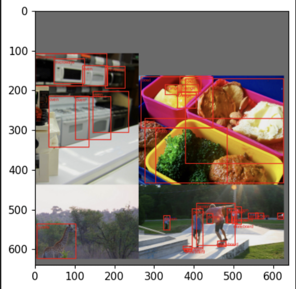  
The image is always 3x640x640: it has 3 colour channels, and all the transforms applied make sure that the resulting training image will be exactly 640x640 pixels, even if the original image was not.   
The labels `y1` have dimensions of `n_objects`x6, `n_objects` being the number of objects in the resulting image or in a batch (in case of dataloader). 6 stands for image_id (idx of the image within a batch), class idx (0 - person, 6 - train, and so on) and 4 bounding box coordinates.  

`path` contains the path to the original image, so that we can see how it looks like before all the data augmentations.  

And this is how we can take a look into what a dataloader returns:  
```python
for X, y, paths, _ in train_loader:
    break
# y is of shape number_objs*6
# 6: image_index, class_index, x, y, w, h
print(X.shape)
print(y.shape)
print(paths[0])
show_image(X[0], y[:9])
```
```
torch.Size([4, 3, 640, 640])
torch.Size([43, 6])
/Users/maksimgaiduk/repos/datasets/coco/images/train2017/000000152397.jpg
```
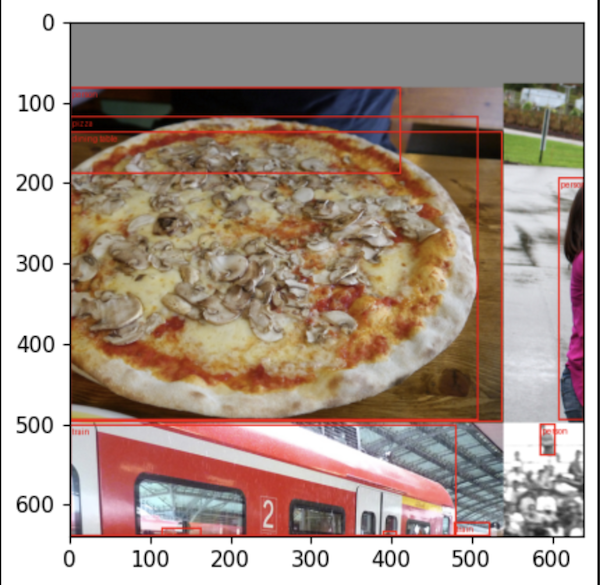  
Dataloader is an iterable that loads data from the dataset. It takes care of batching (combining several images into a batch), shuffling (generating random indices for each batch so that batch will consist of different images on every epoch), data prefetching (loading and transforming some batches in advance, so that once the GPU is done with backprop on the current batch, the next batch is ready).   

Now let's go over the data augmentation techniques used here.
### Data augmentation
*Mosaic*
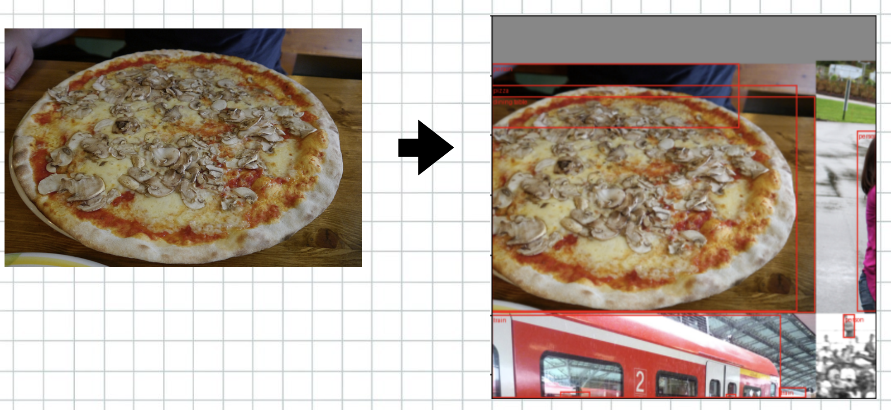  
We've seen examples of that already. This is probably the heavies image transform in YOLO: it takes a desired image, 3 more random images from the dataset, and clips them into a single mosaic. We can see from the example that some of the objects, like the person on the upper right image, got almost completely clipped off, but we still require the model to be able to detect that during training.  

*Translate*  

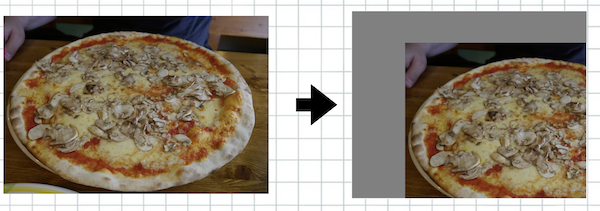   
Translate "shifts" the image in random direction - up or down and left or right - leaving a gray area in one corner and clipping off the image in another corner. This is needed to make sure that the model has *translation symmetry*: pizza shifted to the right is still a pizza. Note that convolutions should have this by default; however, since we use padding in the model, appending zero pixels around the border of the image, the convolution might be able to determine if this particular piece of image is located near the border or not. Translation augmentation helps us randomize the process a little bit, making the task harder for the model. Although in RGB, zero pixel will correspond to black colour, because of data normalization - shifting all values so that total mean is zero - zero pixels will correspond to gray colour.  

In YOLOv5, every image is augmented with `Translate` by shifting up to 50% to either side randomly.  

*Scale*  
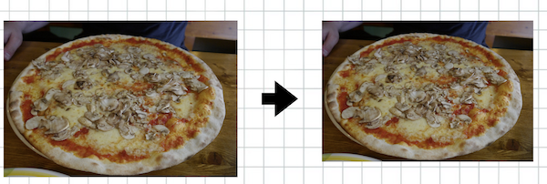   
Scale makes the image a bit smaller or larger, kind of like you would have if you would resize a photo on your phone. It is almost unnoticable to human eye, but the actual pixel values are completely different. YOLO scales images up or down by up to 10% of total scale, randomly.  

*RandomResizedCrop*  
   
We've seen this one when training [ResNet](https://github.com/adensur/blog/blob/main/computer_vision_zero_to_hero/08_resnet_imagenet/Readme.md) model. This transform selects a random area in the image, thus cropping out some parts of the image; and then further resizes that part, changing the aspect ratio a little bit.  

*Blur*  
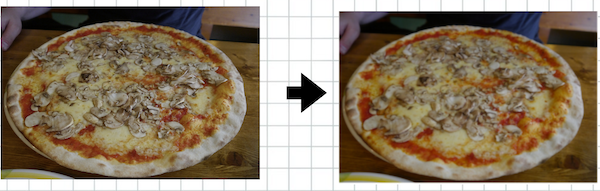   
Applied with probability of 1%.  

*ToGray*  
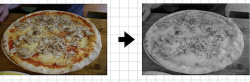   

Applied with probability of 1%.   

*CLAHE*   
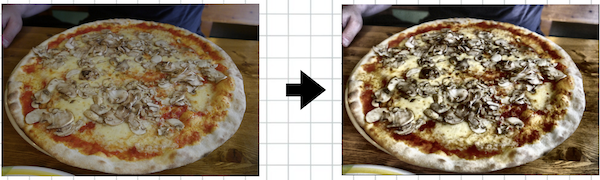   
[CLAHE](https://en.wikipedia.org/wiki/Adaptive_histogram_equalization#Contrast_Limited_AHE) stands for "Contrast Limited Adapted Histogram Equalization". It is an image quality enhancement technique that can be used to restore old photos, for example. It changes the values of the colours to increase the contrast of the picture without changing the meaning.  
Applied with probability of 1%.  

*augment_hsv*  

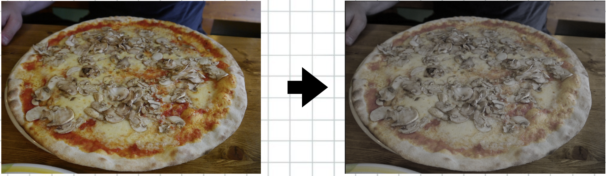   
This is YOLO's own colour augmentation technique that changes the values for the colours randomly.  
*fliplr*   

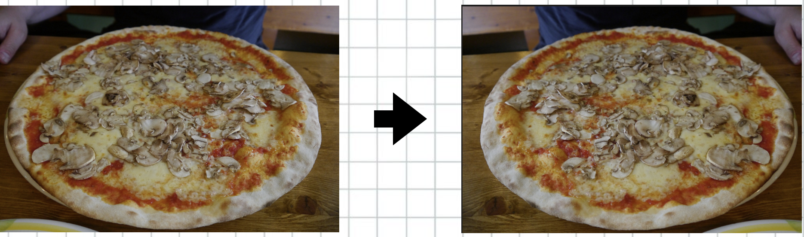   
Flips the image horizontally with the probability of 50%. 
### The source code for transforms
We can see the reference to `create_dataloder` function in [train.py](https://github.com/ultralytics/yolov5/blob/ad97dc6a6d8b4384eb7224e98c8584ecd8bcfd2a/train.py#L248). [Here](https://github.com/ultralytics/yolov5/blob/ad97dc6a6d8b4384eb7224e98c8584ecd8bcfd2a/utils/dataloaders.py#L154) is the definition of that function. Mainly, it defines a `LoadImagesAndLabels` dataset class, and a loader on top of that that deals with buffering, shuffling etc.  
Main logic behind image transforms and parsing the format of the data lives in the dataset class. It is defined in the same [file](https://github.com/ultralytics/yolov5/blob/ad97dc6a6d8b4384eb7224e98c8584ecd8bcfd2a/utils/dataloaders.py#L496).   
```python
class LoadImagesAndLabels(Dataset):
    # ...
    def __init__():
        # ...
    def __len__(self):
        # ...
    def __getitem__(self, index):
        # ...
```
This class inherits from pytorch's `Dataset` class. It has 3 methods it needs to implement:  
- `__init__` method for construction. It handles data indexing: reading the header file that contains paths to all the image files; checking the labels and removing duplicates; saving cache
- `__len__`: returns the length of the dataset - number of examples it contains. This is just the number of image files indexed in step 1
- `__getitem__`: returns the example by index. At this point, we either load image from disk (using OpenCV lib, `cv2.imread()`), or load it from cache; and then perform a series of transforms.  

There are several places where image transforms are defined. First, in `__getitem__` method, we call the [load_mosaic](https://github.com/ultralytics/yolov5/blob/ad97dc6a6d8b4384eb7224e98c8584ecd8bcfd2a/utils/dataloaders.py#L734C39-L734C39). It is [defined](https://github.com/ultralytics/yolov5/blob/ad97dc6a6d8b4384eb7224e98c8584ecd8bcfd2a/utils/dataloaders.py#L830) in the same file. This is raw code that operates on images themselves (converted to numpy arrays), and it handles the logic of cropping the necessary part of the image, combining several images together, and updating the labels to correctly correspond to the bounding boxes in this new, mosaic image.   

Images are then transformed using [random_perspective](https://github.com/ultralytics/yolov5/blob/ad97dc6a6d8b4384eb7224e98c8584ecd8bcfd2a/utils/dataloaders.py#L876C25-L876C43) method. [Here](https://github.com/ultralytics/yolov5/blob/ad97dc6a6d8b4384eb7224e98c8584ecd8bcfd2a/utils/augmentations.py#L144) is the definition for that. It defines some image transformations using raw matrix operations. In this file, in default YOLO settings, only scale and translate operations are used.  
```python
# sample of code from random_perspective

# Rotation and Scale
R = np.eye(3)
a = random.uniform(-degrees, degrees)
# a += random.choice([-180, -90, 0, 90])  # add 90deg rotations to small rotations
s = random.uniform(1 - scale, 1 + scale)
# s = 2 ** random.uniform(-scale, scale)
R[:2] = cv2.getRotationMatrix2D(angle=a, center=(0, 0), scale=s)

# Translation
T = np.eye(3)
T[0, 2] = random.uniform(0.5 - translate, 0.5 + translate) * width  # x translation (pixels)
T[1, 2] = random.uniform(0.5 - translate, 0.5 + translate) * height  # y translation (pixels)

# combining all together
# Combined rotation matrix
M = T @ S @ R @ P @ C  # order of operations (right to left) is IMPORTANT
if (border[0] != 0) or (border[1] != 0) or (M != np.eye(3)).any():  # image changed
    if perspective:
        im = cv2.warpPerspective(im, M, dsize=(width, height), borderValue=(114, 114, 114))
    else:  # affine
        im = cv2.warpAffine(im, M[:2], dsize=(width, height), borderValue=(114, 114, 114))

```

Another set of transformations is used in the same `__getitem__` method, a bit below: [link](https://github.com/ultralytics/yolov5/blob/ad97dc6a6d8b4384eb7224e98c8584ecd8bcfd2a/utils/dataloaders.py#L771). [Here](https://github.com/ultralytics/yolov5/blob/ad97dc6a6d8b4384eb7224e98c8584ecd8bcfd2a/utils/augmentations.py#L31) is the source code for them. 
```python
T = [
                A.RandomResizedCrop(height=size, width=size, scale=(0.8, 1.0), ratio=(0.9, 1.11), p=0.0),
                A.Blur(p=0.01),
                A.MedianBlur(p=0.01),
                A.ToGray(p=0.01),
                A.CLAHE(p=0.01),
                A.RandomBrightnessContrast(p=0.0),
                A.RandomGamma(p=0.0),
                A.ImageCompression(quality_lower=75, p=0.0),
            ]  # transforms
```
It uses [Albumentations](https://albumentations.ai/) library - a popular framework for image transformations.  

Finally, we have some data augmentations defined directly in `__getitem__` [method](https://github.com/ultralytics/yolov5/blob/ad97dc6a6d8b4384eb7224e98c8584ecd8bcfd2a/utils/dataloaders.py#L783):  
```python
if random.random() < hyp["fliplr"]:
    img = np.fliplr(img)
    if nl:
        labels[:, 1] = 1 - labels[:, 1]
```
All the transformations described above use numpy arrays; `__getitem__` method converts numpy array to PyTorch tensor in the very end.
### Model architecture
Let's come back to our jupyter notebook now. Since we have initialized a dataloader and got our first image batch, we can now define a model and call it:
```python
model = Model(cfg, ch=3, nc=80, anchors=hyp.get('anchors')).to(device)
X = X.to(device).float() / 255 # image, converted to proper range
print(X.shape)
preds = model(X)
print(len(preds))
preds[0].shape, preds[1].shape, preds[2].shape
```
```
torch.Size([4, 3, 640, 640])
3
(torch.Size([4, 3, 80, 80, 85]),
 torch.Size([4, 3, 40, 40, 85]),
 torch.Size([4, 3, 20, 20, 85]))
```
YOLOv5 uses 3 grid scales "superimposed" on the image to determine which cell is responsible for detecting each object: 20x20 grid, 40x40 grid, 80x80 grid. It outputs 3 tensors corresponding to every grid scale. Let's go over these dimensions one by one:  
- `4`: the batch dimension
- `3`: anchor dimension. Model uses 3 anchors on every grid scale
- `20x20`, `40x40`, `80x80`: grid dimensions for different grid scales
- `85`: 4 bbox coordinates + confidence + 80 class logit predictions (COCO dataset has 80 classes)  

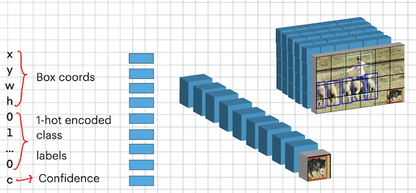  

And here are the examples of different scales, with anchors plotted on top:  

80x80:  
  
40x40:  
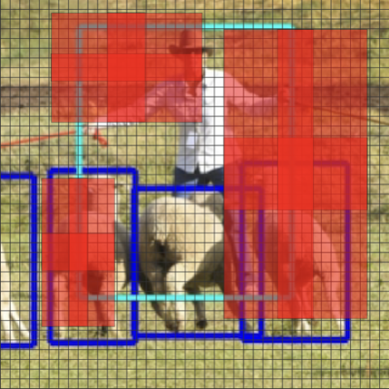  
20x20:  
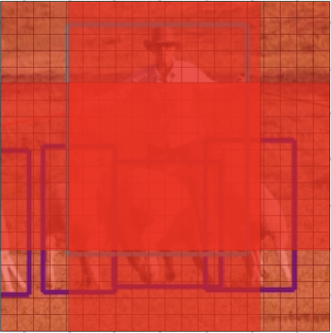  

In the example above, the grid and the anchors are plotted at real scale, as used in the model.  

The dense, red patch in the middle of the anchor corresponds to the anchor itself; the matching rule $\frac{1}{4} <= \frac{wh}{wh_a} <= 4$ allows objects up to 4 times bigger or smaller to match with that anchor, so the less dense red area around can also be thought of as effective anchor receptive area.   

As we can see from the image, the finest 80x80 grid uses smaller anchors that will only match really small objects on the picture. Objects missed in the finest and the middle grid scale will be matched in the 20x20 grid with the biggest anchors. The training script performs the anchor check in the beggining of the training to make sure that current anchors match most of the objects in the validation dataset (with theshold of 99.5%).  

Also note that the same object can match more than one anchor, thus motivating the network to detect the same object more than once. This is one of the reasons for the necessity of Non Maximal Suppresion (NMS) as a post processing step.  

Here is the definition of the model written in [yolov5n.yaml](https://github.com/ultralytics/yolov5/blob/ad97dc6a6d8b4384eb7224e98c8584ecd8bcfd2a/models/yolov5n.yaml) config file:  
```python
# YOLOv5 🚀 by Ultralytics, AGPL-3.0 license

# Parameters
nc: 80  # number of classes
depth_multiple: 0.33  # model depth multiple
width_multiple: 0.25  # layer channel multiple
anchors:
  - [10,13, 16,30, 33,23]  # P3/8
  - [30,61, 62,45, 59,119]  # P4/16
  - [116,90, 156,198, 373,326]  # P5/32

# YOLOv5 v6.0 backbone
backbone:
  # [from, number, module, args]
  [[-1, 1, Conv, [64, 6, 2, 2]],  # 0-P1/2
   [-1, 1, Conv, [128, 3, 2]],  # 1-P2/4
   [-1, 3, C3, [128]],
   [-1, 1, Conv, [256, 3, 2]],  # 3-P3/8
   [-1, 6, C3, [256]],
   [-1, 1, Conv, [512, 3, 2]],  # 5-P4/16
   [-1, 9, C3, [512]],
   [-1, 1, Conv, [1024, 3, 2]],  # 7-P5/32
   [-1, 3, C3, [1024]],
   [-1, 1, SPPF, [1024, 5]],  # 9
  ]

# YOLOv5 v6.0 head
head:
  [[-1, 1, Conv, [512, 1, 1]],
   [-1, 1, nn.Upsample, [None, 2, 'nearest']],
   [[-1, 6], 1, Concat, [1]],  # cat backbone P4
   [-1, 3, C3, [512, False]],  # 13

   [-1, 1, Conv, [256, 1, 1]],
   [-1, 1, nn.Upsample, [None, 2, 'nearest']],
   [[-1, 4], 1, Concat, [1]],  # cat backbone P3
   [-1, 3, C3, [256, False]],  # 17 (P3/8-small)

   [-1, 1, Conv, [256, 3, 2]],
   [[-1, 14], 1, Concat, [1]],  # cat head P4
   [-1, 3, C3, [512, False]],  # 20 (P4/16-medium)

   [-1, 1, Conv, [512, 3, 2]],
   [[-1, 10], 1, Concat, [1]],  # cat head P5
   [-1, 3, C3, [1024, False]],  # 23 (P5/32-large)

   [[17, 20, 23], 1, Detect, [nc, anchors]],  # Detect(P3, P4, P5)
  ]

```
The model is initialized in `train.py` script [here](https://github.com/ultralytics/yolov5/blob/ad97dc6a6d8b4384eb7224e98c8584ecd8bcfd2a/train.py#L190). [Here](https://github.com/ultralytics/yolov5/blob/ad97dc6a6d8b4384eb7224e98c8584ecd8bcfd2a/models/yolo.py#L201) is the source code for the model. Mainly, it iterates over the yaml config, using python's `eval` function to interpret strings in config as code. The yaml config itself defines the classes to be used for individual layers, and the parameters: inputs, numbers of channels and so on.  

Let's feed the image into the network layer by layer to understand more what is happening here:  
```python
x1 = model.model[0](X)
print(x1.shape)
model.model[0]
```
```
torch.Size([4, 16, 320, 320])
Conv(
  (conv): Conv2d(3, 16, kernel_size=(6, 6), stride=(2, 2), padding=(2, 2), bias=False)
  (bn): BatchNorm2d(16, eps=0.001, momentum=0.03, affine=True, track_running_stats=True)
  (act): SiLU(inplace=True)
)
```
First layer is just a convolution with kernel size 6 (!), followed by BatchNorm and activation function - this is a common practice in all computer vision models. The activation function used is [SiLU](https://arxiv.org/abs/1702.03118v3), a modified, slightly smoother version of ReLU:  
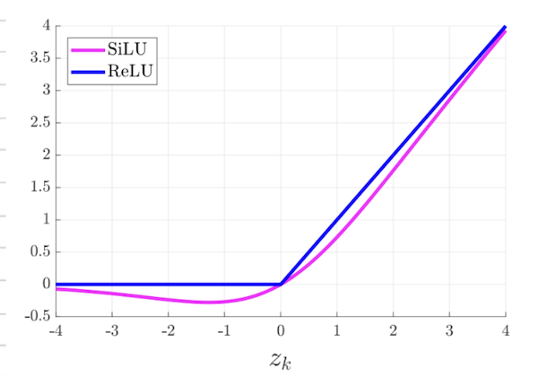  
We also use padding to make sure that output image size either stays the same after applying the convolution, or decreases by a simple factor like x2 if we used stride.   

The first layer reduced image size from `640x640` to `320x320`, increasing the number of channels from `3` to `16` at the same time. This design is also typical for computer vision networks.  
```python
x2 = model.model[1](x1)
print(x2.shape)
model.model[1]
```
```
torch.Size([4, 32, 160, 160])
Conv(
  (conv): Conv2d(16, 32, kernel_size=(3, 3), stride=(2, 2), padding=(1, 1), bias=False)
  (bn): BatchNorm2d(32, eps=0.001, momentum=0.03, affine=True, track_running_stats=True)
  (act): SiLU(inplace=True)
)
```
```python
x3 = model.model[2](x2)
print(x3.shape)
model.model[2]
```
```
C3(
  (cv1): Conv(
    (conv): Conv2d(32, 16, kernel_size=(1, 1), stride=(1, 1), bias=False)
    (bn): BatchNorm2d(16, eps=0.001, momentum=0.03, affine=True, track_running_stats=True)
    (act): SiLU(inplace=True)
  )
  (cv2): Conv(
    (conv): Conv2d(32, 16, kernel_size=(1, 1), stride=(1, 1), bias=False)
    (bn): BatchNorm2d(16, eps=0.001, momentum=0.03, affine=True, track_running_stats=True)
    (act): SiLU(inplace=True)
  )
  (cv3): Conv(
    (conv): Conv2d(32, 32, kernel_size=(1, 1), stride=(1, 1), bias=False)
    (bn): BatchNorm2d(32, eps=0.001, momentum=0.03, affine=True, track_running_stats=True)
    (act): SiLU(inplace=True)
  )
  (m): Sequential(
    (0): Bottleneck(
      (cv1): Conv(
        (conv): Conv2d(16, 16, kernel_size=(1, 1), stride=(1, 1), bias=False)
        (bn): BatchNorm2d(16, eps=0.001, momentum=0.03, affine=True, track_running_stats=True)
        (act): SiLU(inplace=True)
      )
      (cv2): Conv(
        (conv): Conv2d(16, 16, kernel_size=(3, 3), stride=(1, 1), padding=(1, 1), bias=False)
        (bn): BatchNorm2d(16, eps=0.001, momentum=0.03, affine=True, track_running_stats=True)
        (act): SiLU(inplace=True)
      )
    )
  )
)
```
Second layer is more or less the same as the first one: conv + bn + silu, reducing image size while increasing the number of channels.   

Third layer has a bunch of new stuff: 1v1 convolutions, BottleNeck block, and C3 block. Let's go over them one by one.
### 1v1 convolution
We first saw 1v1 convolutions in our previous [post](https://github.com/adensur/blog/tree/main/computer_vision_zero_to_hero/08_resnet_imagenet) devoted to training a ResNet model.  
A typical 3v3 convolution can be represented like this:  
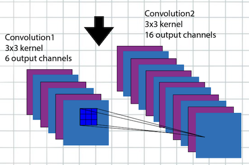  
It has a 3 by 3 receptive field, but, when viewed "from above", it also connects all input channels to all output channels:  
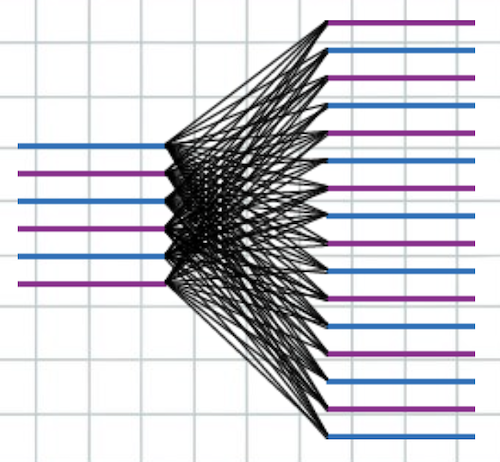  
The number of parameters in this case, with 6 input channels and 16 output channels, is `3x3x6x16`, and it is multiplicative, meaning that increasing the number of either input channels or output channels by x2 will increase the number of parameters by x2 as well. 3v3 convolution can be seen as doing two things at once: it propagates spatial information, connecting neighboring pixels within its receptive field together; and it applies a generic, learnable transformation by connecting all input and output channels, thus allowing the network to approximate more complex functions.   

1v1 convolition can be seen as doing just one thing: it still applies a generic transformation, but doesn't connect neighboring pixels together. It can also be seen as analogue to dense, fully connected layer, applied to each pixel individually.  
### Bottleneck
We've also seen Bottlenecks when training ResNet. [Here](https://github.com/ultralytics/yolov5/blob/ad97dc6a6d8b4384eb7224e98c8584ecd8bcfd2a/models/common.py#L134) is the definition of the layer in the code.  
```python
class Bottleneck(nn.Module):
    # Standard bottleneck
    def __init__(self, c1, c2, shortcut=True, g=1, e=0.5):  # ch_in, ch_out, shortcut, groups, expansion
        super().__init__()
        c_ = int(c2 * e)  # hidden channels
        self.cv1 = Conv(c1, c_, 1, 1)
        self.cv2 = Conv(c_, c2, 3, 1, g=g)
        self.add = shortcut and c1 == c2

    def forward(self, x):
        return x + self.cv2(self.cv1(x)) if self.add else self.cv2(self.cv1(x))
```
  
It's a combination of 1v1 and 3v3 convolutions with a residual connection from input directly to the output that allows the model to train more effectively.
### C3 block
[Here](https://github.com/ultralytics/yolov5/blob/ad97dc6a6d8b4384eb7224e98c8584ecd8bcfd2a/models/common.py#L180) is the definition of C3 block:
```python
class C3(nn.Module):
    # CSP Bottleneck with 3 convolutions
    def __init__(self, c1, c2, n=1, shortcut=True, g=1, e=0.5):  # ch_in, ch_out, number, shortcut, groups, expansion
        super().__init__()
        c_ = int(c2 * e)  # hidden channels
        self.cv1 = Conv(c1, c_, 1, 1)
        self.cv2 = Conv(c1, c_, 1, 1)
        self.cv3 = Conv(2 * c_, c2, 1)  # optional act=FReLU(c2)
        self.m = nn.Sequential(*(Bottleneck(c_, c_, shortcut, g, e=1.0) for _ in range(n)))

    def forward(self, x):
        return self.cv3(torch.cat((self.m(self.cv1(x)), self.cv2(x)), 1))
```
[Here](https://arxiv.org/pdf/1812.04920.pdf) is the paper about Concentrated-Comprehensive Convolution (C3) convolution.  
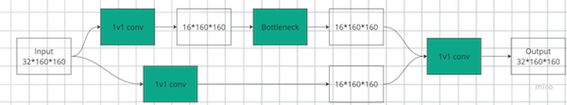   

It takes an input, say of shape `32x160x160`; passes it through 2 1v1 convolutions independantly, projecting the number of channels down to 16 each time; output of one of those is further passed through a Bottleneck block that doesn't change the shape; finally, two outputs with 16 channels are concatenated together and passed through another 1v1 convolution, returning it to the original `32x160x160` shape.   

Overall, third layer - the C3 block - can be seen as another alternative to a single convolution or Bottleneck, applying some transformation to the image but leaving the overall dimensions intact.  
```python
x4 = model.model[3](x3)
print(x4.shape)
model.model[3]
```
```
torch.Size([4, 64, 80, 80])
Conv(
  (conv): Conv2d(32, 64, kernel_size=(3, 3), stride=(2, 2), padding=(1, 1), bias=False)
  (bn): BatchNorm2d(64, eps=0.001, momentum=0.03, affine=True, track_running_stats=True)
  (act): SiLU(inplace=True)
)
```
```python
x5 = model.model[4](x4)
print(x5.shape)
model.model[4]
```
```
torch.Size([4, 64, 80, 80])
C3(
  (cv1): Conv(
    (conv): Conv2d(64, 32, kernel_size=(1, 1), stride=(1, 1), bias=False)
    (bn): BatchNorm2d(32, eps=0.001, momentum=0.03, affine=True, track_running_stats=True)
    (act): SiLU(inplace=True)
  )
  (cv2): Conv(
    (conv): Conv2d(64, 32, kernel_size=(1, 1), stride=(1, 1), bias=False)
    (bn): BatchNorm2d(32, eps=0.001, momentum=0.03, affine=True, track_running_stats=True)
    (act): SiLU(inplace=True)
  )
  (cv3): Conv(
    (conv): Conv2d(64, 64, kernel_size=(1, 1), stride=(1, 1), bias=False)
    (bn): BatchNorm2d(64, eps=0.001, momentum=0.03, affine=True, track_running_stats=True)
    (act): SiLU(inplace=True)
  )
  (m): Sequential(
    (0): Bottleneck(
      (cv1): Conv(
        (conv): Conv2d(32, 32, kernel_size=(1, 1), stride=(1, 1), bias=False)
        (bn): BatchNorm2d(32, eps=0.001, momentum=0.03, affine=True, track_running_stats=True)
        (act): SiLU(inplace=True)
      )
      (cv2): Conv(
        (conv): Conv2d(32, 32, kernel_size=(3, 3), stride=(1, 1), padding=(1, 1), bias=False)
...
        (act): SiLU(inplace=True)
      )
    )
  )
)
```
```python
x6 = model.model[5](x5)
print(x6.shape)
model.model[5]
```
```
torch.Size([4, 128, 40, 40])
Conv(
  (conv): Conv2d(64, 128, kernel_size=(3, 3), stride=(2, 2), padding=(1, 1), bias=False)
  (bn): BatchNorm2d(128, eps=0.001, momentum=0.03, affine=True, track_running_stats=True)
  (act): SiLU(inplace=True)
)
```
```python
x7 = model.model[6](x6)
print(x7.shape)
model.model[6]
```
```
torch.Size([4, 128, 40, 40])
C3(
  (cv1): Conv(
    (conv): Conv2d(128, 64, kernel_size=(1, 1), stride=(1, 1), bias=False)
    (bn): BatchNorm2d(64, eps=0.001, momentum=0.03, affine=True, track_running_stats=True)
    (act): SiLU(inplace=True)
  )
  (cv2): Conv(
    (conv): Conv2d(128, 64, kernel_size=(1, 1), stride=(1, 1), bias=False)
    (bn): BatchNorm2d(64, eps=0.001, momentum=0.03, affine=True, track_running_stats=True)
    (act): SiLU(inplace=True)
  )
  (cv3): Conv(
    (conv): Conv2d(128, 128, kernel_size=(1, 1), stride=(1, 1), bias=False)
    (bn): BatchNorm2d(128, eps=0.001, momentum=0.03, affine=True, track_running_stats=True)
    (act): SiLU(inplace=True)
  )
  (m): Sequential(
    (0): Bottleneck(
      (cv1): Conv(
        (conv): Conv2d(64, 64, kernel_size=(1, 1), stride=(1, 1), bias=False)
        (bn): BatchNorm2d(64, eps=0.001, momentum=0.03, affine=True, track_running_stats=True)
        (act): SiLU(inplace=True)
      )
      (cv2): Conv(
        (conv): Conv2d(64, 64, kernel_size=(3, 3), stride=(1, 1), padding=(1, 1), bias=False)
...
        (act): SiLU(inplace=True)
      )
    )
  )
)
```
```python
x8 = model.model[7](x7)
print(x8.shape)
model.model[7]
```
```
torch.Size([4, 256, 20, 20])
Conv(
  (conv): Conv2d(128, 256, kernel_size=(3, 3), stride=(2, 2), padding=(1, 1), bias=False)
  (bn): BatchNorm2d(256, eps=0.001, momentum=0.03, affine=True, track_running_stats=True)
  (act): SiLU(inplace=True)
)
```
```python
x9 = model.model[8](x8)
print(x9.shape)
model.model[8]
```
```
torch.Size([4, 256, 20, 20])
C3(
  (cv1): Conv(
    (conv): Conv2d(256, 128, kernel_size=(1, 1), stride=(1, 1), bias=False)
    (bn): BatchNorm2d(128, eps=0.001, momentum=0.03, affine=True, track_running_stats=True)
    (act): SiLU(inplace=True)
  )
  (cv2): Conv(
    (conv): Conv2d(256, 128, kernel_size=(1, 1), stride=(1, 1), bias=False)
    (bn): BatchNorm2d(128, eps=0.001, momentum=0.03, affine=True, track_running_stats=True)
    (act): SiLU(inplace=True)
  )
  (cv3): Conv(
    (conv): Conv2d(256, 256, kernel_size=(1, 1), stride=(1, 1), bias=False)
    (bn): BatchNorm2d(256, eps=0.001, momentum=0.03, affine=True, track_running_stats=True)
    (act): SiLU(inplace=True)
  )
  (m): Sequential(
    (0): Bottleneck(
      (cv1): Conv(
        (conv): Conv2d(128, 128, kernel_size=(1, 1), stride=(1, 1), bias=False)
        (bn): BatchNorm2d(128, eps=0.001, momentum=0.03, affine=True, track_running_stats=True)
        (act): SiLU(inplace=True)
      )
      (cv2): Conv(
        (conv): Conv2d(128, 128, kernel_size=(3, 3), stride=(1, 1), padding=(1, 1), bias=False)
...
        (act): SiLU(inplace=True)
      )
    )
  )
)
```
```python
x10 = model.model[9](x9)
print(x10.shape)
model.model[9]
```
```
torch.Size([4, 256, 20, 20])
SPPF(
  (cv1): Conv(
    (conv): Conv2d(256, 128, kernel_size=(1, 1), stride=(1, 1), bias=False)
    (bn): BatchNorm2d(128, eps=0.001, momentum=0.03, affine=True, track_running_stats=True)
    (act): SiLU(inplace=True)
  )
  (cv2): Conv(
    (conv): Conv2d(512, 256, kernel_size=(1, 1), stride=(1, 1), bias=False)
    (bn): BatchNorm2d(256, eps=0.001, momentum=0.03, affine=True, track_running_stats=True)
    (act): SiLU(inplace=True)
  )
  (m): MaxPool2d(kernel_size=5, stride=1, padding=2, dilation=1, ceil_mode=False)
)
```
Layers 4-9 contain nothing new, just the combination of convolutions and C3 blocks that reduced the size of the image to `20x20` and increased the number of channels to `256`. Layer 10 is a "Spatial Pyramid Pooling" (SPPF) block.
### Spatial pyramid pooling
[Here](https://github.com/ultralytics/yolov5/blob/ad97dc6a6d8b4384eb7224e98c8584ecd8bcfd2a/models/common.py#L242) is the definition of the block in code.  
```python
class SPPF(nn.Module):
    # Spatial Pyramid Pooling - Fast (SPPF) layer for YOLOv5 by Glenn Jocher
    def __init__(self, c1, c2, k=5):  # equivalent to SPP(k=(5, 9, 13))
        super().__init__()
        c_ = c1 // 2  # hidden channels
        self.cv1 = Conv(c1, c_, 1, 1)
        self.cv2 = Conv(c_ * 4, c2, 1, 1)
        self.m = nn.MaxPool2d(kernel_size=k, stride=1, padding=k // 2)

    def forward(self, x):
        x = self.cv1(x)
        with warnings.catch_warnings():
            warnings.simplefilter('ignore')  # suppress torch 1.9.0 max_pool2d() warning
            y1 = self.m(x)
            y2 = self.m(y1)
            return self.cv2(torch.cat((x, y1, y2, self.m(y2)), 1))
```
And [here](https://arxiv.org/pdf/1406.4729.pdf) is the paper for SPPF.  
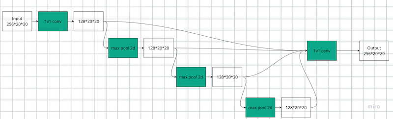  
It takes the input, here, with shape `256x20x20`; projects the number of channels down to 128 using a single 1v1 convolution; and then consecutively feeds that into a series of 4 5v5 max pooling operations with no stride. All the intermediate outputs are concatenated together, arriving at 512 total channels; those are then projected through the final 1v1 convolution, projecting it back to the original shape with 256 channels.  

In the result of such operation, we got a signal from maximum operation applied to nearest 5, 10, 15, and 20 pixels, while leaving the original pixel in place as well.  

The 10th layer, the SPPF, concludes the "backbone" of the model. The entire backbone itself can be seen as image processing unit, similar to ResNet152 minus the final fully connected layer. Now let's move on to the "detection" part of the model:   

```python
x11 = model.model[10](x10)
print(x11.shape)
model.model[10]
```
```
torch.Size([4, 128, 20, 20])
Conv(
  (conv): Conv2d(256, 128, kernel_size=(1, 1), stride=(1, 1), bias=False)
  (bn): BatchNorm2d(128, eps=0.001, momentum=0.03, affine=True, track_running_stats=True)
  (act): SiLU(inplace=True)
)
```
```python
x12 = model.model[11](x11)
print(x12.shape)
model.model[11]
```
```
torch.Size([4, 128, 40, 40])
Upsample(scale_factor=2.0, mode='nearest')
```
```
x13 = model.model[12]([x12, x7])
print(x13.shape)
model.model[12]
```
```
torch.Size([4, 256, 40, 40])
Concat()
```
```
x14 = model.model[13](x13)
print(x14.shape)
model.model[13]
```
```
C3(
  (cv1): Conv(
    (conv): Conv2d(256, 64, kernel_size=(1, 1), stride=(1, 1), bias=False)
    (bn): BatchNorm2d(64, eps=0.001, momentum=0.03, affine=True, track_running_stats=True)
    (act): SiLU(inplace=True)
  )
  (cv2): Conv(
    (conv): Conv2d(256, 64, kernel_size=(1, 1), stride=(1, 1), bias=False)
    (bn): BatchNorm2d(64, eps=0.001, momentum=0.03, affine=True, track_running_stats=True)
    (act): SiLU(inplace=True)
  )
  (cv3): Conv(
    (conv): Conv2d(128, 128, kernel_size=(1, 1), stride=(1, 1), bias=False)
    (bn): BatchNorm2d(128, eps=0.001, momentum=0.03, affine=True, track_running_stats=True)
    (act): SiLU(inplace=True)
  )
  (m): Sequential(
    (0): Bottleneck(
      (cv1): Conv(
        (conv): Conv2d(64, 64, kernel_size=(1, 1), stride=(1, 1), bias=False)
        (bn): BatchNorm2d(64, eps=0.001, momentum=0.03, affine=True, track_running_stats=True)
        (act): SiLU(inplace=True)
      )
      (cv2): Conv(
        (conv): Conv2d(64, 64, kernel_size=(3, 3), stride=(1, 1), padding=(1, 1), bias=False)
...
        (act): SiLU(inplace=True)
      )
    )
  )
)
```
Layer 11 is just another convolution that projected `256` channels down to `128`.  
Layer 12 is the "Upsample" block. It is needed for us to get back up to `40x40` and `80x80` scale that is needed by our grid outputs.
### Upsample block and U-Shape architecture
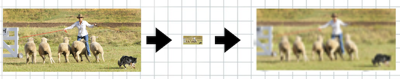  
Usample itself has no learnable parameters, it just increases the number of pixels in the image by trying to approximate pixel values from neighboring pixels - the same process happens if you try to enlarge a low-resolution photo on your phone, for example. As you can see from the image above, the process is not exact, and resulting image (here plotted as an actual photo, although in reality it will operate on internal neural network representation that looks completely different to real photo) is much less detailed and blurry.   

We can, however, add a residual connection to one of the earlier blocks in the network that had this `40x40` size - this happens in layer 13, the concat layer - and then feed that into another C3 layer, thus allowing it to see the upsampled version, but from the more recent state of the network - more processed, containing more useful information, as well as the earlier, higher-resolution version that can be used to fix some pixel-approximation errors.  

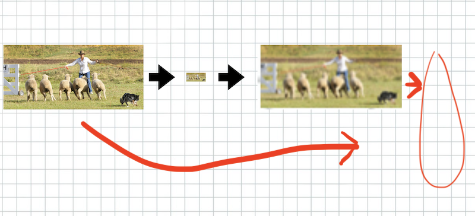   

This trick is really important for object segmentation networks - predicting which pixels belong to which class - because they need output image dimensions to be the same as input. In our case, we only need to upsample up to 40x40 or 80x80. The entire architecture of the network will look like this:  
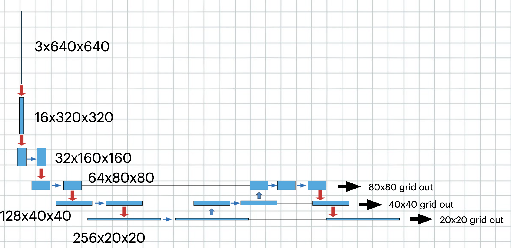   
The first part of the network - "backbone" - projects the size of the image from 640x640 down to 20x20, but with 256 channels; we then use a series of upsampling with residual connections to sample it up back to 80x80 again, and then downsample down to 20x20 again to get all the grid outputs. Below are the specific layer output shapes and layer composition:  
```python
x15 = model.model[14](x14)
print(x15.shape)
model.model[14]
```
```
torch.Size([4, 64, 40, 40])
Conv(
  (conv): Conv2d(128, 64, kernel_size=(1, 1), stride=(1, 1), bias=False)
  (bn): BatchNorm2d(64, eps=0.001, momentum=0.03, affine=True, track_running_stats=True)
  (act): SiLU(inplace=True)
)
```
```python
x16 = model.model[15](x15)
print(x16.shape)
model.model[15]
```
```
torch.Size([4, 64, 80, 80])
Upsample(scale_factor=2.0, mode='nearest')
```
```python
x17 = model.model[16]([x16, x5])
print(x17.shape)
model.model[16]
```
```
torch.Size([4, 128, 80, 80])
Concat()
```
```python
x18 = model.model[17](x17)
print(x18.shape)
model.model[17]
```
```
torch.Size([4, 64, 80, 80])
C3(
  (cv1): Conv(
    (conv): Conv2d(128, 32, kernel_size=(1, 1), stride=(1, 1), bias=False)
    (bn): BatchNorm2d(32, eps=0.001, momentum=0.03, affine=True, track_running_stats=True)
    (act): SiLU(inplace=True)
  )
  (cv2): Conv(
    (conv): Conv2d(128, 32, kernel_size=(1, 1), stride=(1, 1), bias=False)
    (bn): BatchNorm2d(32, eps=0.001, momentum=0.03, affine=True, track_running_stats=True)
    (act): SiLU(inplace=True)
  )
  (cv3): Conv(
    (conv): Conv2d(64, 64, kernel_size=(1, 1), stride=(1, 1), bias=False)
    (bn): BatchNorm2d(64, eps=0.001, momentum=0.03, affine=True, track_running_stats=True)
    (act): SiLU(inplace=True)
  )
  (m): Sequential(
    (0): Bottleneck(
      (cv1): Conv(
        (conv): Conv2d(32, 32, kernel_size=(1, 1), stride=(1, 1), bias=False)
        (bn): BatchNorm2d(32, eps=0.001, momentum=0.03, affine=True, track_running_stats=True)
        (act): SiLU(inplace=True)
      )
      (cv2): Conv(
        (conv): Conv2d(32, 32, kernel_size=(3, 3), stride=(1, 1), padding=(1, 1), bias=False)
...
        (act): SiLU(inplace=True)
      )
    )
  )
)
```
```python
x19 = model.model[18](x18)
print(x19.shape)
model.model[18]
```
```
torch.Size([4, 64, 40, 40])
Conv(
  (conv): Conv2d(64, 64, kernel_size=(3, 3), stride=(2, 2), padding=(1, 1), bias=False)
  (bn): BatchNorm2d(64, eps=0.001, momentum=0.03, affine=True, track_running_stats=True)
  (act): SiLU(inplace=True)
)
```
```python
x20 = model.model[19]([x19, x15])
print(x20.shape)
model.model[19]
```
```
torch.Size([4, 128, 40, 40])
Concat()
```
```python
x21 = model.model[20](x20)
print(x21.shape)
model.model[20]
```
```
torch.Size([4, 128, 40, 40])
C3(
  (cv1): Conv(
    (conv): Conv2d(128, 64, kernel_size=(1, 1), stride=(1, 1), bias=False)
    (bn): BatchNorm2d(64, eps=0.001, momentum=0.03, affine=True, track_running_stats=True)
    (act): SiLU(inplace=True)
  )
  (cv2): Conv(
    (conv): Conv2d(128, 64, kernel_size=(1, 1), stride=(1, 1), bias=False)
    (bn): BatchNorm2d(64, eps=0.001, momentum=0.03, affine=True, track_running_stats=True)
    (act): SiLU(inplace=True)
  )
  (cv3): Conv(
    (conv): Conv2d(128, 128, kernel_size=(1, 1), stride=(1, 1), bias=False)
    (bn): BatchNorm2d(128, eps=0.001, momentum=0.03, affine=True, track_running_stats=True)
    (act): SiLU(inplace=True)
  )
  (m): Sequential(
    (0): Bottleneck(
      (cv1): Conv(
        (conv): Conv2d(64, 64, kernel_size=(1, 1), stride=(1, 1), bias=False)
        (bn): BatchNorm2d(64, eps=0.001, momentum=0.03, affine=True, track_running_stats=True)
        (act): SiLU(inplace=True)
      )
      (cv2): Conv(
        (conv): Conv2d(64, 64, kernel_size=(3, 3), stride=(1, 1), padding=(1, 1), bias=False)
...
        (act): SiLU(inplace=True)
      )
    )
  )
)
```
```python
x22 = model.model[21](x21)
print(x22.shape)
model.model[21]
```
```
torch.Size([4, 128, 20, 20])
Conv(
  (conv): Conv2d(128, 128, kernel_size=(3, 3), stride=(2, 2), padding=(1, 1), bias=False)
  (bn): BatchNorm2d(128, eps=0.001, momentum=0.03, affine=True, track_running_stats=True)
  (act): SiLU(inplace=True)
)
```
```python
x23 = model.model[22]([x22, x11])
print(x23.shape)
model.model[22]
```
```
torch.Size([4, 256, 20, 20])
Concat()
```
```python
torch.Size([4, 256, 20, 20])
C3(
  (cv1): Conv(
    (conv): Conv2d(256, 128, kernel_size=(1, 1), stride=(1, 1), bias=False)
    (bn): BatchNorm2d(128, eps=0.001, momentum=0.03, affine=True, track_running_stats=True)
    (act): SiLU(inplace=True)
  )
  (cv2): Conv(
    (conv): Conv2d(256, 128, kernel_size=(1, 1), stride=(1, 1), bias=False)
    (bn): BatchNorm2d(128, eps=0.001, momentum=0.03, affine=True, track_running_stats=True)
    (act): SiLU(inplace=True)
  )
  (cv3): Conv(
    (conv): Conv2d(256, 256, kernel_size=(1, 1), stride=(1, 1), bias=False)
    (bn): BatchNorm2d(256, eps=0.001, momentum=0.03, affine=True, track_running_stats=True)
    (act): SiLU(inplace=True)
  )
  (m): Sequential(
    (0): Bottleneck(
      (cv1): Conv(
        (conv): Conv2d(128, 128, kernel_size=(1, 1), stride=(1, 1), bias=False)
        (bn): BatchNorm2d(128, eps=0.001, momentum=0.03, affine=True, track_running_stats=True)
        (act): SiLU(inplace=True)
      )
      (cv2): Conv(
        (conv): Conv2d(128, 128, kernel_size=(3, 3), stride=(1, 1), padding=(1, 1), bias=False)
...
        (act): SiLU(inplace=True)
      )
    )
  )
)
```
```python
# 17, 20, 23
print(x18.shape, x21.shape, x24.shape)
x25 = model.model[24]([x18, x21, x24])
print(len(x25))
print(x25[0].shape, x25[1].shape, x25[2].shape)
model.model[24]
```
```
torch.Size([4, 64, 80, 80]) torch.Size([4, 128, 40, 40]) torch.Size([4, 256, 20, 20])
3
torch.Size([4, 3, 80, 80, 85]) torch.Size([4, 3, 40, 40, 85]) torch.Size([4, 3, 20, 20, 85])
Detect(
  (m): ModuleList(
    (0): Conv2d(64, 255, kernel_size=(1, 1), stride=(1, 1))
    (1): Conv2d(128, 255, kernel_size=(1, 1), stride=(1, 1))
    (2): Conv2d(256, 255, kernel_size=(1, 1), stride=(1, 1))
  )
)
```
[Here](https://github.com/ultralytics/yolov5/blob/ad97dc6a6d8b4384eb7224e98c8584ecd8bcfd2a/models/yolo.py#L72) is the source code for the final layer, the Detect module:  
```python
class Detect(nn.Module):
    def __init__(self, nc=80, anchors=(), ch=(), inplace=True):  # detection layer
        ...
        self.m = nn.ModuleList(nn.Conv2d(x, self.no * self.na, 1) for x in ch)  # output conv

    def forward(self, x):
        z = []  # inference output
        for i in range(self.nl):
            x[i] = self.m[i](x[i])  # conv
            bs, _, ny, nx = x[i].shape  # x(bs,255,20,20) to x(bs,3,20,20,85)
            x[i] = x[i].view(bs, self.na, self.no, ny, nx).permute(0, 1, 3, 4, 2).contiguous()

            if not self.training:  # inference
                # ...

        return x if self.training else (torch.cat(z, 1),) if self.export else (torch.cat(z, 1), x)
```
It does have some code for output conversion - converting grid coordinates to proper format, etc. But it mainly consists of yet another set of convolutions that produce output of the desired shape. There is nothing in the architecture of the model specific to YOLO - how the objects are matched against the grid, which coordinate is supposed to predict bounding box height, and which - the probability of the object being a person, and so on. All of that will only materialize after we define the loss, and start propagating useful signal back through the model.  
## Loss
[Here](https://github.com/ultralytics/yolov5/blob/ad97dc6a6d8b4384eb7224e98c8584ecd8bcfd2a/train.py#L320) is where the loss is initialized in the train script. [Here](https://github.com/ultralytics/yolov5/blob/ad97dc6a6d8b4384eb7224e98c8584ecd8bcfd2a/utils/loss.py#L89) is the definition of it.  
```python
    def __call__(self, p, targets):  # predictions, targets
        lcls = torch.zeros(1, device=self.device)  # class loss
        lbox = torch.zeros(1, device=self.device)  # box loss
        lobj = torch.zeros(1, device=self.device)  # object loss
        tcls, tbox, indices, anchors = self.build_targets(p, targets)  # targets
```
The easiest way to read that is to break on the `__call__` method (the one used to compute the actual loss) in pdb and print out intermediate results. It also helps to look at the actual image being processed:  
  
This is going to be the first image in the batch.
```python
# pdb at the start of __call__ method, loss.py:123
p p[0].shape, p[1].shape, p[2].shape
```
```
(torch.Size([4, 3, 80, 80, 85]), torch.Size([4, 3, 40, 40, 85]), torch.Size([4, 3, 20, 20, 85]))
```
```python
p targets.shape
```
```
torch.Size([43, 6])
```
```python
p targets
```
```
tensor([[0.00000e+00, 5.30000e+01, 3.96669e-01, 4.79963e-01, 7.93338e-01, 5.88065e-01],
        [0.00000e+00, 0.00000e+00, 3.21526e-01, 2.12996e-01, 6.43052e-01, 1.67260e-01],
        [0.00000e+00, 6.00000e+01, 4.20099e-01, 4.96443e-01, 8.40199e-01, 5.63289e-01],
        [0.00000e+00, 0.00000e+00, 9.74390e-01, 5.39114e-01, 5.12177e-02, 4.69156e-01],
        [0.00000e+00, 0.00000e+00, 6.21530e-01, 9.94613e-01, 2.69818e-02, 1.07708e-02],
        [0.00000e+00, 0.00000e+00, 2.17510e-01, 9.92081e-01, 7.67630e-02, 1.58359e-02],
        [0.00000e+00, 6.00000e+00, 3.75330e-01, 8.92184e-01, 7.50660e-01, 2.15629e-01],
        [0.00000e+00, 6.00000e+00, 7.81094e-01, 9.86248e-01, 7.03293e-02, 2.75012e-02],
        [0.00000e+00, 0.00000e+00, 9.27958e-01, 8.12408e-01, 3.07235e-02, 6.00933e-02],
...
```
So `p` correspond to 3 grid-scale predictions, with 80x80/40x40/20x20 grid scale, 3 anchors per grid cell, and 85 predictions per anchor.   

`targets` contain all the ground truth objects in the batch; first column corresponds to the image_idx of the object; second column - to the class; then 4 columns for bbox coordinates. We can see that the first image has a pizza (class 53), few people (class 0), train (class 6), and dining tables (class 60). We will look at what happens to the train in the next transformations, because it is the only train in the batch.  
This line:  
```python
tcls, tbox, indices, anchors = self.build_targets(p, targets)  # targets
```
performs the conversion of targets - list of objects with image_idx, class label and 4 bbox coordinates - to the format we can use for loss computation, having the model output 3 tensors with shapes `4x3x80x80x85` and so on. It contains the code to match objects to anchors and grid cells. Let's read the content of this function:    
```python
    def build_targets(self, p, targets):
        # Build targets for compute_loss(), input targets(image,class,x,y,w,h)
        na, nt = self.na, targets.shape[0]  # number of anchors, targets
        tcls, tbox, indices, anch = [], [], [], []
        gain = torch.ones(7, device=self.device)  # normalized to gridspace gain
        ai = torch.arange(na, device=self.device).float().view(na, 1).repeat(1, nt)  # same as .repeat_interleave(nt)
        targets = torch.cat((targets.repeat(na, 1, 1), ai[..., None]), 2)  # append anchor indices

        g = 0.5  # bias
        off = torch.tensor(
            [
                [0, 0],
                [1, 0],
                [0, 1],
                [-1, 0],
                [0, -1],  # j,k,l,m
                # [1, 1], [1, -1], [-1, 1], [-1, -1],  # jk,jm,lk,lm
            ],
            device=self.device).float() * g  # offsets

        for i in range(self.nl):
            anchors, shape = self.anchors[i], p[i].shape
            gain[2:6] = torch.tensor(shape)[[3, 2, 3, 2]]  # xyxy gain

            # Match targets to anchors
            t = targets * gain  # shape(3,n,7)
```
We iterate over all the "layers" - corresponding to 80x80, 40x40 and 20x20 grid outputs, 3 layers in total.  

```python
# pdb at loss.py:205
p t, t.shape
```
```
(torch.Size([3, 43, 7]), tensor([[[ 0.00000, 53.00000, 31.73352, 38.39706, 63.46703, 47.04517,  0.00000],
         [ 0.00000,  0.00000, 25.72207, 17.03971, 51.44413, 13.38081,  0.00000],
         [ 0.00000, 60.00000, 33.60794, 39.71546, 67.21589, 45.06309,  0.00000],
         [ 0.00000,  0.00000, 77.95117, 43.12909,  4.09741, 37.53251,  0.00000],
         [ 0.00000,  0.00000, 49.72239, 79.56905,  2.15854,  0.86166,  0.00000],
         [ 0.00000,  0.00000, 17.40078, 79.36644,  6.14104,  1.26687,  0.00000],
         [ 0.00000,  6.00000, 30.02640, 71.37471, 60.05280, 17.25033,  0.00000],
         [ 0.00000,  6.00000, 62.48754, 78.89983,  5.62634,  2.20010,  0.00000],
         [ 0.00000,  0.00000, 74.23668, 64.99264,  2.45788,  4.80746,  0.00000],
         ...
          [[ 0.00000, 53.00000, 31.73352, 38.39706, 63.46703, 47.04517,  1.00000],
         [ 0.00000,  0.00000, 25.72207, 17.03971, 51.44413, 13.38081,  1.00000],
         [ 0.00000, 60.00000, 33.60794, 39.71546, 67.21589, 45.06309,  1.00000],
         [ 0.00000,  0.00000, 77.95117, 43.12909,  4.09741, 37.53251,  1.00000],
         [ 0.00000,  0.00000, 49.72239, 79.56905,  2.15854,  0.86166,  1.00000],
         [ 0.00000,  0.00000, 17.40078, 79.36644,  6.14104,  1.26687,  1.00000],
         [ 0.00000,  6.00000, 30.02640, 71.37471, 60.05280, 17.25033,  1.00000],
         [ 0.00000,  6.00000, 62.48754, 78.89983,  5.62634,  2.20010,  1.00000],
         [ 0.00000,  0.00000, 74.23668, 64.99264,  2.45788,  4.80746,  1.00000],
         ...
         [[ 0.00000, 53.00000, 31.73352, 38.39706, 63.46703, 47.04517,  2.00000],
         [ 0.00000,  0.00000, 25.72207, 17.03971, 51.44413, 13.38081,  2.00000],
         [ 0.00000, 60.00000, 33.60794, 39.71546, 67.21589, 45.06309,  2.00000],
         [ 0.00000,  0.00000, 77.95117, 43.12909,  4.09741, 37.53251,  2.00000],
         [ 0.00000,  0.00000, 49.72239, 79.56905,  2.15854,  0.86166,  2.00000],
         [ 0.00000,  0.00000, 17.40078, 79.36644,  6.14104,  1.26687,  2.00000],
         [ 0.00000,  6.00000, 30.02640, 71.37471, 60.05280, 17.25033,  2.00000],
         [ 0.00000,  6.00000, 62.48754, 78.89983,  5.62634,  2.20010,  2.00000],
         [ 0.00000,  0.00000, 74.23668, 64.99264,  2.45788,  4.80746,  2.00000],
```
First we broadcast the targets by anchors, so now every object is repeated 3 times, with 3 different anchor indices. Then we multiply bbox labels by `gain` - converting them from relative (number from 0 to 1, relative x, y, w, h) to actual pixel values for current scale, numbers from 0 to 80.  
```python
if nt:
    # Matches
    r = t[..., 4:6] / anchors[:, None]  # wh ratio
```
`r` now contains ratios of width and height of the objects divided by width and height of each anchor.  
```python
# pdb at loss.py:209
p r.shape, r
```
```
torch.Size([3, 43, 2])), tensor([[[50.77363, 28.95088],
         [41.15531,  8.23434],
         [53.77271, 27.73113],
         [ 3.27793, 23.09693],
         [ 1.72683,  0.53025],
         [ 4.91283,  0.77961],
         [48.04224, 10.61559],
         [ 4.50107,  1.35391],
```
```python
j = torch.max(r, 1 / r).max(2)[0] < self.hyp['anchor_t']  # compare
```
`j` is now the boolean tensor, indicating which positions in the `r` tensor were below `anchor_t` threshold (`4` by default). This is analogues to $\frac{1}{4} <= \frac{wh}{wh_a} <= 4$ condition mentioned above.
```python
t = t[j]  # filter
```
```python
# pdb at loss.py:213
p t, t.shape
```
```
(torch.Size([35, 7]), tensor([[ 0.00000,  0.00000, 49.72239, 79.56905,  2.15854,  0.86166,  0.00000],
        [ 0.00000,  0.00000, 74.23668, 64.99264,  2.45788,  4.80746,  0.00000],
        [ 0.00000,  0.00000, 17.40078, 79.36644,  6.14104,  1.26687,  1.00000],
        [ 0.00000,  6.00000, 62.48754, 78.89983,  5.62634,  2.20010,  1.00000],
        [ 0.00000,  0.00000, 74.23668, 64.99264,  2.45788,  4.80746,  1.00000],
        [ 0.00000,  0.00000, 49.72239, 79.56905,  2.15854,  0.86166,  2.00000],
        [ 0.00000,  0.00000, 17.40078, 79.36644,  6.14104,  1.26687,  2.00000],
        [ 0.00000,  6.00000, 62.48754, 78.89983,  5.62634,  2.20010,  2.00000],
        [ 0.00000,  0.00000, 74.23668, 64.99264,  2.45788,  4.80746,  2.00000],
        ...
```
We had 43 objects in a batch; some of them matched none of the anchors and were filtered out (pizza, dining table); some of them matched 1, some - more than 1 anchor. The train matched 2 anchors. Not to worry, those objects that didn't match anything, will most likely match to something on other grid scales - 40x40 or 20x20.  

```python
# Offsets
                gxy = t[:, 2:4]  # grid xy
                gxi = gain[[2, 3]] - gxy  # inverse
                j, k = ((gxy % 1 < g) & (gxy > 1)).T
                l, m = ((gxi % 1 < g) & (gxi > 1)).T
                j = torch.stack((torch.ones_like(j), j, k, l, m))
                t = t.repeat((5, 1, 1))[j]
                offsets = (torch.zeros_like(gxy)[None] + off[:, None])[j]
            else:
                t = targets[0]
                offsets = 0

            # Define
            bc, gxy, gwh, a = t.chunk(4, 1)  # (image, class), grid xy, grid wh, anchors
            a, (b, c) = a.long().view(-1), bc.long().T  # anchors, image, class
            gij = (gxy - offsets).long()
            gi, gj = gij.T  # grid indices

            # Append
            indices.append((b, a, gj.clamp_(0, shape[2] - 1), gi.clamp_(0, shape[3] - 1)))  # image, anchor, grid
            tbox.append(torch.cat((gxy - gij, gwh), 1))  # box
            anch.append(anchors[a])  # anchors
            tcls.append(c)  # class
```
```python
# pdb at the end of build_targets
(Pdb) p indices[0][0].shape, indices[0][0]
(torch.Size([103]), tensor([0, 0, 2, 0, 0, 0, 1, 1, 1, 1, 1, 1, 1, 2, 2, 2, 0, 0, 0, 0, 1, 1, 1, 1, 1, 1, 1, 1, 1, 1, 1, 2, 2, 2, 2, 0, 2, 0, 0, 0, 1, 1, 2, 2, 0, 0, 0, 1, 1, 1, 1, 2, 2, 0, 1, 2, 2, 0, 1, 1, 2, 0, 1, 1, 1, 1, 1, 2, 0, 1, 1, 1, 1, 1, 1, 1, 2, 2, 0, 2, 0, 0, 1, 1, 1, 1, 1, 1, 2, 0, 0, 1, 1, 1, 1, 1, 1, 1, 1, 1, 2, 2, 2]))
(Pdb) p indices[0][1].shape, indices[0][1]
(torch.Size([103]), tensor([0, 0, 0, 1, 1, 1, 1, 1, 1, 1, 1, 1, 1, 1, 1, 1, 2, 2, 2, 2, 2, 2, 2, 2, 2, 2, 2, 2, 2, 2, 2, 2, 2, 2, 2, 0, 0, 1, 1, 1, 1, 1, 1, 1, 2, 2, 2, 2, 2, 2, 2, 2, 2, 1, 1, 1, 1, 2, 2, 2, 2, 0, 1, 1, 1, 1, 1, 1, 2, 2, 2, 2, 2, 2, 2, 2, 2, 2, 0, 0, 1, 1, 1, 1, 1, 1, 1, 1, 1, 2, 2, 2, 2, 2, 2, 2, 2, 2, 2, 2, 2, 2, 2]))
(Pdb) p indices[0][2].shape, indices[0][2]
(torch.Size([103]), tensor([79, 64, 56, 79, 78, 64,  4, 51, 46, 46,  3,  3, 48, 15, 56, 73, 79, 79, 78, 64, 28,  4, 51, 46, 48, 46, 50, 47,  3,  3, 48, 47, 15, 50, 56, 64, 56, 79, 78, 64, 46,  3, 15, 56, 79, 78, 64, 28, 46, 48,  3, 15, 56, 78, 50, 14, 72, 78, 27, 49, 14, 79,  4, 51, 46,  3, 48, 73, 79,  4, 51, 46, 50, 47,  3, 48, 47, 50,
        65, 57, 79, 65,  5, 47, 47,  4,  4, 49, 57, 79, 65,  5, 52, 47, 49, 47, 48,  4,  4, 49, 48, 51, 57]))
(Pdb) p indices[0][3].shape, indices[0][3]
(torch.Size([103]), tensor([49, 74, 72, 17, 62, 74, 17, 48, 66, 76, 39, 71, 75, 64, 72, 76, 49, 17, 62, 74, 25, 17, 39, 66, 41, 76, 37, 71, 39, 71, 75, 39, 64, 75, 72, 73, 71, 16, 61, 73, 65, 70, 63, 71, 16, 61, 73, 24, 65, 40, 70, 63, 71, 17, 48, 64, 76, 17, 25, 37, 64, 50, 18, 49, 77, 40, 76, 77, 50, 18, 40, 77, 38, 72, 40, 76, 40, 76,
        74, 72, 62, 74, 17, 66, 76, 39, 71, 75, 72, 62, 74, 17, 39, 66, 41, 76, 71, 39, 71, 75, 39, 75, 72]))
(Pdb) p tcls[0].shape, tcls[0]
(torch.Size([103]), tensor([ 0,  0, 71,  0,  6,  0,  0, 40, 44, 42,  0,  0, 40, 74, 71, 45,  0,  0,  6,  0, 56,  0, 44, 44, 42, 42, 43, 43,  0,  0, 40, 54, 74, 71, 71,  0, 71,  0,  6,  0, 44,  0, 74, 71,  0,  6,  0, 56, 44, 42,  0, 74, 71,  0, 40, 74, 45,  0, 56, 43, 74,  0,  0, 40, 42,  0, 40, 45,  0,  0, 44, 42, 43, 43,  0, 40, 54, 71,
         0, 71,  6,  0,  0, 44, 42,  0,  0, 40, 71,  6,  0,  0, 44, 44, 42, 42, 43,  0,  0, 40, 54, 71, 71]))
(Pdb) p tbox[0].shape, tbox[0]
(torch.Size([103, 4]), tensor([[ 7.22389e-01,  5.69046e-01,  2.15854e+00,  8.61664e-01],
        [ 2.36679e-01,  9.92638e-01,  2.45788e+00,  4.80746e+00],
    ...
(Pdb) p anch[0].shape, anch[0]
(torch.Size([103, 2]), tensor([[1.25000, 1.62500],
        [1.25000, 1.62500],
        [1.25000, 1.62500],
        [2.00000, 3.75000],
    ...
```
We matched the objects to grid cells; some objects matched more then 1 grid cell: we had 35 object-anchor pairs after matching by anchors, and 103 pairs after matching to the grid. We can check what happened to our train like this:  
```python
(Pdb) p indices[0][0][tcls[0]==6] # image ids
tensor([0, 0, 0, 0, 0, 0])
(Pdb) p indices[0][1][tcls[0]==6] # anchor ids
tensor([1, 2, 1, 2, 1, 2])
(Pdb) p indices[0][2][tcls[0]==6] # grid y coord
tensor([78, 78, 78, 78, 79, 79])
(Pdb) p indices[0][3][tcls[0]==6] # grid x coord
tensor([62, 62, 61, 61, 62, 62])
```
Our original train was located at (62.48754, 78.89983) (center of the bounding box). It was on the first picture (image_idx == 0), it matched 2 anchors (idx 1 and 2), each - 3 grid cells: (62, 78), (61, 78), (62, 79). So we actually want our model to detect the same object in several neighboring cells, and by several anchors, which makes the requirement of NMS really necessary to remove duplicates afterwards.   
Now let's come back to our `__call__` method and read further:
```python
# loss.py:126, __call__ method
# Losses
        for i, pi in enumerate(p):  # layer index, layer predictions
            b, a, gj, gi = indices[i]  # image, anchor, gridy, gridx
            tobj = torch.zeros(pi.shape[:4], dtype=pi.dtype, device=self.device)  # target obj

            n = b.shape[0]  # number of targets
            if n:
                # pxy, pwh, _, pcls = pi[b, a, gj, gi].tensor_split((2, 4, 5), dim=1)  # faster, requires torch 1.8.0
                pxy, pwh, _, pcls = pi[b, a, gj, gi].split((2, 2, 1, self.nc), 1)  # target-subset of predictions
```
We do a so-called "target-subset of predictions": for the first layer, 80x80 grid scale, we take 3x80x80 model predictions per every image and filter only those that correspond to cells that matched to some objects (the train being matched to 3 cells and 2 anchors at once), throwing away the rest. In this line, we also define which of the 85 coordinates correspond to classes, which - to bbox predictions, and so on.   
```python
# pdb at loss.py:134
(Pdb) p pxy.shape, pwh.shape, pcls.shape
(torch.Size([103, 2]), torch.Size([103, 2]), torch.Size([103, 80]))
```
Now the predictions of the model are converted to the same shape as the targets!  

It is also interesting to find out what will happen to the objects that got into the same cell. There is no deduplication in `build_targets` function; we could have 2 different trains in the same grid cell matching the same anchor. They will be passed to the loss as 2 independant training examples, both generating some training signal. The model has no way to generate more then 1 object per grid cell per anchor; the training signal will be a bit conflicting in such case, but it still works.  

Now we calculate the loss itself:  
```python
                # Regression
                pxy = pxy.sigmoid() * 2 - 0.5
                pwh = (pwh.sigmoid() * 2) ** 2 * anchors[i]
                pbox = torch.cat((pxy, pwh), 1)  # predicted box
                iou = bbox_iou(pbox, tbox[i], CIoU=True).squeeze()  # iou(prediction, target)
                lbox += (1.0 - iou).mean()  # iou loss

                # Objectness
                iou = iou.detach().clamp(0).type(tobj.dtype)
                if self.sort_obj_iou:
                    j = iou.argsort()
                    b, a, gj, gi, iou = b[j], a[j], gj[j], gi[j], iou[j]
                if self.gr < 1:
                    iou = (1.0 - self.gr) + self.gr * iou
                tobj[b, a, gj, gi] = iou  # iou ratio

                # Classification
                if self.nc > 1:  # cls loss (only if multiple classes)
                    t = torch.full_like(pcls, self.cn, device=self.device)  # targets
                    t[range(n), tcls[i]] = self.cp
                    lcls += self.BCEcls(pcls, t)  # BCE
```
"Regression" is responsible for correct bounding box predictions. It uses [CIoU](https://arxiv.org/pdf/2005.03572.pdf) as loss function, an analogue to IoU that is differentiable.  

We then populate the IoU calculations to the entire grid (3x80x80), which will be used later in objectness loss calculations.  

Classification is responsible for predicting the correct class. It uses binary cross entrophy. The [code](https://github.com/ultralytics/yolov5/blob/ad97dc6a6d8b4384eb7224e98c8584ecd8bcfd2a/utils/loss.py#L98) in the initialization of the loss allows to reweigh positives and to use [FocalLoss](https://arxiv.org/pdf/1708.02002v2.pdf) instead of cross entrophy, thus putting more weight on harder, missclassified examples. None of that is used in YOLOv5 by default.  

Note that regression and classification losses are only defined for those grid cells that matched objects. First image had 7 objects originally, which expanded to 25 grid cell and anchor combinations (this is true for 80x80 scale, other scales, like 40x40 and 20x20 will have slightly different numbers). So out of 3x80x80 = 19200 model predictions, only 25 are used in these 2 loss terms, other 19175 not taking part in loss calculation. They will only take part in Objectness loss below.

```python
obji = self.BCEobj(pi[..., 4], tobj)
            lobj += obji * self.balance[i]  # obj loss
            if self.autobalance:
                self.balance[i] = self.balance[i] * 0.9999 + 0.0001 / obji.detach().item()

        if self.autobalance:
            self.balance = [x / self.balance[self.ssi] for x in self.balance]
        lbox *= self.hyp['box']
        lobj *= self.hyp['obj']
        lcls *= self.hyp['cls']
        bs = tobj.shape[0]  # batch size

        return (lbox + lobj + lcls) * bs, torch.cat((lbox, lobj, lcls)).detach()
```
Then, we calculate the Objectness loss. Now, it takes into account all 3x80x80 predictions - this is the only loss term that can penalize the model for phantom objects predicted in the background. It also predicts the level of overlap between ground truth IoU and predicted IoU for those grid cells that did match some objects; this allows us to rely on confidence as something that also indicates correctness of predicted bounding boxes. It is useful for NMS, that will remove those duplicate predictions that have lower confidence.
## Training loop
The actual training [loop](https://github.com/ultralytics/yolov5/blob/ad97dc6a6d8b4384eb7224e98c8584ecd8bcfd2a/train.py#L328) looks pretty similar to what we've seen in previous posts, including the very first [one](https://github.com/adensur/blog/blob/main/computer_vision_zero_to_hero/01_simple_classification/Readme.md). We iterate over batches of dataloader, compute loss, perform backprop and LR scheduling. We use SGD optimizer. Below I will go over some of the interesting details.   

[Smart optimizer](https://github.com/ultralytics/yolov5/blob/ad97dc6a6d8b4384eb7224e98c8584ecd8bcfd2a/utils/torch_utils.py#L330) creates different parameter groups for biases, batch norm weights and other weights, with different hyperparameters such as weight decay and momentum:  
```python
def smart_optimizer(model, name='Adam', lr=0.001, momentum=0.9, decay=1e-5):
    # YOLOv5 3-param group optimizer: 0) weights with decay, 1) weights no decay, 2) biases no decay
    g = [], [], []  # optimizer parameter groups
    bn = tuple(v for k, v in nn.__dict__.items() if 'Norm' in k)  # normalization layers, i.e. BatchNorm2d()
    for v in model.modules():
        for p_name, p in v.named_parameters(recurse=0):
            if p_name == 'bias':  # bias (no decay)
                g[2].append(p)
            elif p_name == 'weight' and isinstance(v, bn):  # weight (no decay)
                g[1].append(p)
            else:
                g[0].append(p)  # weight (with decay)

    if name == 'Adam':
        optimizer = torch.optim.Adam(g[2], lr=lr, betas=(momentum, 0.999))  # adjust beta1 to momentum
    elif name == 'AdamW':
        optimizer = torch.optim.AdamW(g[2], lr=lr, betas=(momentum, 0.999), weight_decay=0.0)
    elif name == 'RMSProp':
        optimizer = torch.optim.RMSprop(g[2], lr=lr, momentum=momentum)
    elif name == 'SGD':
        optimizer = torch.optim.SGD(g[2], lr=lr, momentum=momentum, nesterov=True)
    else:
        raise NotImplementedError(f'Optimizer {name} not implemented.')

    optimizer.add_param_group({'params': g[0], 'weight_decay': decay})  # add g0 with weight_decay
    optimizer.add_param_group({'params': g[1], 'weight_decay': 0.0})  # add g1 (BatchNorm2d weights)
    LOGGER.info(f"{colorstr('optimizer:')} {type(optimizer).__name__}(lr={lr}) with parameter groups "
                f'{len(g[1])} weight(decay=0.0), {len(g[0])} weight(decay={decay}), {len(g[2])} bias')
    return optimizer
```
LR scheduler is defined [here](https://github.com/ultralytics/yolov5/blob/ad97dc6a6d8b4384eb7224e98c8584ecd8bcfd2a/train.py#L222). It simply changes LR linearly from `1.0` to `0.01`:  
```python
    # Scheduler
    if opt.cos_lr:
        lf = one_cycle(1, hyp["lrf"], epochs)  # cosine 1->hyp['lrf']
    else:
        lf = lambda x: (1 - x / epochs) * (1.0 - hyp["lrf"]) + hyp["lrf"]  # linear
    scheduler = lr_scheduler.LambdaLR(optimizer, lr_lambda=lf)  # plot_lr_scheduler(optimizer, scheduler, epochs)
```  
And [warmap](https://github.com/ultralytics/yolov5/blob/ad97dc6a6d8b4384eb7224e98c8584ecd8bcfd2a/train.py#L356):  
```python
            # Warmup
            if ni <= nw:
                xi = [0, nw]  # x interp
                # compute_loss.gr = np.interp(ni, xi, [0.0, 1.0])  # iou loss ratio (obj_loss = 1.0 or iou)
                accumulate = max(1, np.interp(ni, xi, [1, nbs / batch_size]).round())
                for j, x in enumerate(optimizer.param_groups):
                    # bias lr falls from 0.1 to lr0, all other lrs rise from 0.0 to lr0
                    x["lr"] = np.interp(ni, xi, [hyp["warmup_bias_lr"] if j == 0 else 0.0, x["initial_lr"] * lf(epoch)])
                    if "momentum" in x:
                        x["momentum"] = np.interp(ni, xi, [hyp["warmup_momentum"], hyp["momentum"]])
```
Here is the result of that:  
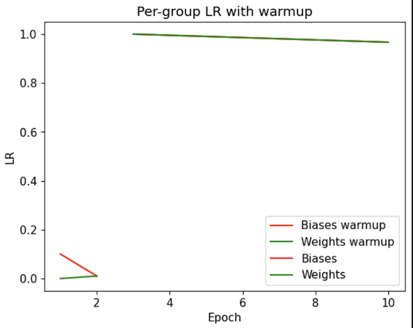  
We start with LR of `0.1` for biases, and `0.0` for everything else. Over the first 3 epochs, the LR of biases slowly decreases to `0.01`, and LR of other parameters increases to `0.01`. After warmup, we set the LR of all params to `1.0` and linearly decrease it to `0.01` over the next 300 epochs.   

This is needed to make sure that the model trains properly, especially in the beginning. Object detection task was always quite challenging in that respect because of its complexity. The 3 loss terms mentioned above will generate different signals, being overwhelming especially during the first iterations, when all the weights are initialized randomly: a lot of phantom objects being predicted in the background, class and bbox predictions being non-accurate. Naive way of training might lead to one of the losses to dominate others, causing the network to converge to some weird state, for example, predicting no objects whatsoever, that will correspond to some local minimum in the loss. Other algorithms use positive reweighing and FocalLoss to combat that; YOLO uses LR warmup and relative reweighing of the loss terms.
## Next up
Transformers, introduced around 2018, was one of the most interesting advancements in Deep Learning in the recent years. It unlocked such stuff as LLMs, ChatGpt and Bert, and pretty much any model using transformers achieves better results than the one without them.  

In the next post, I will talk about Detr - Facebook's object detection model that first came up with the way to use transformers for object detection. It is much simpler than all previous object detection approaches, including YOLO. It doesn't require any data priors like anchor boxes, or post processing like NMS. It generates detections in one inference step using raw image data, the model itself being responsible for not generating duplicate predictions. It is also competetitive in terms of speed, though transformers themselves are quite heavy. Some [data](https://syncedreview.com/2023/04/24/look-again-yolo-baidus-rt-detr-detection-transformer-achieves-sota-results-on-real-time-object-detection/#:~:text=In%20the%20experiments%2C%20RT%2DDETR,in%20both%20speed%20and%20accuracy.) indicates that DETRs can surpass YOLO in speed and accuracy at the same time. Current COCO [SOTA](https://paperswithcode.com/sota/object-detection-on-coco), as of early 2024, is also held by a DETR variant called "co-DETR".