The content is also available as [video](https://youtu.be/A2f4w54fSsM)  

## Plan  

- Motivation
- Direct set prediction and bipartite matching loss
- Model architecture: transformers, attention, self- and cross-attention, positional encoding
- Some cool visualisations of the attention mask  

## Motivation
The motivation behind DETR was to create a model for object detection that will be simpler in its approach. For example, here is how the overall architecture looks like for YOLO, one of the most popular object detectors at the moment:  

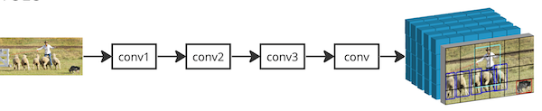   

We feed in the image, pass it through a bunch of convolutions. The output of them is a "hypercube" with something like 3x80x80x85 dimensions, where 80x80 stands for a downscaled resolution of image representation, and can be visualised as a "grid" on top of original image; 85 - 4 bbox coordinates and 81 class logit predictions; and extra 3 anchors per one grid cell prediction. The grid cell which contains the center of the object is supposed to be responsible for detecting that object; but in reality, neighbouring cells might generate such predictions as well, creating duplicates:  

   

To deal with that, YOLO has an extra post processing step after model inference called NMS - Non-Maximum Suppression. In YOLOv5, the rule is to remove box predictions for the same class if the IoU is above `0.45`. This is quite a strong rule, leading to false negatives in the case when there are many objects tightly packed together, with huge overlap between bounding boxes - crowds of people, flocks of birds etc. Here is one such example:  

   

YOLO fails to detect the man in the center, for example, because the bounding box for him was removed by NMS. If you think about it, this also contradicts the overall "methodology" of deep learning: we wanted to have the model as a "black box" that just learns everything itself, without the need for hand-crafted rules. And here we are back with the handcrafted rule - NMS - which is quite crude and spoils the situation in a lot of cases.  

Another popular object detection model, Regional Proposal Network (RCNN), is arguably a bit better:  

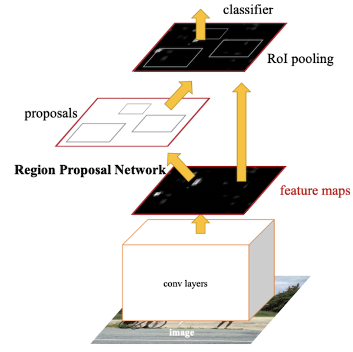   

Instead of hand-crafted rules, it has two-stage detection: first stage proposes crude estimations for the objects, second stage refines them and maybe filters some of them out. This is better in terms of "handcraftability": the model doesn't require external knowledge coded into it; but two-stage approach is challenging:  
- The proposal selection operation is not differentiable, so the two detectors have to be learned independantly: first the proposal part, then the refinement part
- Inference becomes slower, because you need multiple model inference steps   

DETR aimed at solving all of these problems: create a simple, one-stage detector that does not require any prior knowledge or hand-crafted components to work. To demonstrate how succesful that was, let's look at the COCO dataset [leaderboard](https://paperswithcode.com/sota/object-detection-on-coco):   

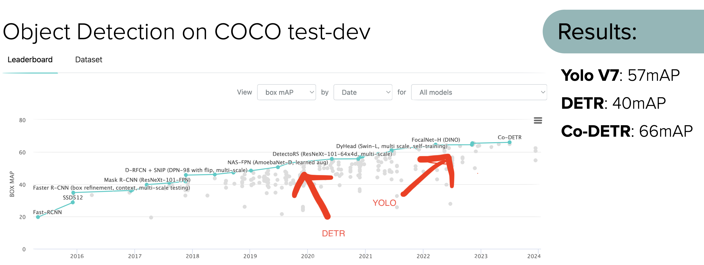   

DETR came out in 2020, and had mAP score of 40, which was relatively competitive, but below SOTA at that time; training times were also infamously long.   

YOLOv7, reported in 2022, has mAP of 57, with entirely convolutional model and low inference latency. In this respect, DETR itself as a model is clearly losing; however, the suggested approach spawned a huge outbreak of profitable research: deformable DETR, DAB Detr, denoising and DINO models and finally, Co-DETR in 2023 are all based on the same architecture. Current SOTA in object detection belongs to Co-DETR, with 66 mAP. Some [research](https://arxiv.org/pdf/2304.08069.pdf) indicates that some DETR variants might outperform YOLO both in speed and accuracy.  
## Direct set prediction
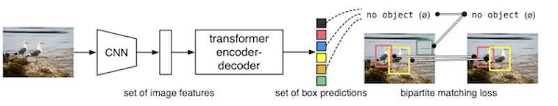  
Above is the image from the original [paper](https://arxiv.org/pdf/2005.12872.pdf). It depicts the overall achitecture of the model.  

We start with an image, feed that into a Convolutional Neural Network, like ResNet-50. I have an in-depth [post](https://github.com/adensur/blog/blob/main/computer_vision_zero_to_hero/08_resnet_imagenet/Readme.md) about such a model. By applying a series of convolutional steps, the image is gradually "downscaled" to lower resolution, something like 20x20, but the number of channels increases to 2048. Normal ResNet-50 will then have something like average pooling + fully connected layer to get 1000 class predictions (ImageNet, the dataset it was trained on, had 1000 classes). These parts are cut off, and instead this 20x20x2048 image representation is passed through a conv layer to reduce the number of channels to 256, and then fed into the Transformer. This CNN part of the network is usually called a "backbone".  

We pass this refined image representation through a Transformer (more on that later), and get output predictions. Each "prediction" can be thought of as a token that contains 4 bbox coordinates + 90 or something class probabilities + 1 special class "No Object". The model has to give a constant size tensor of outputs; typically, a DETR will output 100 tokens. If the picture has less objects, say, only 2, 98 out of 100 will have to predict "No Object".  

Now, we want the model to output the set of predictions (say, two birds with corresponding bounding boxes) directly. This means that we don't want a token to be somehow connected to specific parts of the image it needs to detect, or anchor priors for the object size, or anything like that. We also want the prediction of the model to be "unordered", i.e., the loss should not penalize the model for giving the same set of predictions, but in different order.  

The problem is more difficult than it sounds. Consider this example:  

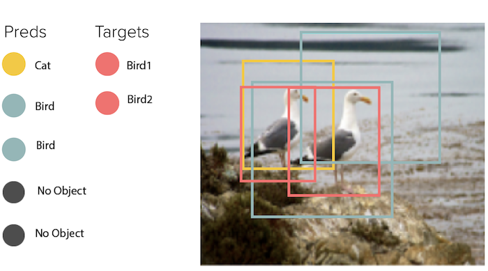   

We have a picture with 2 birds. The model predicts one object with a bounding box more or less matching the first box, but says that it's a cat; second object with a worse bounding box match, that says it's a bird; and a third object with bounding box being completely off, but also correctly saying it's a bird. Which output token should match which ground truth object? The closest one? The one with the correct class? What will we do if we have a lot of similar predictions? This is especially important in the beginning of the training, when the model is generating a lot of random predictions, and we need to match them to the reality somehow.  

The solution is called "Bipartite Matching Loss". The Bipartite Matching problem comes from graph theory and can be visualised like this:   

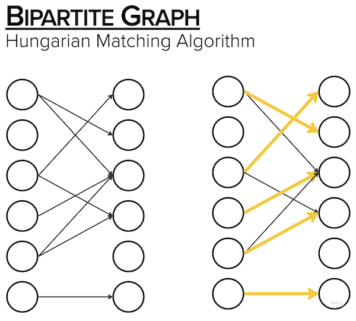    

Bipartite graph is such a graph that has only 2 "columns" of nodes. The problem is usually formulated as "find the match between jobs and job applicants" or "between actors and movies" such that one actor only stars in one movie, and one movie only has 1 actor. And we need to find such a match between the nodes that optimizes some "score".  

The naive solution would be to just brute-force: iterate over all possible combinations and choose the one with the best score. There is a more efficient algorithm called "Hungarian Matching", but the result is exactly the same.   

In our case, the score is the "loss" for object detection:
- CrossEntropy loss for classification, also considering "no object" as a special class
- L1 loss for bounding box prediction - distance between predicted and ground truth bounding box coordinates
- [GIoU](https://arxiv.org/pdf/1902.09630.pdf) - a version of IoU, Intersection over Union, the measure of bounding box overlap, modified to become differentiable.   

Note that unlike YOLO, we don't need an extra term like "objectness" to penalize phantom object predictions - classification loss handles that already.  

Now the loss covers everything that we wanted:
- It is unordered: hungarian matching loss will find exactly the same match if you reorder the predictions of the network
- It penalizes phantom objects:   

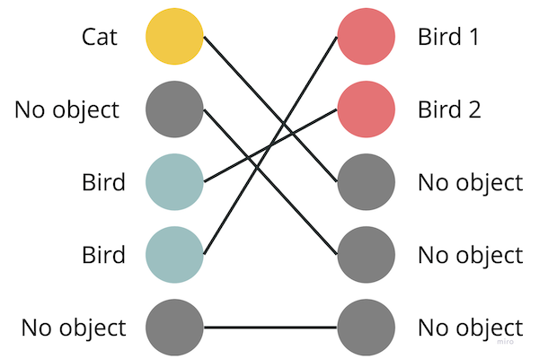   

In this case, the network generated 2 correct bird predictions, and a phantom "cat" object in the background. Bipartite matching loss had to connect the "cat" prediction to something - in this case, to the "no object" token, which incurs an increase in classification loss, because "cat" != "no object"  

- It penalizes duplicates:  

    

In this case, the model detected 3 birds; one of them had to be connected to the "no object" token, incurring an increase in the classification loss.  
- Prediction in single stage: we dont need multi-stage detection or post-processing, we can just use the output of the model itself as detections. It is also trained end-to-end.   

However, there is a problem: in order for the network to be able to not output any duplicates, we need some sort of "inter-layer" cooperation that is not present in convolutions or dense layers. Think about the following problem: a teacher asks the class to provide exactly 2 volunteers. If the students can communicate, they can see who else volunteered, and make their decision based on that, they will be able to cooperate in such a way as to really provide exactly 2 volunteers. If the students can't communicate - they have to write their name on a piece of paper, for example - the best they can do is put their name down with a certain probability, which causes the class to yield 2 volunteers on average, but that sometimes will be 1, or 3, or something else.   

This is how we can visualize a simple convolution layer:  

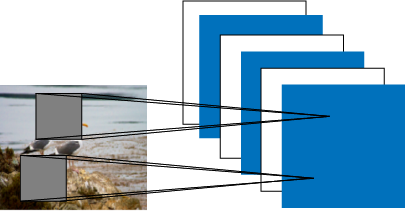   

A single pixel in the output is produced by applying a "convolution kernel" to a certain area, say, 3v3, in the input image; this means that the information flows from the neighbouring pixels in the previous layer to a single pixel in the next layer, but there is no information flow between pixels of the current layer.  

Luckily, this is exactly the problem that is fixed with Transformers!

## Transformers.
Transformers were introduced in 2017 in the paper ["Attention is all you need"](https://arxiv.org/pdf/1706.03762.pdf). Main idea behind them is the "attention" mechanism, which is mainly about providing the network with the ability to *ignore stuff*. Think about a loud cocktail party: there are lots of conversations going on around you, and you need to focus only on what your immediate partner is saying. *Attention* doesn't provide you with any extra information; instead, it allows you to *ignore* some of the existing information, allowing you to process the important parts more effectively.  
### Sequence - tranformer inputs
Transformers operate on sequences. Inputs and outputs of the transformer are sequences.  

For example, consider the phrase "The agreement on the European Economic Area was signed in August 1992."; we want to translate it to French, getting "L’accord sur la zone économique européenne a été signé en août 1992.". Before passing this to the transformer, we need to convert the sentence to a sequence of vectors. This is done by a process called "embedding lookup": we look words up in a fixed dictionary, each word corresponding to a learnable, randomly initialized vector of dimensionality, say, E = 256; we get 13 word-vectors, so the sequence length is S=13. In reality, Transformers expect fixed-size input, so we "pad" this sequence with zeroes to a fixed length, say, S=512.  

Here is an illustration of how we can get a sequence from an image:  

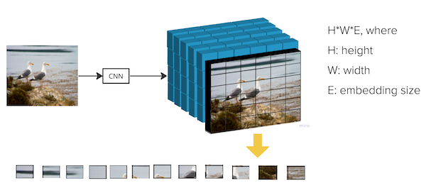   
We have our backbone output with dimensionality of 28x28x256, 28x28 correspinding to the height and width of our downscaled, condensed version of an image; 256 being the embedding dimension. We then flatten this out along height and width dimension, getting sequence length of S=28x28=784. Note that the resulting sequence length is quadratic by the dimensions of the backbone output. Also note that the "flatten" process causes us to lose all the positional information - we will have to deal with that by the use of positional encodings.  

### Self attention
Self attention is achieved by applying a "scaled dot product attention" operation between the elements of the "image" sequence. Here is the image from the paper:  

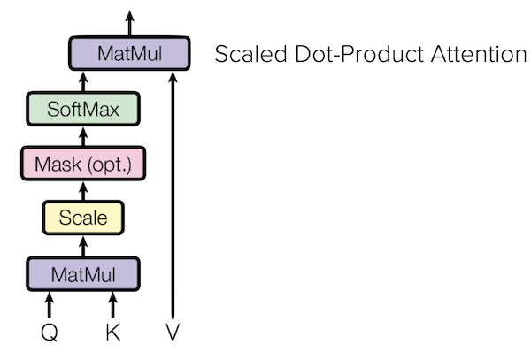   

We take sequence elements, each element being a vector of 256 numbers - Embedding dimensionality - and project them into Query, Key and Value vectors using 3 independant dense layers. We then calculate the `dot product` between every possible pairs of Queries and Keys. A `dot product` operation is calculated by just multiplying the vectors element-wise, and then summing the result. The result of the dot product of two vectors is just a single number. Dot product geometric interpretation is "orthogonality": the dot product is maximal if the vectors are orthogonal to each other.  

By computing dot product between every possible pair, we arrive at an "Attention Mask". It will be used later to determine which weights to use for each element of a sequence. Here is a visualisation of this:   

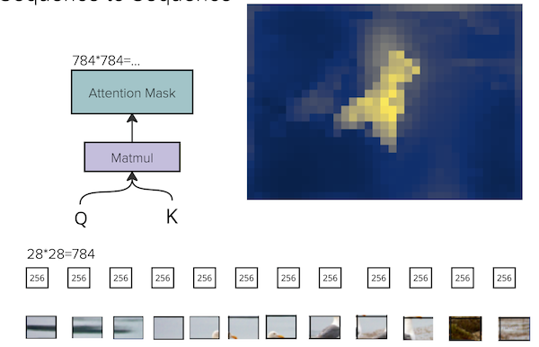   

Initially, we had a flattened sequence with length 784, representing the image. Attention mask will have the shape of 784x784; it is hard to visualize that, but we can choose one row of that matrix (with shape 1x784), corresponding to a single element in the "Query" sequence. The image above shows the attention mask for "Query" element corresponding to the beak of a bird. Curiously, the attention looks like an actual outline of the bird, despite the fact that the model wasn't explicitly provided with that info. The model was trained using bounding boxes, so it was not given exact pixel segmentation information about the object. It was able to infer that on its own.   

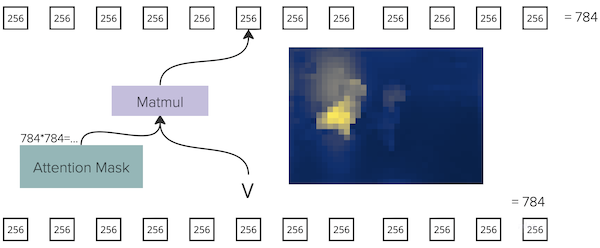   
Then we take the "Value" representation of the sequence and use the attention mask to arrive at the output. In matrix terms, we "multiply" the sequence of V elements with the dimension of 784x256 by the attention mask, 784x784, arriving at another sequence of 784x256 dimensionality.  

In non-matrix terms, we compute ith element in the output as the weighted sum of all the V elements in the sequence; the weight for jth element in this sum is given by the attention between ith Query and jth Key.   

As the result of this "self-attention" operation, we arrived at the sequence with exactly the same shape as the input sequence; this attention module required pairwise dot-product between all the elements in the sequence, thus making sure we have a lot of "node cooperation" and informational exchange between elements in the sequence. Since the output shape is the same as the input shape, we can "stack" many such layers on top of each other. DETR uses 6 self-attention layers in its encoder. There are also residual connections that skip this transformer layer to make sure that the model learns better.     

When we computed the dot products for attention mask, the product between two Key and Query vectors, 256 numbers in each, yields just 1 number. This number is used to control the flow of information from the Value to the output layer; this underscores that the Attention mechanism is mainly about *ignoring* information.  

Another note: the attention mask calculation is quadratic in complexity with regard to sequence length, which means its is quartic (4th power!) to the dimensions of the image representation after the backbone. This makes it hard to scale DETR up to image representations with higher resolutions, like 40x40 or 80x80, because they get prohibitively expensive. This causes DETR to have poor quality when detecting small objects - a downside that will be addressed in later research.   

### Multihead attention
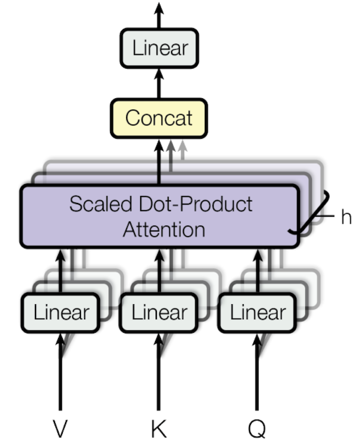   

In the actual Transformer, we use "MultiHead Attention". It is identical to applying the attention operation N=8 (for example) times in parallel: we generate 8 different projections for Key, Query, and Value (each with Embedding dimension of 256/8 = 32); compute 8 independant attention masks; arrive at 8 independant output sequences (again, with 32 embedding dimension), and concatenate them all together along the Embedding dimension, getting the same 784x256 output. This is useful because there can be more than one thing going on in the picture, and the model might need independant attention masks to represent that.  

## More detailed model architecture. Decoder, cross-attention
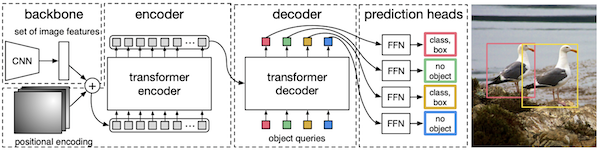   
Above is the more detailed schema of the model architecture. Image representation from the backbone is flattened, added to positional encodings (more on that later), and then passed through the Encoder with a bunch of self-attention layers to get even better, refined representation of the image. After that, we have a "Decoder" with cross attention.   

Initial input to the decoder are the "queries". Think of them as "experts" that *query* the image and attend to different parts of the image, and also attend and communicate to each other, in order to eventually come up with object predictions - bounding boxes and classes. DETR uses 100 queries. The output of the encoder is passed in as a side input to the decoder. Queries are learnable vectors with dimensionality of 256, initialized randomly.   

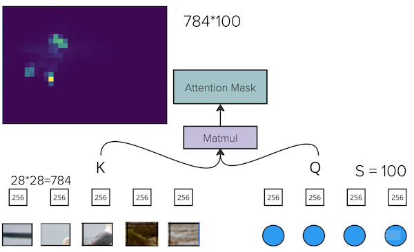   

In cross attention, we get an "Image" sequence - the refined representation of the image with 784x256 shape, coming out of the decoder - as Keys and Values, and Queries are coming from the Query sequence, with 100x256 shape.   

As the result of pairwise dot-product, we now get the non-rectangular, 784x100 attention mask matrix. In the image above, we can see the visualisation of this mask for one of the queries. We can see that the attention pattern changed a bit: it now focuses more on those parts of the bird that are affecting the actual bounding box - head, tail and legs, and less on the middle of the bird. This makes sense, because the queries have to come up with the bounding box predictions.  

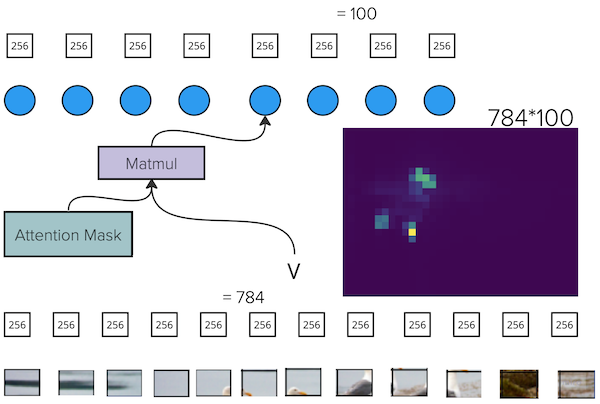   

After computing cross attention mask, we now take Values from the "Image" sequence (784x256 shape), and perform matrix multiplication with the attention mask (100x784). Following the rules of matrix multiplication, the common dimension (784) goes away, and we arrive at the output with shape 100x256. We can view this output as a refined representation of the queries; it also has the same shape as the "query" input, meaning that we can stack many such layers on top of each other. The "side input" from image content does not change as the result of this operation; different cross attention layers use the same encoder output as their side input.  

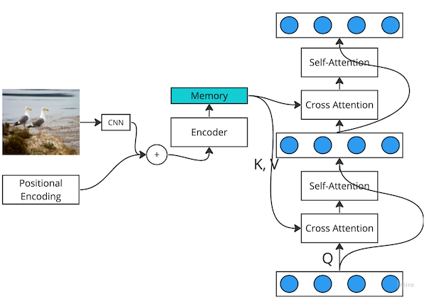   

Decoder uses 6 cross attention layers, interleaved with self-attention layers between queries (when Q, K and V all come from the "Query" sequence), and residual connections. Output of the decoder, with 100x256 shape, is then projected, using extra dense layers, into "bbox predictions" with shape 100x4 (100 tokens, 4 bbox coordinates for each), and 100x91 class predictions (90 classes in COCO + 1 extra "no object class").  
## Positional encoding
As mentioned above, the "flatten" operation and the transformer itself doesn't use any positional information on its own. To compensate for that, we need to have a special "positional embedding" added to the image representation to make it work.    

Here is a really good [post](https://towardsdatascience.com/master-positional-encoding-part-i-63c05d90a0c3) that explains the concepts really well, with beautiful math involved. I will briefly repeat the explanation here.   
### 1d case

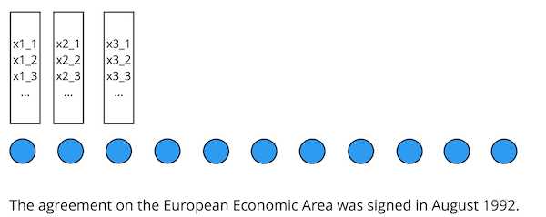   

For positional embedding, we want to have a set of numbers (of the same dimensionality as our content sequence, i.e., 256, because we will sum them later), that satisfies the following conditions:  
- It is normalized. Meaning that simply putting actual position - integer number like 1, 2, 3...100 will not work
- It makes it easy for the network to represent relative position using embeddings from 2 elements.   

First approach is to just initialize embedding for every position randomly, and make them trainable. It works well enough.   

Another approach is the so-called "sin-cos" approach. Here is the heatmap visualisation of the resulting embeddings:   

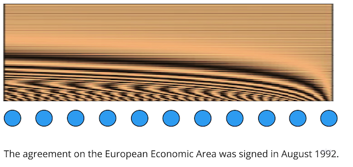   

Let's say that `x` coordinate represents the index along the sequence, and `y` coordinate represents the position within the embedding. For y = 0, we have a sine wave with the highest frequency, changing rapidly as the position changes. For y = 100, the frequency is really small, so the change in position only incurs slight change in the amplitude. We can think of these sine waves with different frequency as different "knobs" with variable sensitivity:   

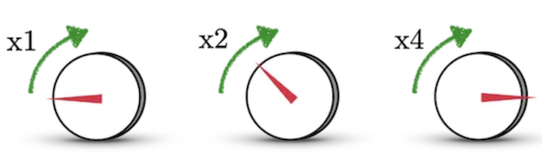   

The first knob is really insensitive; slight adjustment of the knob changes the volume drastically. Second knob is a bit more sensitive, so we can rotate it much more, allowing us to more precisely control the volume; third knob is even more sensitive and so on. The combination of a big number of knobs allows us to easily represent values in a huge range as well as with a lot of precision.   

Since we need embedding with size 256, we will have 128 coordinates for sine waves with different frequencies, and 128 coordinates for cosine waves with different frequencies. Having both sine and cosine in the embedding makes it really easy for the network to represent relative position, because the translation function in such a case looks relatively easy.   

Sine-Cosine positional embeddings do not require trainable parameters, and are more popular in practice.
### 2d case

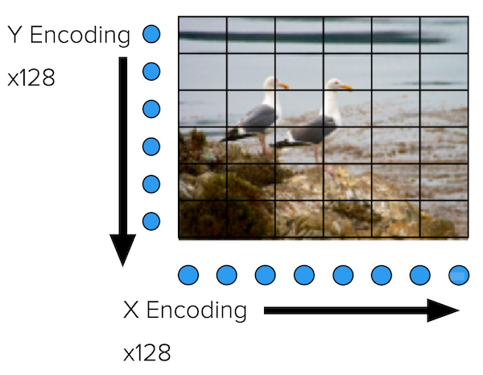   

For 2d positional representation, we simply use a combination of 2 1d positional embeddings. X-axis embedding has 128 coordinates - 64 for sine, 64 for cosine; Y-axis embedding also has 128 coordinates - 64 for sine, 64 for cosine; resulting embedding is the concatenation of X and Y embeddings for current grid cell.  
### Adding positional embeddings to image representation

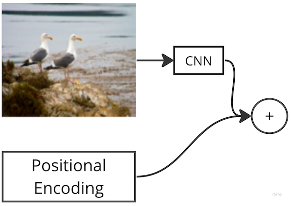   

Final curious detail about positional embeddings is that we *add* them to the image representation, coordinate wise, instead of concatenating along the channel dimension. This was done to preserve complexity, because increasing the overall embedding size will make transformers much slower.  

Such an operation seemingly should "spoil" image representation, because we are adding sine and cosine positional information to the "color" or "intensity" representation of the image, which makes no sense at the first glance. However, provided that the backbone is trainable (or at least the final layer of it), the network might "learn" to use fixed size embeddings as it sees fit. It might learn to put all the required image information into first 254 numbers; and from the positional embedding side, it might learn to zero out the first 254 numbers of the output, and put important bits of the positional embedding into the last 2 numbers of the resulting embedding.  
## Analysis
Finally, let's discuss some attention mask visualisations. All of them were done using the [notebook](https://colab.research.google.com/github/facebookresearch/detr/blob/colab/notebooks/detr_attention.ipynb) provided by the official detr [implementation](https://github.com/facebookresearch/detr).

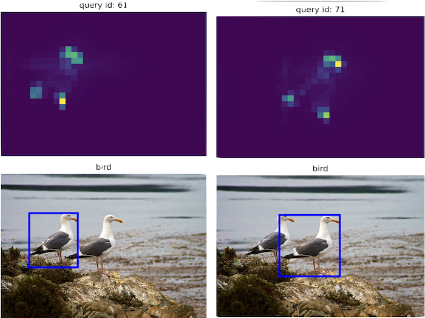   

Above, we have attention mask visualisations of the last decoder layer for those queries that detected the birds. As discussed above, we can see that the queries focus more on extreme points of the object that will affect the bounding box, in our case, head, feet and tail of the bird.  

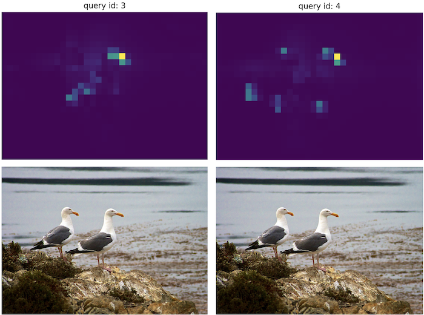   

This one is the same attention mask visualisation, but for the two random queries. Recall that the model should not output duplicates; only 2 of the queries will predict something, other queries will predict "no object". Bounding box coordinates do not participate in the loss in such case. We can see that now the attention mask is more scattered around the birds; perhaps that is why these particular 2 queries didn't come up with a good prediction and "lost in the vote" to be the output of the model.  

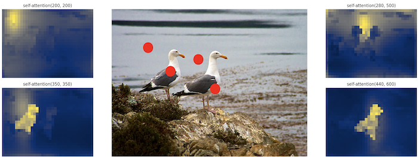   

These are self-attention masks for the last layer of the encoder, for the random point in the background (upper left), background point near the birds (upper right), point on the left bird (bottom left) and point on the right bird (bottom right). As we've seen before, points located on the object itself mainly attend to the points belonging to the same object, thus creating an unsupervised segmentation for the object. Random point in the background (upper left) simply attends to nearest areas around it; point in the background near the birds (upper right) attends to nearest background, but the bird silhouettes are "shadowed out". People have similar behaviour: if you were asked to determine the color of the water, for example, you will also try to "look through the birds", pointing your attention only at the background, away from the objects obstructing the view.   

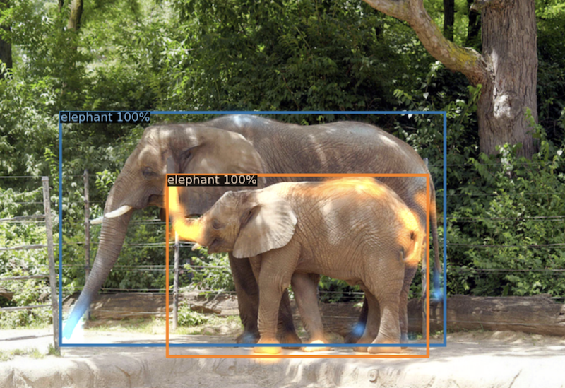   

This is an image from the original paper demonstrating cross-attention mask for the last decoder layer. Once again we see that the queries focus more on the extreme points of the object that lie near the bounding box itself (trunk, tail, feet). In this case, the model was also able to correctly identify which feet belong to which elephant, allowing it to draw proper bounding boxes. This case would be nightmarish for YOLO, because the bounding boxes overlap a lot. One of the predictions would probably be removed by NMS. DETR has no problem in identifying objects packed together in a tight space, with big overlap between bounding boxes.  

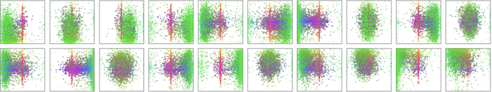   

This is another image from the paper, showing the location and size (depicted by color; green = small objects, red - big objects) of the objects being predicted by each query. We can see that they also tend to "specialise", similar to anchor boxes: some queries focus more on objects located in the lower left corner, for example. Unlike bounding boxes, this behaviour was not externally coded into the model; the model came up with this behaviour on its own.
## Next Up
In the next post, I will traditionally go through the process of running and reading the code of the official DETR [implementation](https://github.com/facebookresearch/detr)