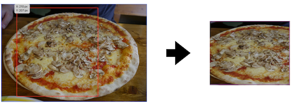
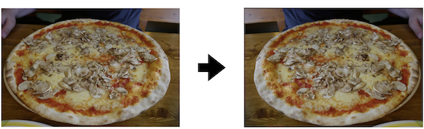
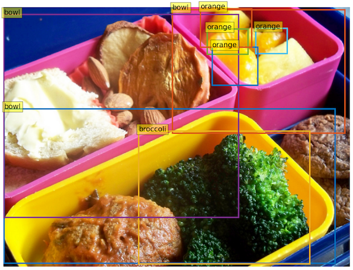
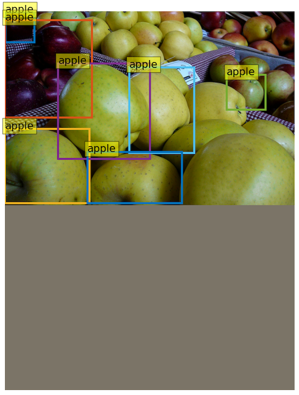
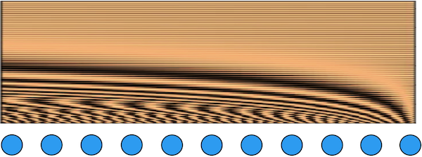
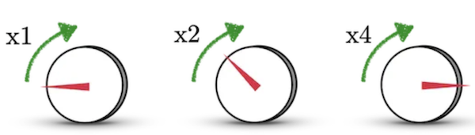
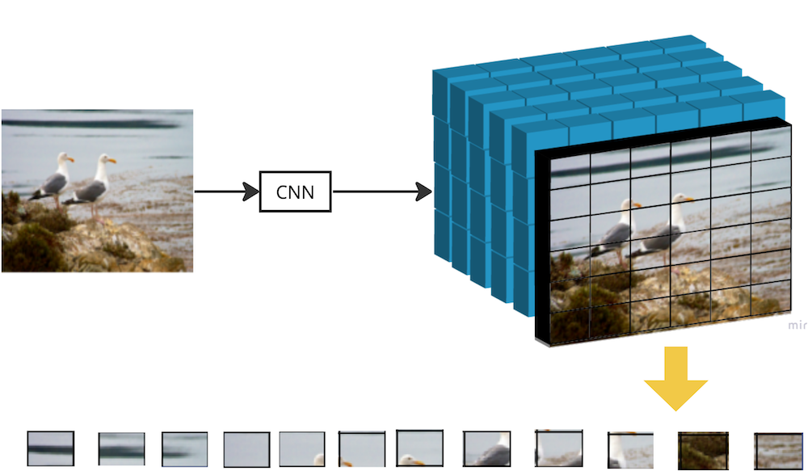
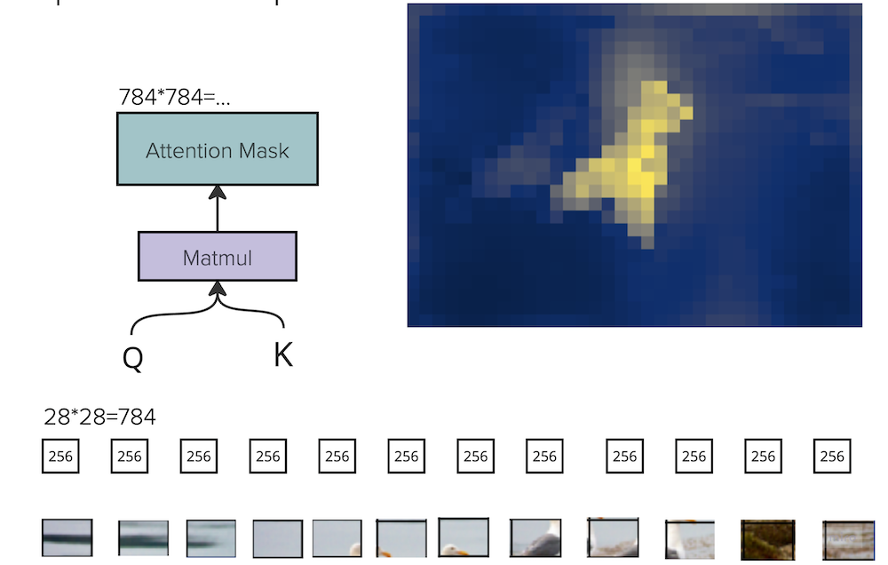
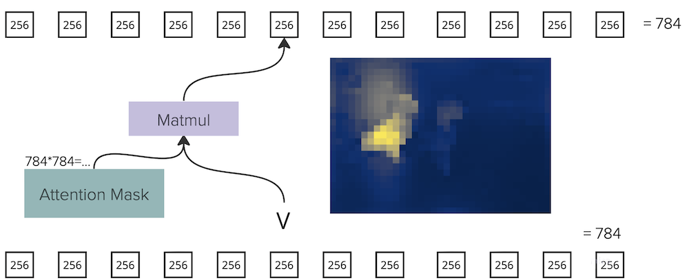

The content is also available as [video](https://youtu.be/UfutqqyFjEM).
## The plan
This post will describe how to train your own [detr](https://github.com/facebookresearch/detr) model from scratch, and briefly go through the source code itself, providing some explanations. The algorithm itself was described in previous [post](https://github.com/adensur/blog/blob/main/computer_vision_zero_to_hero/12_detr/Readme.md). The plan:   

- How to train your own model from scratch (benchmark reproduction)
- My setup to read the code and run the debugger
- Reading dataloading code and image transform
- Model architecture: backbone, transformer, encoder-decoder, queries, positional embeddings
- Loss
- Training loop

## How to train your own model from scratch
Benchmark reproduction is fairly easy. The code is published [here](https://github.com/facebookresearch/detr). It contains instructions both on how to load pretrained model and how to train one from scratch, as well as a few jupyter notebooks with cool visualizations. The code itself is also fairly simple, compared to YOLO, for example, that we've talked about in one of the previous [posts](https://github.com/adensur/blog/blob/main/computer_vision_zero_to_hero/11_yolo_code_read/Readme.md) - it uses mainly PyTorch functions, so it doesn't need any extra code to handle data loading, image transforms and other heavy lifting. It installs without problems on Linux, Mac, arm and x86 architectures, cuda and mps. To set up:  
```
git clone https://github.com/facebookresearch/detr.git
cd detr
pip install -r requirements.txt
```
As usual, take close attention to the version of Python you are using when installing the libraries (pip) and running the script. I use `python3.9` for both, and this is the command I use for setup:
```
python3.9 -m pip install -r requirements.txt
```
Invoking it like this makes sure that pip used for setup corresponds to the same python you later use when running.  

To download the dataset, go to the official CoCo [website](https://cocodataset.org/#download), download "train images", "val images" and "annotations" to the same folder, and unzip all of them. This is how the directory structure should look like:   
```
path/to/coco/
  annotations/  # annotation json files
  train2017/    # train images
  val2017/      # val images
```
To run the training:   
```bash
python3.9 main.py --coco_path ~/repos/datasets/coco_original --device mps
```
This will launch the training on Mac, on mps device. Replace the device with `cuda` to train on GPU. Alternatively, use `torchrun` to run the same on multiple GPUs.  

That is about it. Now you just have to wait for one or few weeks until it trains. Default batch size is already just 2, so it is doubtful that you can reduce it further in case of lack of memory on gpu.
## My setup for code reading and debugging
I find it useful to have 2 things to aid code reading: jupyter notebook to execute code interactively and plot images, and debugger to step through the actual DETR code and print out intermediate variables. I do both in VSCode, which allows me to step into functions to debug even from Jupyter notebook itself. Alternatively, you can use [pdb](https://docs.python.org/3/library/pdb.html) to debug the training script from the command line.  

To set up debugging with VSCode:   
- Select correct interpreter for VSCode: cmd-shift-p, "Python: Select Interpreter", and choose the same python you used for installing and running before.
- Go to "Run and Debug" tab, and "Add Configuration" near the "run" button on the top left. This will create the `launch.json` file.
- Add cmd arguments in the `launch.json`, at least path to the dataset and device:  
```json
{
    "version": "0.2.0",
    "configurations": [
        {
            "name": "Python: Current File",
            "type": "python",
            "request": "launch",
            "program": "${file}",
            "console": "integratedTerminal",
            "justMyCode": true,
            "args": "--coco_path ~/repos/datasets/coco_original --device mps"
        }
    ]
}
```
After that, you can launch debugger from VSCode itself - in the same "Run and Debug" tab, choose "Run" with the same config name as in the `launch.json`, in our case - `Python: Current File`. This will allow you to set breakpoints directly in VSCode, print out variables in the debug console, and do other stuff.   

For Jupyter Notebook setup, I simply create a `sandbox.ipynb` file at the root of the repository, and open it in VSCode. Once again, make sure to select the same python as the kernel for the notebook. This allows you to import modules from this repo, similar to how it is done in `main.py` script - so you can simply copy-paste and execute code from there. You can also copy the [notebook](./sandbox.ipynb) from this post to the root of the DETR repo and run it.   

In the Jupyter notebook, we can now import all the libraries, including the ones defined in DETR repo itself:  
```python
# jupyter notebook
import argparse
import datetime
import json
import random
import time
from pathlib import Path

import numpy as np
import torch
from torch.utils.data import DataLoader, DistributedSampler

import datasets
import util.misc as utils
from datasets import build_dataset, get_coco_api_from_dataset
from engine import evaluate, train_one_epoch
from models import build_model

import matplotlib.pyplot as plt
import torchvision
```
Some helper functions to know the class labels and to plot images:  
```python
# jupyter notebook
# COCO classes
CLASSES = [
    'N/A', 'person', 'bicycle', 'car', 'motorcycle', 'airplane', 'bus',
    'train', 'truck', 'boat', 'traffic light', 'fire hydrant', 'N/A',
    'stop sign', 'parking meter', 'bench', 'bird', 'cat', 'dog', 'horse',
    'sheep', 'cow', 'elephant', 'bear', 'zebra', 'giraffe', 'N/A', 'backpack',
    'umbrella', 'N/A', 'N/A', 'handbag', 'tie', 'suitcase', 'frisbee', 'skis',
    'snowboard', 'sports ball', 'kite', 'baseball bat', 'baseball glove',
    'skateboard', 'surfboard', 'tennis racket', 'bottle', 'N/A', 'wine glass',
    'cup', 'fork', 'knife', 'spoon', 'bowl', 'banana', 'apple', 'sandwich',
    'orange', 'broccoli', 'carrot', 'hot dog', 'pizza', 'donut', 'cake',
    'chair', 'couch', 'potted plant', 'bed', 'N/A', 'dining table', 'N/A',
    'N/A', 'toilet', 'N/A', 'tv', 'laptop', 'mouse', 'remote', 'keyboard',
    'cell phone', 'microwave', 'oven', 'toaster', 'sink', 'refrigerator', 'N/A',
    'book', 'clock', 'vase', 'scissors', 'teddy bear', 'hair drier',
    'toothbrush'
]

coco_idx_to_label = {idx: label for idx, label in enumerate(CLASSES)}

# colors for visualization
COLORS = [[0.000, 0.447, 0.741], [0.850, 0.325, 0.098], [0.929, 0.694, 0.125],
          [0.494, 0.184, 0.556], [0.466, 0.674, 0.188], [0.301, 0.745, 0.933]]

class UnNormalize(object):
    def __init__(self, mean, std):
        self.mean = mean
        self.std = std

    def __call__(self, tensor):
        """
        Args:
            tensor (Tensor): Tensor image of size (C, H, W) to be normalized.
        Returns:
            Tensor: Normalized image.
        """
        output_tensor = []
        for t, m, s in zip(tensor, self.mean, self.std):
            output_tensor.append(t.mul(s).add(m))
            # t.mul_(s).add_(m)
            # The normalize code -> t.sub_(m).div_(s)
        return torch.stack(output_tensor, dim=0)

unnorm = UnNormalize(mean=(0.485, 0.456, 0.406), std=(0.229, 0.224, 0.225))

# for output bounding box post-processing
def box_cxcywh_to_xyxy(x):
    x_c, y_c, w, h = x.unbind(1)
    b = [(x_c - 0.5 * w), (y_c - 0.5 * h),
         (x_c + 0.5 * w), (y_c + 0.5 * h)]
    return torch.stack(b, dim=1)

def rescale_bboxes(out_bbox, size):
    img_w, img_h = size
    b = box_cxcywh_to_xyxy(out_bbox)
    b = b * torch.tensor([img_w, img_h, img_w, img_h], dtype=torch.float32)
    return b

def plot_results(img, labels, boxes, mask=None):
    h, w = img.shape[1:]
    if mask != None:
        # width
        if torch.where(mask[0])[0].shape[0] > 0:
            mask_w = torch.where(mask[0])[0][0]
            w = min(w, mask_w)
        if torch.where(mask[:, 0])[0].shape[0]:
            mask_h = torch.where(mask[:, 0])[0][0]
            h = min(h, mask_h)
            
    boxes = rescale_bboxes(boxes, (w, h))
    plt.figure(figsize=(16,10))
    unimage = unnorm(img)
    #image = (unimage*256).to(torch.uint8)
    image = unimage
    pil_img = torchvision.transforms.functional.to_pil_image(image)
    plt.imshow(pil_img)
    
    ax = plt.gca()
    colors = COLORS * 100
    for label, (xmin, ymin, xmax, ymax), c in zip(labels, boxes.tolist(), colors):
        ax.add_patch(plt.Rectangle((xmin, ymin), xmax - xmin, ymax - ymin,
                                   fill=False, color=c, linewidth=3))
        text = f'{CLASSES[label]}'
        ax.text(xmin, ymin, text, fontsize=15,
                bbox=dict(facecolor='yellow', alpha=0.5))
    plt.axis('off')
    plt.show()
```
We add `UnNormalize` function to convert our preprocess image tensors from normalized form (numbers with 0 mean and 1 stddev) back to original form - (0, 1) representing relative R, G, and B color intensity. Without it, the plotted images will look weird, with huge areas "blacked out". We define some helper functions for bounding box manipulation - converting them from the CoCo dataset format (specifying center coordinates, height and width) to the format expected by plotting function: coordinates of one corner and height and width. Then, we add a "plot" function that receives an image tensor and labels (including bounding boxes), and plots them.   

Finally, we add the `args` helper object that contain all the command line arguments used in `main.py`, including the default ones:  
```python
# jupyter notebook
class Args(argparse.Namespace):
    lr=0.0001
    lr_backbone=1e-05
    batch_size=2
    weight_decay=0.0001
    epochs=300
    lr_drop=200
    clip_max_norm=0.1
    frozen_weights=None
    backbone='resnet50'
    dilation=False
    position_embedding='sine'
    enc_layers=6
    dec_layers=6
    dim_feedforward=2048
    hidden_dim=256
    dropout=0.1
    nheads=8
    num_queries=100
    pre_norm=False
    masks=False
    aux_loss=True
    set_cost_class=1
    set_cost_bbox=5
    set_cost_giou=2
    mask_loss_coef=1
    dice_loss_coef=1
    bbox_loss_coef=5
    giou_loss_coef=2
    eos_coef=0.1
    dataset_file='coco'
    coco_path='/Users/maksimgaiduk/repos/datasets/coco_original'
    coco_panoptic_path=None
    remove_difficult=False
    output_dir=''
    device='mps'
    seed=42
    resume=''
    start_epoch=0
    eval=False
    num_workers=2
    world_size=1
    dist_url='env://'
    distributed=False

args = Args()
```
We define them in such a way to make them equivalent to the actual command line args, allowing us to copy paste the code directly from the scripts within DETR repo. I've got the actual values by running the script in the debugger and printing out `args` values right at the start of main function.   

Finally, we set up all the random seeds - this mainly helps make sure that images we see are the same each time, which might be useful if you are trying to understand the dimensions being passed around.  

```python
# jupyter notebook
# fix the seed for reproducibility
seed = args.seed + utils.get_rank()
torch.manual_seed(seed)
np.random.seed(seed)
random.seed(seed)
```

## Loading the data
Initializing the dataset is now really simple:  
```python
# jupyter notebook
dataset_train = build_dataset(image_set='train', args=args)
```
You can copy this line of code directly from `main.py` of the original repo itself, and it will just work. We can get the images from the dataset like this:  
```python
# jupyter notebook
print(len(dataset_train[0]))
print(dataset_train[0][0].shape)
print(dataset_train[1][0].shape)
dataset_train[0][1]
```
```
2
torch.Size([3, 512, 682])
torch.Size([3, 480, 646])
{'boxes': tensor([[0.5205, 0.6888, 0.9556, 0.5955],
         [0.2635, 0.2472, 0.4989, 0.4764],
         [0.3629, 0.7329, 0.4941, 0.5106],
         [0.6606, 0.4189, 0.6789, 0.7815],
         [0.3532, 0.1326, 0.1180, 0.0969],
         [0.2269, 0.1298, 0.0907, 0.0972],
         [0.3317, 0.2269, 0.1313, 0.1469],
         [0.3571, 0.0792, 0.1481, 0.1481]]),
 'labels': tensor([51, 51, 56, 51, 55, 55, 55, 55]),
 'image_id': tensor([9]),
 'area': tensor([282171.7812, 104435.5469, 116523.6641,  57095.6250,   5263.0371,
           3898.9131,   8482.9902,   6992.8281]),
 'iscrowd': tensor([0, 0, 0, 0, 0, 0, 0, 0]),
 'orig_size': tensor([480, 640]),
 'size': tensor([736, 981])}
```
The interface to the `dataset` as the same as python's `list`: it has `len`, and we can index into it to get an actual sample. Each sample is a pair of (features, targets), where `features` corresponds to the actual image tensor, after the transforms; `targets` is the dictionary with a bunch of values: bbox coordinates, class labels, and a bunch of other stuff not used by detr.   

We can immediately notice that all the images returned by the dataset have different sizes. Compare that to [resnet](https://github.com/adensur/blog/blob/main/computer_vision_zero_to_hero/08_resnet_imagenet/Readme.md) that used much lower resolution (224x224), and resized all images to the same size; or [YOLO](https://github.com/adensur/blog/blob/main/computer_vision_zero_to_hero/11_yolo_code_read/Readme.md), that used higher resolution, but used the same size of "mosaic" images with 640x640 pixels.   

In here, we only use 2 transforms: RandomResizedCrop and RandomHorizontalFlip.  

Here is an example of RandomResizedCrop:  

  

It crops out a random portion of the image, and then resizes it randomly in a certain interval, slightly changing the aspect ratio.  

Here is an example of RandomHorizontalFlip:  

  

It flips the image horizontally with 50% probability.  

We can find the definition of the dataset [here](https://github.com/facebookresearch/detr/blob/main/datasets/coco.py#L17):
```python
# source codem coco.py:17
class CocoDetection(torchvision.datasets.CocoDetection):
    def __init__(self, img_folder, ann_file, transforms, return_masks):
        super(CocoDetection, self).__init__(img_folder, ann_file)
        self._transforms = transforms
        self.prepare = ConvertCocoPolysToMask(return_masks)

    def __getitem__(self, idx):
        img, target = super(CocoDetection, self).__getitem__(idx)
        image_id = self.ids[idx]
        target = {'image_id': image_id, 'annotations': target}
        img, target = self.prepare(img, target)
        if self._transforms is not None:
            img, target = self._transforms(img, target)
        return img, target
```
It inherits from torchvision's [CocoDetection](https://pytorch.org/vision/stable/generated/torchvision.datasets.CocoDetection.html) class that handles all the heavy lifting: reading the files from disk, reading the labels etc, in exactly the format we got after downloading the dataset from CoCo website. On top of that, we add `ConvertCocoPolysToMask` that is only needed for segmentation, and `transforms`.   

Transforms are defined [here](https://github.com/facebookresearch/detr/blob/main/datasets/coco.py#L115):  
```python
# source code, coco.py:115
def make_coco_transforms(image_set):

    normalize = T.Compose([
        T.ToTensor(),
        T.Normalize([0.485, 0.456, 0.406], [0.229, 0.224, 0.225])
    ])

    scales = [480, 512, 544, 576, 608, 640, 672, 704, 736, 768, 800]

    if image_set == 'train':
        return T.Compose([
            T.RandomHorizontalFlip(),
            T.RandomSelect(
                T.RandomResize(scales, max_size=1333),
                T.Compose([
                    T.RandomResize([400, 500, 600]),
                    T.RandomSizeCrop(384, 600),
                    T.RandomResize(scales, max_size=1333),
                ])
            ),
            normalize,
        ])

    if image_set == 'val':
        return T.Compose([
            T.RandomResize([800], max_size=1333),
            normalize,
        ])

    raise ValueError(f'unknown {image_set}')
```
And here is how we can view the image from the dataset:  
```python
# jupyter notebook
example = dataset_train[0]
plot_results(example[0], example[1]["labels"], example[1]["boxes"])
```
  
It demonstrates how the image looks like after applying image transforms, but before the `collate_fn` (more on that later).   

Now let's create a dataloader. To do that, we also need a `sampler` (to shuffle images):  
```python
# jupyter notebook
sampler_train = torch.utils.data.RandomSampler(dataset_train)    
batch_sampler_train = torch.utils.data.BatchSampler(
    sampler_train, args.batch_size, drop_last=True)
data_loader_train = DataLoader(dataset_train, batch_sampler=batch_sampler_train,
    collate_fn=utils.collate_fn, num_workers=args.num_workers)
```
We can get an example batch from dataloader like this:  
```python
# jupyter notebook
for X, y in data_loader_train:
    break
X.tensors.shape
```
```
torch.Size([2, 3, 1063, 813])
```
[Here](https://github.com/facebookresearch/detr/blob/main/util/misc.py#L269) is the definition of our custom `collate_fn`:  
```python
# source code
# misc.py:269
def collate_fn(batch):
    batch = list(zip(*batch))
    batch[0] = nested_tensor_from_tensor_list(batch[0])
    return tuple(batch)
```
Normally, a custom `collate_fn` is used to run custom code to unite several examples from the dataset into a batch. In our case, `dataset` returns images with variable shapes; tensors don't like that. So to create a batch, we `pad` all images to the maximum height/width with zeroes, but also save `mask` to show which parts of the image are real, and which are not.  

The object returned from this `collate_fn` is of type `NestedTensor` - it is defined in the same utils file in the repo. However, modern pytorch has a beta-version of the `NestedTensor` class as well. It contains 2 main fields: `tensors` with actual images, and `mask` - a boolean tensor, where `False` stands for "real parts of the image" and `True` stands for "padding".   

Here is how we can take a look at the image itself:  
```python
# jupyter notebook
plot_results(X.tensors[1], y[1]["labels"], y[1]["boxes"], mask=X.mask[1])
```
   

We can see padding as the gray area on the bottom of the image.   

As we will later see, the backbone of the model - ResNet50, which represents the "convolutional" part of the model, will be applied to the padded image. Convolutional model doesn't care about the image size; it simply projects the entire image into a smaller representation; in ResNet50, 32 times smaller, so our 1063x813 image will be downscaled to 34x26, but with increased number of channels. Before passing this downscaled image to the transformer, we will also apply the mask to zero out those parts of the image that belonged to the padding only.  

## Model architecture
We will go over major parts in the model architecture sequentially:
- Positional embeddings
- Encoder
- Decoder

To easily understand what is happening, we can construct the model in the jupyter notebook:
```python
# jupyter notebook
device = "mps"
model, criterion, postprocessors = build_model(args)
model.to(device)
model
```
```
DETR(
  (transformer): Transformer(
    (encoder): TransformerEncoder(
        ...
```
Then put a breakpoint in the part of the code needed, and then call it like this, using the "debug cell" option in VSCode:
```python
# jupyter notebook
preds = model(X.to(device))
print(preds.keys())
preds["pred_logits"].shape, preds["pred_boxes"].shape,
```
### Positional Embeddings
[Here](https://github.com/facebookresearch/detr/blob/main/models/position_encoding.py#L28) is the code for the forward pass of the encoding.  

[Here](https://github.com/adensur/blog/blob/main/computer_vision_zero_to_hero/12_detr/Readme.md#positional-encoding) is the motivation and explanation of Positional Embeddings from the last post. Quick reminder:  

   

For every element in the sequence, we have to create a 256-dim positional embedding. In 2d case, we will have 4 parts of these embeddings: sine and cosine for x-coordinate, and sine and cosine for y-coordinate, each with 64 dimensions. Above is the (almost correct) visualisation of the value of different embedding coordinates for different `x` positions: the first coordinate represents a sine wave with the highest frequency; the frequency gradually decays, being really low for the last, 64th coordinate, at which point the value increases just a little bit over the entire range of positions.  

   

These "sine waves" with different frequencies represent "knobs" with different sensitivity. The first one is the most insensitive, so rotating it even slightly changes the value a lot; this allows us to achieve huge range of potential values. Second knob is more sensitive, so you have to rotate it much more to achieve the same difference in value; this allows us to choose the value with more precision. Third model is even more sensitive, etc. The combination of all these knobs allows us to have wide range as well as good precision in the value. Sine and Cosine are good, because they allow the network to easily represent relative positions using simple manipulations on the positional embedding.  

Now let's read the forward pass code line by line:  
```python
# source code
# position_encoding.py:29
x = tensor_list.tensors
mask = tensor_list.mask
assert mask is not None
not_mask = ~mask
y_embed = not_mask.cumsum(1, dtype=torch.float32)
x_embed = not_mask.cumsum(2, dtype=torch.float32)
```
`mask` was a boolean tensor that marks which parts of the image belong to padding; `not_mask` represents parts of the image that are real. `cumsum` call, or cumulative sum, converts boolean True and False values to 1s and 0s, and then calculates cumulative sum: 0, 1, 2, 3, ... 34.  
```python
# debugger
y_embed[0] # tensor for the first image
```
```
tensor([[[ 1.,  1.,  1.,  ...,  1.,  0.,  0.],
         [ 2.,  2.,  2.,  ...,  2.,  0.,  0.],
         [ 3.,  3.,  3.,  ...,  3.,  0.,  0.],
         ...,
         [32., 32., 32.,  ..., 32.,  0.,  0.],
         [33., 33., 33.,  ..., 33.,  0.,  0.],
         [34., 34., 34.,  ..., 34.,  0.,  0.]],, device='mps:0')
```
For y-embed, we will have rows of 1s, 2s, ..., 34s repeated along the rows; last couple of coordinates that correspond to `mask` will be zeroes.
```python
# source code
# position_encoding.py:35
if self.normalize:
    eps = 1e-6
    y_embed = y_embed / (y_embed[:, -1:, :] + eps) * self.scale
    x_embed = x_embed / (x_embed[:, :, -1:] + eps) * self.scale
```
```python
# debugger
y_embed
```
```
tensor([[0.1848, 0.1848, 0.1848, 0.1848, 0.1848, 0.1848, 0.1848, 0.1848, 0.1848,
         0.1848, 0.1848, 0.1848, 0.1848, 0.1848, 0.1848, 0.1848, 0.1848, 0.1848,
         0.1848, 0.1848, 0.1848, 0.1848, 0.1848, 0.1848, 0.0000, 0.0000],
        [6.2832, 6.2832, 6.2832, 6.2832, 6.2832, 6.2832, 6.2832, 6.2832, 6.2832,
         6.2832, 6.2832, 6.2832, 6.2832, 6.2832, 6.2832, 6.2832, 6.2832, 6.2832,
         6.2832, 6.2832, 6.2832, 6.2832, 6.2832, 6.2832, 0.0000, 0.0000]],
       device='mps:0')
```
Normalization turns numbers 1, 2, ..., 34 to 0.18, ..., 6.28; 6.28 stands for 2 Pi - an entire period of the sine function. This means that the picture above visualising the sine values is not entirely correct; the picture shows that the highest frequency of the sine is really high, having about 20 periods within the image. In reality, highest frequency will have exactly 1 full sine period within the picture.  
```python
# source code
# position_encoding.py:40
dim_t = torch.arange(self.num_pos_feats, dtype=torch.float32, device=x.device)
```
```python
# debugger
dim_t
```
```
tensor([  0.,   1.,   2.,   3.,   4., ..., 116., 117., 118., 119.,
        120., 121., 122., 123., 124., 125., 126., 127.], device='mps:0')
```
dim_t represents coordinates along the embedding dimension. Right now it's a vector with numbers 0, 1, 2, ..., 127;
```python
# sourcecode
# position_encoding.py:41
dim_t = self.temperature ** (2 * (dim_t // 2) / self.num_pos_feats)
```
```python
# debugger
dim_t
```
```
tensor([    1.0000,     1.0000,     1.1548,     1.1548,     1.3335,     1.3335,
            1.5399,     1.5399,     ......,  6493.8164,  7498.9419,  7498.9419,
         8659.6426,  8659.6426], device='mps:0')
```
We now turned our vector 0, ..., 127 to 1, ..., 8659; the temperature was 10000. Temperature controls how fast the period increases along the embedding dimension. In our case, for the first coordinate the period will be 2Pi; for the last coordinate - 20000Pi, so the sine will change only slightly along the positional dimension.   

The numbers in this tensor are also duplicated; we have two 1s, two `1.15`, etc. First one will be used for sine, second - for cosine.  

```python
# source code
# position_encoding.py:43
pos_x = x_embed[:, :, :, None] / dim_t
pos_y = y_embed[:, :, :, None] / dim_t
```
```python
# debugger
pos_y[0,:,0,0]
pos_y[0,:,0,127]
```
```
tensor([0.1848, 0.3696, 0.5544, 0.7392, 0.9240, 1.1088, 1.2936, 1.4784, 1.6632,
        1.8480, 2.0328, 2.2176, 2.4024, 2.5872, 2.7720, 2.9568, 3.1416, 3.3264,
        3.5112, 3.6960, 3.8808, 4.0656, 4.2504, 4.4352, 4.6200, 4.8048, 4.9896,
        5.1744, 5.3592, 5.5440, 5.7288, 5.9136, 6.0984, 6.2832],
       device='mps:0')

tensor([    0.0000,     0.0000,     0.0001,     0.0001,     0.0001,     0.0001,
            0.0001,     0.0002,     0.0002,     0.0002,     0.0002,     0.0003,
            0.0003,     0.0003,     0.0003,     0.0003,     0.0004,     0.0004,
            0.0004,     0.0004,     0.0004,     0.0005,     0.0005,     0.0005,
            0.0005,     0.0006,     0.0006,     0.0006,     0.0006,     0.0006,
            0.0007,     0.0007,     0.0007,     0.0007], device='mps:0')
```
Now, we've constructed the `angle`, in radians, to be passed to sine/cosine function. Above, I've printed out the `pos_y` for the first image, for all the rows for the 0th column (all the columns are equal for the y embed), for first and last coordinate within embedding dimension. The first one now goes from 0 to 2Pi; last one - from 0 to 0.0007.
```python
# source code
# positional_encoding.py:45
pos_x = torch.stack((pos_x[:, :, :, 0::2].sin(), pos_x[:, :, :, 1::2].cos()), dim=4).flatten(3)
pos_y = torch.stack((pos_y[:, :, :, 0::2].sin(), pos_y[:, :, :, 1::2].cos()), dim=4).flatten(3)
pos = torch.cat((pos_y, pos_x), dim=3).permute(0, 3, 1, 2)
return pos
```
```python
# debugger
pos_y[0,:,0,0]
pos_y[0,:,0,127]
```
```
tensor([     0.1837,      0.3612,      0.5264,      0.6737,      0.7980,
             0.8952,      0.9618,      0.9957,      0.9957,      0.9618,
             0.8952,      0.7980,      0.6737,      0.5264,      0.3612,
             0.1837,     -0.0000,     -0.1837,     -0.3612,     -0.5264,
            -0.6737,     -0.7980,     -0.8952,     -0.9618,     -0.9957,
            -0.9957,     -0.9618,     -0.8952,     -0.7980,     -0.6737,
            -0.5264,     -0.3612,     -0.1837,      0.0000], device='mps:0')

tensor([    0.0000,     0.0000,     0.0001,     0.0001,     0.0001,     0.0001,
            0.0001,     0.0002,     0.0002,     0.0002,     0.0002,     0.0003,
            0.0003,     0.0003,     0.0003,     0.0003,     0.0004,     0.0004,
            0.0004,     0.0004,     0.0004,     0.0005,     0.0005,     0.0005,
            0.0005,     0.0006,     0.0006,     0.0006,     0.0006,     0.0006,
            0.0007,     0.0007,     0.0007,     0.0007], device='mps:0')
```
Now we apply sine and cosine functions. First embedding coordinate of `pos_y` now has 1 full period of the sine function: it starts at 0, goes to 1, drops to -1, and then returns to 0, marking the full period of sine. 126th coordinate goes from 0 to `0.0007`. 127th coordinate corresponds to cosine, and all the values will be around 1.0.    

We return these 64 coordinates for cosine and sine for x and y axis in a single embedding with 256 dimensions.
# Encoder
Transformer model, Encoder, and EncoderLayer are all defined in this [file](https://github.com/facebookresearch/detr/blob/main/models/transformer.py).   

Encoder is just a wrapper that calls EncoderLayer sequentially, 6 times:  
```python
# source code
# transformer.py:62
class TransformerEncoder(nn.Module):

    def __init__(self, encoder_layer, num_layers, norm=None):
        super().__init__()
        self.layers = _get_clones(encoder_layer, num_layers)
        self.num_layers = num_layers
        self.norm = norm

    def forward(self, src,
                mask: Optional[Tensor] = None,
                src_key_padding_mask: Optional[Tensor] = None,
                pos: Optional[Tensor] = None):
        output = src

        for layer in self.layers:
            output = layer(output, src_mask=mask,
                           src_key_padding_mask=src_key_padding_mask, pos=pos)

        if self.norm is not None:
            output = self.norm(output)

        return output
```
EncoderLayer performs self-attention on the sequence representing the image.  

   

After being passed through the CNN, the image gets flattened. So we get 884 sequence length from the 34x26 "downsampled" image. The entire sequence is 2x884x256: 2 is the batch size; 256 is the embedding size.    

In the self-attention layer, we first "project" every element in the sequence into Query, Key and Value embeddings. They are projected using 3 sets of 256x256 weights for Q, K and V. For each of those, the same weights are reused for projecting different elements in the sequence. In multi-head self attention with num_heads=8, we then split all these 256-dim embeddings into 8 parts of 32 coordinates each.

   

To get attention mask, we perform dot-product operation between every possible pair of sequence elements, multiplying Query embedding of the first element of the pair by the Key embedding of the second element. For multi-head attention with 8 heads, we do this operation 8 times, using different 32-dim embeddings each time, and arrive at 8 independant attention masks. From self-attention of 884 sequence elements, we get 884x884 attention mask. On the image above, one 1x884 row of that attention mask is plotted - it represents the attention from the point on the beak of one of the birds to every other point in the image. We can see that we mostly attend to the bird itself, so the model de-facto arrived at pixel segmentation of the object, without being provided that info during training. 

   

Having an 884x884 attention mask, we multiply the Values sequence with the attention mask. We get 884x884 times 884x32, and we get 884x32 as output for one attention head (common dimension goes away after matrix multiplication). This is the same as saying "ith element in the output sequence is a weighted sum of Values from the input sequence, weights being taken from ith row of the attention matrix". 8 versions of 884x32 sequences are calculated, and then concatenated together into a single 884x256 sequence - the same shape as the input sequence.    

This is the code for the EncoderLayer:  
```python
# source code
# transformer.py:127
class TransformerEncoderLayer(nn.Module):

    def __init__(self, d_model, nhead, dim_feedforward=2048, dropout=0.1,
                 activation="relu", normalize_before=False):
        super().__init__()
        self.self_attn = nn.MultiheadAttention(d_model, nhead, dropout=dropout)
        # Implementation of Feedforward model
        self.linear1 = nn.Linear(d_model, dim_feedforward)
        self.dropout = nn.Dropout(dropout)
        self.linear2 = nn.Linear(dim_feedforward, d_model)

        self.norm1 = nn.LayerNorm(d_model)
        self.norm2 = nn.LayerNorm(d_model)
        self.dropout1 = nn.Dropout(dropout)
        self.dropout2 = nn.Dropout(dropout)

        self.activation = _get_activation_fn(activation)
        self.normalize_before = normalize_before

    def with_pos_embed(self, tensor, pos: Optional[Tensor]):
        return tensor if pos is None else tensor + pos

    def forward_post(self,
                     src,
                     src_mask: Optional[Tensor] = None,
                     src_key_padding_mask: Optional[Tensor] = None,
                     pos: Optional[Tensor] = None):
        q = k = self.with_pos_embed(src, pos)
        src2 = self.self_attn(q, k, value=src, attn_mask=src_mask,
                              key_padding_mask=src_key_padding_mask)[0]
        src = src + self.dropout1(src2)
        src = self.norm1(src)
        src2 = self.linear2(self.dropout(self.activation(self.linear1(src))))
        src = src + self.dropout2(src2)
        src = self.norm2(src)
        return src
```
Main calculations happen in the torch native layer, [nn.MultiheadAttention](https://pytorch.org/docs/stable/generated/torch.nn.MultiheadAttention.html).   

In the Encoder, we use it for self-attention: Q, K and V all come from the image sequence. `with_pos_embed` simply adds positional embeddings to the image embedding. Note that positional embedding is only used with Q and K, i.e., for attention mask calculations; Values don't use positional embedding.   

We pass in the mask into the attention layer, thus making sure that we don't use padded parts of the sequence in the calculation.  

In the code we can also see a bunch of linear layers, residuals, LayerNorm and dropout. [Here](https://stats.stackexchange.com/questions/474440/why-do-transformers-use-layer-norm-instead-of-batch-norm) is a good explanation of why we use LayerNorm in transformers instead of BatchNorm. In text-based transformers, especially on "next token prediction" task, we need to be really careful about not looking into the future. Depending on how the batch is created, we might accidentally let the model look into the future through the BatchNorm. I am not sure whether the same holds true for image transformers, but we use LayerNorm nonetheless. BatchNorm was also shown to be a good regularizer, because mean and stddev calculations performed over a batch introduce certain "noise" in the system, making it harder for the model to just remember the images. LayerNorm doesn't have this property, so we have to use Dropout as a regularizer instead. 

### Decoder
Decoder is defined in the same file:  
```python
# source code
# transformer.py:86
class TransformerDecoder(nn.Module):

    def __init__(self, decoder_layer, num_layers, norm=None, return_intermediate=False):
        super().__init__()
        self.layers = _get_clones(decoder_layer, num_layers)
        self.num_layers = num_layers
        self.norm = norm
        self.return_intermediate = return_intermediate

    def forward(self, tgt, memory,
                tgt_mask: Optional[Tensor] = None,
                memory_mask: Optional[Tensor] = None,
                tgt_key_padding_mask: Optional[Tensor] = None,
                memory_key_padding_mask: Optional[Tensor] = None,
                pos: Optional[Tensor] = None,
                query_pos: Optional[Tensor] = None):
        output = tgt

        intermediate = []

        for layer in self.layers:
            output = layer(output, memory, tgt_mask=tgt_mask,
                           memory_mask=memory_mask,
                           tgt_key_padding_mask=tgt_key_padding_mask,
                           memory_key_padding_mask=memory_key_padding_mask,
                           pos=pos, query_pos=query_pos)
            if self.return_intermediate:
                intermediate.append(self.norm(output))

        if self.norm is not None:
            output = self.norm(output)
            if self.return_intermediate:
                intermediate.pop()
                intermediate.append(output)

        if self.return_intermediate:
            return torch.stack(intermediate)

        return output.unsqueeze(0)
```
Input to the decoder initially is just a vector of zeroes. Decoder also serves as a "wrapper" to call the DecoderLayer N=6 times. Each time, we pass the current `tgt` through the DecoderLayer, which adds Query embeddings (learnable vectors, 100x256 shape) to the input.  

Apart from this, Decoder applies the final fully-connected layers to convert the 100x256 sequence of query embeddings into 100x92 class probabilities (91 class in CoCo + 1 "no object class") or 100x4 bbox predictions. The same procedure is also done for every intermediate layer output. All of them will participate in the loss.  

Here is the code for DecoderLayer:  
```python
# source code
# transformer.py:187
class TransformerDecoderLayer(nn.Module):

    def __init__(self, d_model, nhead, dim_feedforward=2048, dropout=0.1,
                 activation="relu", normalize_before=False):
        super().__init__()
        self.self_attn = nn.MultiheadAttention(d_model, nhead, dropout=dropout)
        self.multihead_attn = nn.MultiheadAttention(d_model, nhead, dropout=dropout)
        # Implementation of Feedforward model
        self.linear1 = nn.Linear(d_model, dim_feedforward)
        self.dropout = nn.Dropout(dropout)
        self.linear2 = nn.Linear(dim_feedforward, d_model)

        self.norm1 = nn.LayerNorm(d_model)
        self.norm2 = nn.LayerNorm(d_model)
        self.norm3 = nn.LayerNorm(d_model)
        self.dropout1 = nn.Dropout(dropout)
        self.dropout2 = nn.Dropout(dropout)
        self.dropout3 = nn.Dropout(dropout)

        self.activation = _get_activation_fn(activation)
        self.normalize_before = normalize_before

    def with_pos_embed(self, tensor, pos: Optional[Tensor]):
        return tensor if pos is None else tensor + pos

    def forward_post(self, tgt, memory,
                     tgt_mask: Optional[Tensor] = None,
                     memory_mask: Optional[Tensor] = None,
                     tgt_key_padding_mask: Optional[Tensor] = None,
                     memory_key_padding_mask: Optional[Tensor] = None,
                     pos: Optional[Tensor] = None,
                     query_pos: Optional[Tensor] = None):
        q = k = self.with_pos_embed(tgt, query_pos)
        tgt2 = self.self_attn(q, k, value=tgt, attn_mask=tgt_mask,
                              key_padding_mask=tgt_key_padding_mask)[0]
        tgt = tgt + self.dropout1(tgt2)
        tgt = self.norm1(tgt)
        tgt2 = self.multihead_attn(query=self.with_pos_embed(tgt, query_pos),
                                   key=self.with_pos_embed(memory, pos),
                                   value=memory, attn_mask=memory_mask,
                                   key_padding_mask=memory_key_padding_mask)[0]
        tgt = tgt + self.dropout2(tgt2)
        tgt = self.norm2(tgt)
        tgt2 = self.linear2(self.dropout(self.activation(self.linear1(tgt))))
        tgt = tgt + self.dropout3(tgt2)
        tgt = self.norm3(tgt)
        return tgt
```
It also uses `nn.MultiheadAttention` as the main layer for computations. In here, it is used twice: in self attention and cross attention.

Self attention: attention between the elements in the Query sequence (corresponding to "experts" judging the image and deciding on what objects they see). Once again, Query and Key use the "Query" version of positional embedding - trainable, randomly initialized 100x256 vector; Value doesn't have this positional addition. This also means that for the first layer, the input Value and the output of the self attention will all be zeroes. Input and output for this layer both have 100x256 dimensions. 

For cross attention, we use Query from the "Query" or "Expert" input (100x256) sequence, and Key and Value from the image sequence (884x256). Attention mask is now non-rectangular - 100x884. After computing the attention mask, we get the output from 884x256 Values: multiplying 100x884 by 884x256, we get 100x256 as output - the same as the query input. Query input uses "Query" learnable vectors instead of positional embeddings; Key inputs use image-based, sine-cosine positional embeddings. Value doesn't use positional embedding.  

Once again,  we also have a bunch of residuals, fully connected layers, layernorms and dropouts.

## Loss function
Here is what we can do to compute the model outputs and the value for the loss:
```python
# jupyter notebook
model.train()
criterion.train()
outputs = model(X.to(device))
targets = [{k: v.to(device) for k, v in t.items()} for t in y]
loss_dict = criterion(outputs, targets)
len(loss_dict), loss_dict
```
```
25, {'loss_ce': tensor(4.6280, device='mps:0', grad_fn=<NllLoss2DBackward0>),
 'class_error': tensor(100., device='mps:0'),
 'loss_bbox': tensor(0.8472, device='mps:0', grad_fn=<DivBackward0>),
 'loss_giou': tensor(1.0052, device='mps:0', grad_fn=<DivBackward0>),
 'cardinality_error': tensor(95.5000, device='mps:0'),
 'loss_ce_0': tensor(4.7059, device='mps:0', grad_fn=<NllLoss2DBackward0>),
 'loss_bbox_0': tensor(0.8338, device='mps:0', grad_fn=<DivBackward0>),
 'loss_giou_0': tensor(1.0119, device='mps:0', grad_fn=<DivBackward0>),
 'cardinality_error_0': tensor(95.5000, device='mps:0'),
 'loss_ce_1': tensor(4.8940, device='mps:0', grad_fn=<NllLoss2DBackward0>),
 'loss_bbox_1': tensor(0.8365, device='mps:0', grad_fn=<DivBackward0>),
 'loss_giou_1': tensor(1.0220, device='mps:0', grad_fn=<DivBackward0>),
 'cardinality_error_1': tensor(95.5000, device='mps:0'),
 'loss_ce_2': tensor(4.8327, device='mps:0', grad_fn=<NllLoss2DBackward0>),
 'loss_bbox_2': tensor(0.8319, device='mps:0', grad_fn=<DivBackward0>),
 'loss_giou_2': tensor(1.0145, device='mps:0', grad_fn=<DivBackward0>),
 'cardinality_error_2': tensor(95.5000, device='mps:0'),
 'loss_ce_3': tensor(4.7953, device='mps:0', grad_fn=<NllLoss2DBackward0>),
 'loss_bbox_3': tensor(0.8414, device='mps:0', grad_fn=<DivBackward0>),
 'loss_giou_3': tensor(1.0160, device='mps:0', grad_fn=<DivBackward0>),
 'cardinality_error_3': tensor(95.5000, device='mps:0'),
 'loss_ce_4': tensor(4.3013, device='mps:0', grad_fn=<NllLoss2DBackward0>),
 'loss_bbox_4': tensor(0.8510, device='mps:0', grad_fn=<DivBackward0>),
 'loss_giou_4': tensor(1.0048, device='mps:0', grad_fn=<DivBackward0>),
 'cardinality_error_4': tensor(95., device='mps:0')}
```
The loss contains 18 values that are used for backprop: crossentropy, L1 bbox and GIoU bbox loss for each of the 6 layers; plus 7 errors used only for debugging.  

[Here](https://github.com/facebookresearch/detr/blob/main/models/detr.py#L83) is the code for the SetCriterion - Bipartite Matching loss used in DETR.   
```python
# source code
# detr.py:215
# Forward pass for SetCriterion
def forward(self, outputs, targets):
    """ This performs the loss computation.
    Parameters:
            outputs: dict of tensors, see the output specification of the model for the format
            targets: list of dicts, such that len(targets) == batch_size.
                    The expected keys in each dict depends on the losses applied, see each loss' doc
    """
    outputs_without_aux = {k: v for k, v in outputs.items() if k != 'aux_outputs'}

    # Retrieve the matching between the outputs of the last layer and the targets
    indices = self.matcher(outputs_without_aux, targets)

    # Compute the average number of target boxes accross all nodes, for normalization purposes
    num_boxes = sum(len(t["labels"]) for t in targets)
    num_boxes = torch.as_tensor([num_boxes], dtype=torch.float, device=next(iter(outputs.values())).device)
    if is_dist_avail_and_initialized():
        torch.distributed.all_reduce(num_boxes)
    num_boxes = torch.clamp(num_boxes / get_world_size(), min=1).item()

    # Compute all the requested losses
    losses = {}
    for loss in self.losses:
        losses.update(self.get_loss(loss, outputs, targets, indices, num_boxes))

    # In case of auxiliary losses, we repeat this process with the output of each intermediate layer.
    if 'aux_outputs' in outputs:
        for i, aux_outputs in enumerate(outputs['aux_outputs']):
            indices = self.matcher(aux_outputs, targets)
            for loss in self.losses:
                if loss == 'masks':
                    # Intermediate masks losses are too costly to compute, we ignore them.
                    continue
                kwargs = {}
                if loss == 'labels':
                    # Logging is enabled only for the last layer
                    kwargs = {'log': False}
                l_dict = self.get_loss(loss, aux_outputs, targets, indices, num_boxes, **kwargs)
                l_dict = {k + f'_{i}': v for k, v in l_dict.items()}
                losses.update(l_dict)

    return losses
```
`outputs` here correspond to the output of the Transformer, its Decoder layer - they contain predictions from all the 6 layers of the decoder.   

We only use the predictions of the final layer - `outputs_without_aux` - for the Hungarian Matcher (more on that later). It determines which ground truth objects to connect with which model predictions. So the actual loss and the "loss criteria" used in matching are slightly different.  

We then calculate cross entropy, GIoU and L1 loss for all the intermediate layer outputs.  

[Here](https://github.com/facebookresearch/detr/blob/main/models/matcher.py#L12) is the code for the Hungarian Matcher: 
```python
# source code
# matcher.py:35
# HungarianMatcher forward pass
@torch.no_grad()
def forward(self, outputs, targets):
    bs, num_queries = outputs["pred_logits"].shape[:2]

    # We flatten to compute the cost matrices in a batch
    out_prob = outputs["pred_logits"].flatten(0, 1).softmax(-1)  # [batch_size * num_queries, num_classes]
    out_bbox = outputs["pred_boxes"].flatten(0, 1)  # [batch_size * num_queries, 4]

    # Also concat the target labels and boxes
    tgt_ids = torch.cat([v["labels"] for v in targets])
    tgt_bbox = torch.cat([v["boxes"] for v in targets])

    # Compute the classification cost. Contrary to the loss, we don't use the NLL,
    # but approximate it in 1 - proba[target class].
    # The 1 is a constant that doesn't change the matching, it can be ommitted.
    cost_class = -out_prob[:, tgt_ids]

    # Compute the L1 cost between boxes
    cost_bbox = torch.cdist(out_bbox, tgt_bbox, p=1)

    # Compute the giou cost betwen boxes
    cost_giou = -generalized_box_iou(box_cxcywh_to_xyxy(out_bbox), box_cxcywh_to_xyxy(tgt_bbox))

    # Final cost matrix
    C = self.cost_bbox * cost_bbox + self.cost_class * cost_class + self.cost_giou * cost_giou
    C = C.view(bs, num_queries, -1).cpu()

    sizes = [len(v["boxes"]) for v in targets]
    indices = [linear_sum_assignment(c[i]) for i, c in enumerate(C.split(sizes, -1))]
    return [(torch.as_tensor(i, dtype=torch.int64), torch.as_tensor(j, dtype=torch.int64)) for i, j in indices]
```
We mark the forward pass as `@torch.no_grad()` because matching loss will not be used in gradient propagation, only the final loss will.  

We compute the matrix `C` - containing matching loss values between every expert and every ground truth object in the picture. Instead of negative log likelihood for the classification loss, we approximate it with `-out_prob`. This is another difference between the final loss and the loss used in the matcher.  

The actual Hungarian matching happens in the [linear_sum_assignment](https://docs.scipy.org/doc/scipy/reference/generated/scipy.optimize.linear_sum_assignment.html) call - imported from scipy. It find such connections between ground truth objects and predictions of the model that minimize the total loss.
## Training
[Here](https://github.com/facebookresearch/detr/blob/main/main.py) is the main function that performs the training. The code there is quite clean, and it performs all the stuff expected from PyTorch training script: builds the model, dataset and dataloader; initializes optimizer and LR scheduler. Then iterates over epochs, over train dataset, and performs some gradient updates. We will go over the most important moments.  

```python
# source code
# main.py:131
param_dicts = [
        {"params": [p for n, p in model_without_ddp.named_parameters() if "backbone" not in n and p.requires_grad]},
        {
            "params": [p for n, p in model_without_ddp.named_parameters() if "backbone" in n and p.requires_grad],
            "lr": args.lr_backbone,
        },
] 
```
We define 2 param groups with different learning rate: backbone and everything else.
```python
# source code
# main.py:138
optimizer = torch.optim.AdamW(param_dicts, lr=args.lr,
                                  weight_decay=args.weight_decay)
```
Unlike many other convolutional-based models that rely on [SGD](https://pytorch.org/docs/stable/generated/torch.optim.SGD.html), most of the transformer-based models use Adam optimizer. I have a previous [post](https://github.com/adensur/blog/blob/main/computer_vision_zero_to_hero/06_optimizers/Readme.md#adam) about it. 
```python
# source code
# main.py:140
lr_scheduler = torch.optim.lr_scheduler.StepLR(optimizer, args.lr_drop)
```
We use Step learning rate sheculder with `lr_drop` of 200. It will reduce the learning rate by x10 after 200 epochs.  

Actual model parameter updates happen in the [train_one_epoch](https://github.com/facebookresearch/detr/blob/main/engine.py#L17) function. There is nothing new there compared to similar models.

## Next up
In the next post, I will talk about Deformable Convolutions and Deformable DETR - a cool tweak to the attention mechanism that greatly speeds up and improves the quality of DETR. It is one of the many steps on our road to current SOTA model on CoCo - CoDETR.