The content is also available as [video](https://youtu.be/9UG4amweIjk).  

CoCo object detection [leaderboard](https://paperswithcode.com/sota/object-detection-on-coco), as of early 2024, has "Co-DETR" model as SOTA with 66 mAP. Co-DETR consists of a base DETR model, originated in 2020 with mAP of around 40, and a lot of extra additions that helped improve the quality over the last 4 years: Deformable Attention, Dynamic Anchor Boxes (DAB), Denoising (used in DINO model family), replacing convolution-based backbone with transformers (ViT, SWIN), and finally, Co-DETR. This post talks about Deformable Detr - first step in that journey.  
# The plan
- Deformable convolutions, tracing the origins of the idea and its applications to the convolutions
- Deformable attention: application of the same idea to modern transformer architecture
- Multi-Scale attention
- Results
- Next up
## Deformable convolutions
Below is the picture from the original [paper](https://arxiv.org/pdf/1703.06211.pdf) that dates back to 2017 and introduces the idea for the first time.  

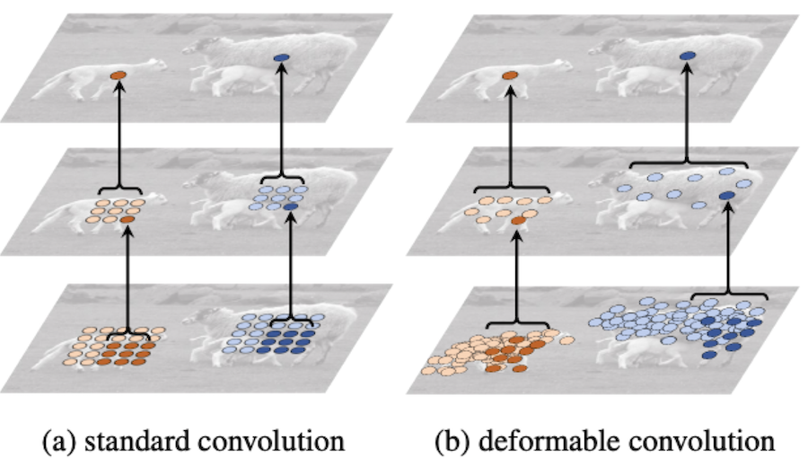   

Normal convolutions (to the left), with a 3v3 receptive field, for example, can "cooperate" accross layers to form big effective receptive field. So after applying 2 such convolutions, the 3v3 receptive field effectively increased to 5v5, and so on. This way, with a deep enough model, we can be sure that in the final representation of the image, every pixel effectively has "seen" the entire input image. However, such approach might not be the most effective. In the case of a big object, we might not need to densely cover the object completely over the high-resolution initial image, because most of those pixels don't provide any useful information - they are excessive. We can use a diluted convolution, that will only look at every 2nd or every 3d pixel. But then this convolution will not work well for small objects, because in this case we want more resolution.  

Deformable convolutions let the network decide for itself, based on the content of the current image, where exactly to look. The network might decide to focus on a small area when recognizing a small object, but have a "densier" receptive field that uses all the pixels in the high-resolution image; or on a bigger area, with spread-out, diluted receptive pixels that still contain enough information.  

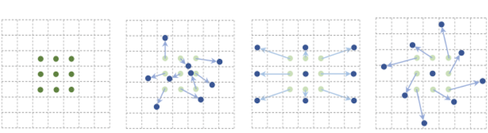   

The left pane on the picture above represents the normal convolution. For a given output pixel, we have a 3v3 area around the reference point, and we compute the output pixel value by multiplying 9 pixel values in the input image with 9 kernel weights. These 9 pixels around the reference points are called "sampling points", denoted $p$.  

In deformable convolution (second pane from the left), instead of having 9 fixed sampling points, we want to have 9 sampling points whose location is computed dynamically: $p + \Delta p$, where $\Delta p$ are offsets with respect to the original 3v3 sampling points.   

One of the fundamental motivations behind original convolutions was that we want to embed *translational symmetry* into the network: if the object has moved to a different place in the image, it is still the same object. But we also want *symmetry of scale* - if we came closer to the object, it will appear bigger; and *rotation symmetry* - if the object has turned, or if we have changed the angle of view, the object is still the same. We hope that, although we still do not embed these symmetries into the architecture of the model, the model will at least be able to learn them, which is illustrated on the panes 3 and 4 in the image above.  

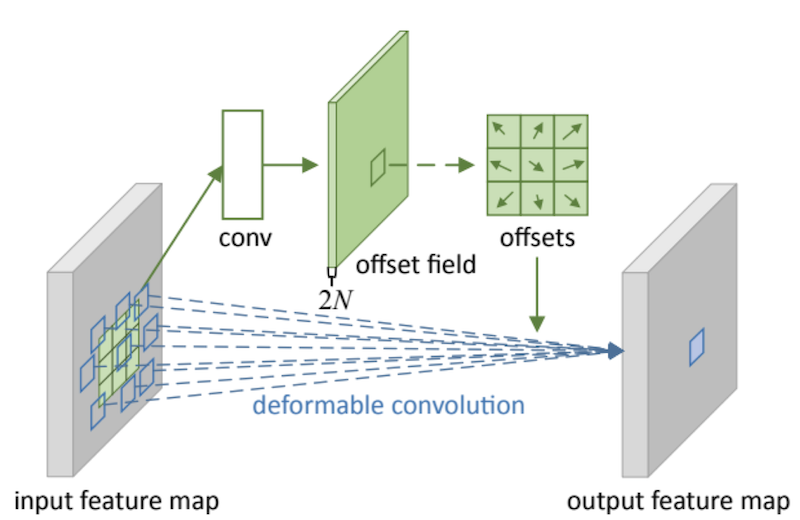   

The image above depicts the concept of deformable convolution. We have 2 branches of our layer: the offset branch and the output branch. The offset branch works like a normal convolution: it has a fixed, 3v3 receptive field; the output of it is a matrix of offsets. For 3v3 convolution, we want 9 pairs of ($\Delta x$, $\Delta y$) offsets - 18 numbers in total.  

Then we will take these offsets, apply them to 9 initial sampling positions $p$ around the reference point to compute our final *sampling points*, and compute the output as the weighted sum of kernel weights with sampling point pixel values.  

The main question here is: what should the offset branch predict? Should it predict integer numbers? We don't really know how to do that - typically, the output of a dense layer or a convolution is a real number, i.e., something that can have a fractional part. We can reframe it as a classification problem: predict probabilities for integer numbers 1, 2, 3, etc. Then the problem is that the "sampling point selection" process is not differentiable: we cannot do backprop through such a layer.  

So this is what we do instead. We let the "offsets branch" predict real numbers for offsets: 1.31, 2.78 etc. After adding those real numbers to integer coordinates of initial sampling points $p$, we get real numbers for our final *sampling points*, potentially with non-zero fractional part. We then compute the value for these fractional pixel locations using *bilinear interpolation*.  

### Bilinear interpolation

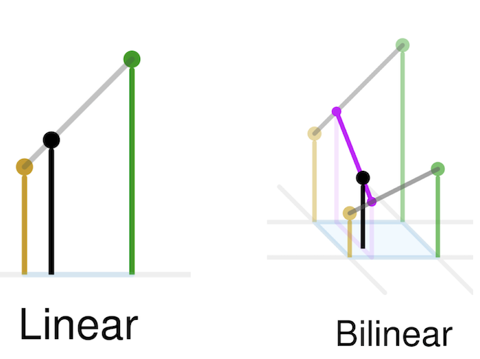   

*Linear* interpolation can be used to estimate pixel values in a 1d sequence. To do that, we look at 2 neighbouring integer locations, and compute the fractional position pixel value as a weighted sum of the values of these 2 neighbours. It can be seen as simply drawing a line in a "1d pixel position - pixel value" 2d space.   

In 2d, we use *bilinear interpolation*: we look at 4 nearest neighbours, and compute fractional pixel value as a weighted sum of those. Bilinear interpolation is most widely used to approximate pixel values when resizing an image.  

In mathematical terms, we can compute the value for a pixel in a non-integer location $p$ as   
$$x(p) = \sum_q g(q_x, p_x) * g(q_y, p_y) * x(q)$$   

Where   

$$g(q_x,p_x) = max(0, 1-|q_x-p_x|)$$

the so called "bilinear kernel", which is a fancy way of saying "look at 4 nearest neighbours". $q$ in the equations above indicate integer pixel locations, while $p$ indicate real-valued, potentially fractional pixel locations.  

As you can see from the *max* operation in the equation above, it is still not strictly differentiable, in the same way "max pooling" is not, for example.   

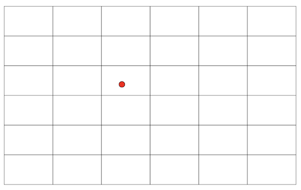   

We can do the backprop through this layer the following way:  
- Compute the 4 neighbours for a given predicted pixel location
- Consider these 4 neighbours constants
- Differentiate the upper equation above: it provides the dependency between the value of the pixel in the fractional position and known pixel values in the input feature map.   

By doing it that way, we lose strict convergence guarantees (the sampling position might oscillate between various grid cells), and we lose the globality of the gradient: maybe the perfect place for the sampling point denoted by a red dot in the image above would be 3 cells from here; but the gradient is only computed for 4 nearest neighbours, so the red dot will be dragged in the direction of either 4 of these. We can hope that the gradient descent still works, and that the red dot will first be "dragged" to one of the neighbours, then, if the learning rate is high enough, it will "jump over" to the next cell, and so on, allowing it to travel along the grid. Practice shows that this is indeed what happens, and the sampling points are able to arrive at really good locations.  

### Deformable convolutions results

Below are some demonstrations of what actually happens:  

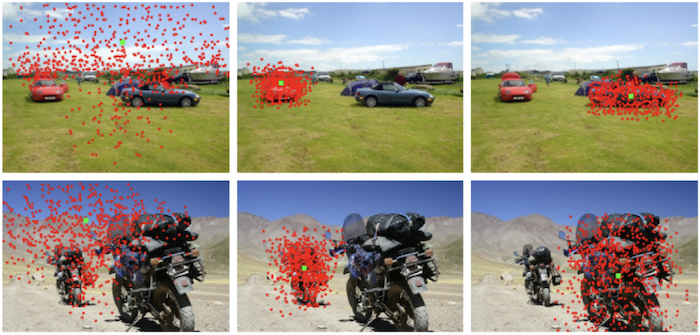   

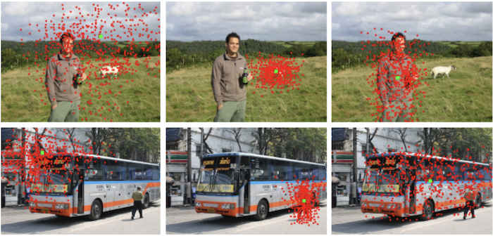   

The green point indicates the reference point - for which pixel in the output we compute the sampling points. Red points indicate sampling points over several deformable convolution layers.   

We can see that when the reference point is located in the background, sampling points try to scatter around as much as possible to cover more ground. When the reference point is located on a small object, sampling points are densely covering the object and small area around it, allowing the network to "see" the object in a lot of detail. When the reference point is located on a big object, sampling points also cover the object and the area around it, but they are now more scattered, only looking at some locations - similar to how a diluted convolution would do.   

## Deformable attention
Similar to how we have plotted the receptive area for deformable convolutions above, we can plot the receptive area for classical attention used in transformers:  

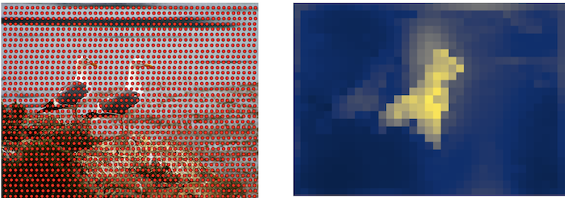   

It densely covers the entire picture, which is the main problem with transformers in general - they are extremely computationally expensive, and the complexity rises as square of the sequence length. Even for the points we are not interested in (dark blue pixels in the attention mask visualisation to the right), we still take time to compute the attention mask weights for every layer.   

We want each reference point in the output to attend to a limited set of points overall, say, K=4:  

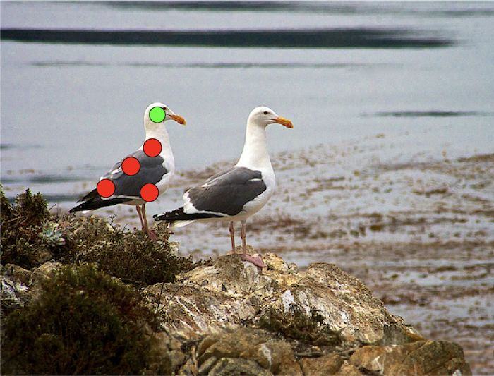   

The picture above denotes the possible attention in a single deformable attention layer, for a reference point (green) located at the head of the bird. After 2 layers, each of those points in turn could have attended to 4 more points, so our effective receptive field becomes quite big:    

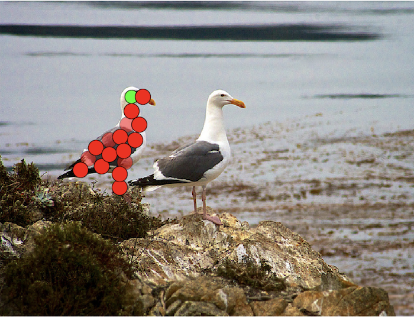   

### Deformable self-attention
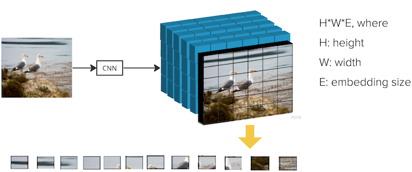   

Similar to normal attention, we need a sequence of elements as the input. We get that by taking the output of the backbone - a small, downsampled version of the image with 20x20 resolution, but 256 channels - and flatten it out, arriving at 800 sequence elements with 256-dimensional embedding each.  

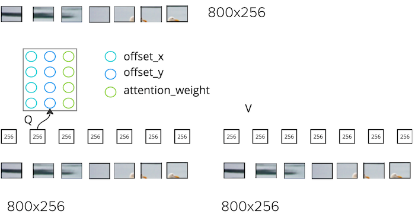   

One of the differences with normal attention is that *we do not use keys*. We have our input Query and Value sequence, in case of self-attention, both coming from the 800x256 image representation; we take 1 query sequence element with shape 1x256; we project that down to 4x3 numbers using our "query projector" - dense layer: we have K=4 sampling points, and for each of them we compute $\Delta x$, $\Delta y$ coordinate offsets and 1 attention mask weight. So, compared to normal attention that computed dot-product between query and value embedding to arrive at 1 attention weight, we now get the attention weight directly from the query element.  

We take query sequence element's 2d position as a reference point $p$; compute final sampling location as $p + \Delta p$ from x and y offset coordinates above. Once again, final sampling point can have fractional parts, so we compute final value of this sampling point as a weighted sum of neighbours using bilinear interpolation.      

Using computed K=4 fractional pixel locations and values, we compute weighted sum using the attention weights above, and arrive at 1 output sequence element. We repeat the procedure for every output sequence element. Outpout sequence shape is the same as input sequence shape, so we can stack such layers on top of each other indefinitely.  

In the encoder part of our Deformable Transformer, we use 6 deformable self-attention layers, interleaved with dense layers, normalization, dropout and residual connections. Output of the encoder - called "memory" - will be used as side input, or "Value" input for all the decoder, cross-attention layers.   

### Cross attention
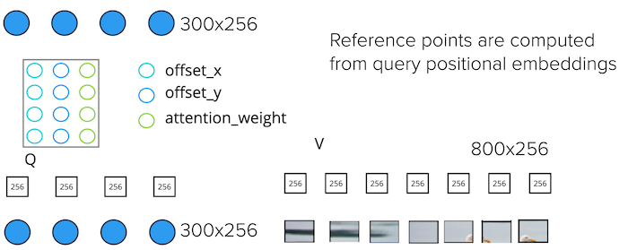   

Value-input to the cross attention layers in the decoder is the decoder output, and it is the same for all cross-attention layers. For our image example, it has 800x256 shape. It represents more refined image representation.  

Query input to the cross attention layer has shape 300x256: we now have 300 "experts" that detect objects on the picture. Query input can be seen as a sum of *query positional embedding* and *target*. *Query positional embedding* is a 300x256 randomly initialized, learnable tensor. For the first decoder layer, *target* is just a 300x256 tensor of zeroes. For second and other layers, *target* is the output of the previous decoder layer.  

The shape of the deformable cross attention layer output is the same as the shape of its Query input.   

To get one output sequence element, we take 1 input Query sequence element, with 1x256 shape; we compute 4x3 numbers for K=4 sampling points, 3 numbers per point: x and y offset coordinates and attention weight. Once again, we don't use Key sequence here, we just arrive at attention weghts looking at current Query element.   

One difference to deformable self-attention is the content of *reference points*. In self-attention, output sequence element represented a pixel within the image, and we used the position of that pixel as a reference point. In decoder's cross attention, output sequence element represents "Query Expert", or a detected objects estimation, and it is not located in the image space. To come up with the reference points, we apply a trainable *dense layer* to *query positional embeddings*. Reference points are real numbers in this case, so they too can have fractional parts.   

This is a major conceptual change in deformable cross attention. The reference *attention positions* now depend on the a-priori *query positional embeddings* that do not depend on the input image at all. This allows the "Query Experts" to specialize on certain parts of the image. Deformable cross-attention mechanism still allows the network to "shift" those attention locations based on image content through the offset prediction mechanism.   

In the Decoder part of the network, we will have 6 deformable cross-attention layers, intermingled with 6 normal self-attention layers (with full pairwise attention masks), normalizations, dropouts, dense layers and residuals.   

Let's sum up main differences between normal attention and deformable attention. For normal attention we have:   
- Quadratic complexity with respect to the input sequence length: $S^2$
- It is computationally infeasible to process high-resolution feature maps, which makes it hard to detect small objects.   

For deformable attention we have:  
- Linear complexity with respect to the inpt sequence length: $4S$ for K=4 attention points
- We can process high resolution images
- We can detect small objects
- We have lost one cross-interaction step, we don't use elements of the Key sequence in attention mask calculation
- We have extra notion of a-priori, image independant "reference points" for every Query Expert. This concept is similar to the anchor boxes concept in YOLO, but these reference points are a) trainable b) the network can adjust attention positions using image-dependant offset prediction.  

### Multi-Scale deformable attention
Thanks to our lighter computational complexity, we can now use multiple scales when detecting objects. This is a common technique in other, convolutional-based object detectors like YOLO.   

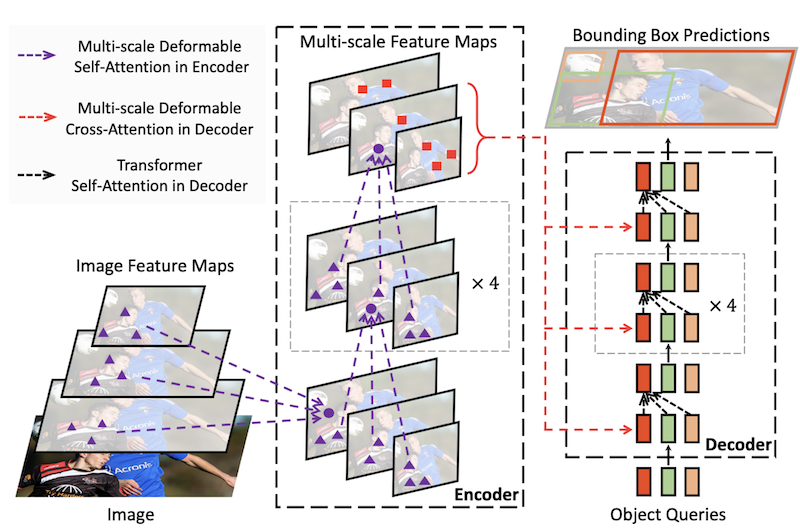   

CNN backbone, like ResNet-50, will typically take an input image (with 640x640 resolution, for example), and downsample it in a series of steps: from 3 RGB channels, 3x640x640 shape, to 128 channels and 320x320 resolution, then to 256x160x160, then 512x80x80, then 1024x40x40, then 2048x20x20. The deeper we are in the network, the more information is contained in each feature map pixel, but the less overall resolution. We can take last 3 downsampled features maps, with 20x20, 40x40, and 80x80 resolution, and use them in our detection transformer.  

We could do that with a normal transformer by just flattening all 3 scales, or "levels" as they are sometimes called, arriving at 8400 sequence length, and performing normal attention on top of that. This is conceptually possible, but computationally infeasible because of the quadratic dependency of computation with respect to sequence length. We would have to compute all pairwise interactions within the "level" as well as between all possible level combinations.  

With Deformable Attention, that is possible. Once again, Encoder input and output are of the same shape. In self-attention, input and output will be represented as 3 "levels" with 20x20, 40x40, and 80x80 resolution, flattened into a single 8400 sequence. Each element in the output is computed using weighted sum from K=4 attention points from every of the 3 input levels. Once again, offset values and attention weights are computed using just the Query sequence element.  

In cross-attention, each element in the Query sequence (coming from the "Query Expert" input) will compute reference points using an extra dense layer projection, and use these reference points to find out the sampling locations in all 3 of the levels.   

In addition to positional embeddings that help the network encode spatial positional information after losing it when "flattening" the image, we also want "level encoding" to represent which level this point belonged to. For "level embedding", we use trainable, randomly-initialized tensor of parameters.   

Actual model described in the original [paper](https://arxiv.org/pdf/2010.04159.pdf) used 4 input scales, arriving at the total sequence length of about 20000 elements for an average image.   

## Results
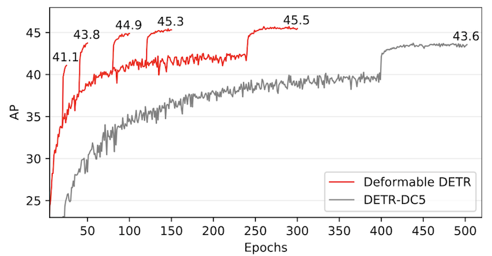   

The image above represents the results of replacing deformable-attention in the DETR model. We can see that Deformable-DETR trains around 50% faster, and arrives at 2% better mAP result on CoCo dataset. Still, this is quite far from the 66 mAP of the current SOTA model - Co-DETR.  

Since its introduction in 2021, Deformable Attention has become part of all the major transformer-based object detection models, like DAB-DETR (dynamic anchor boxes), DINO (Denoising DETR), and Co-DETR.   

Inference time is also around 30% faster.  

## Next up  
In my next post, I want to start a new learning path towards Generative AI. The first post in that path will be about Neural Style Transfer - a cool technique originating back in 2015, that doesn't require too much background knowledge, and that will help us introduce some of the important GenAI concepts. After that, I will look into unconditional image generation using Variational Autoencoders, GANs and diffusers.    

In addition to that, I will continue writing posts about object detection. The very next one will be about reading the source code of Deformable DETR; after that, I will look into other techniques used in modern object detection: Dynamic Anchor Boxes (DAB-DETR), Denoising, replacing cnn-based backbone with transformer (ViT, SWIN), and finally, Co-DETR - current state of the art object detector.   

Another big challenge that we will need to face is to merge the textual description of the image with the image itself. This will allow us to do "open set detection": detecting objects not explicitly encoded in the training data, like the 91 original classes in CoCo dataset; image captioning; finding an object in the image using text description, like "left arm of the third person to the right", which is invaluable in image editing.  

Same techniques will be needed to do text-based image generation: generating an image using a text prompt.  