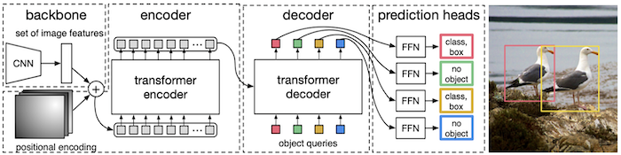
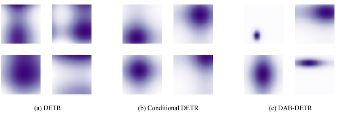
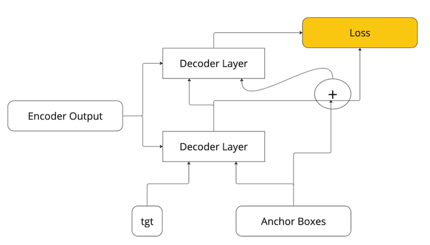
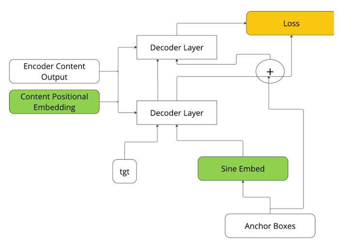
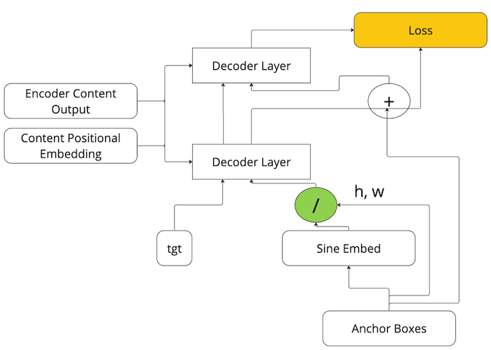
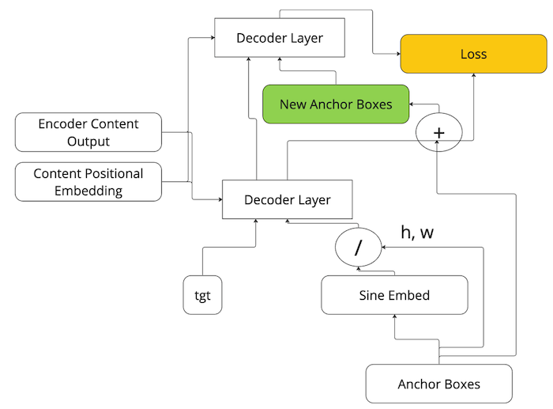
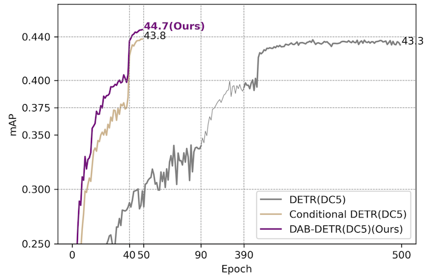

The content is also available as [video](https://youtu.be/8aZIoEt0D7Y)

## Intro
Before 2020, regional proposal networks and YOLO were the best object detectors on the market. YOLO was fast, easy to train, but not as accurate; RCNN-s were much slower, harder to train due to the fact that "region selection" operation is not differentiable, but much more accurate.  

In 2020, [Detr](https://arxiv.org/pdf/2005.12872.pdf) came out. It was the first attempt to use transformers in object detection; it promised a fundamentally easier approach, with end-to-end training, direct solution of object detection task using bipartite matching loss that didn't require any hand-crafted components like NMS or anchor boxes, and potentially higher accuracy thanks to transformers. Although it was competitive in 2020, it quickly got outdated compared to other, convolution-based models on the market. For example, 2022 version of YOLO achieved mAP score of 56 on CoCo dataset, while the original Detr only had 40 mAP. It was also notoriously long to train.  

However, the approach itself was sound, it just required some modifications to work really good. One of my previous posts talked about [Deformable Detr](https://github.com/adensur/blog/blob/main/computer_vision_zero_to_hero/14_deformable_detr/Readme.md), first such modification, focusing on attention mechanism itself. This post will talk about DAB Detr. By now we know that these "techniques" not only help improve the quality of the model, but are also additive, and combining them together with other techniques such as denoising, co-training in Co-DETR and replacing cnn-based backbone with something like ViT allowed to create a much better model. Co-DETR, current SOTA, achieves mAP score of 66 by using the combination of all of these techniques.  

## The plan
In this post we will talk about:  
- Motivation behind "Dynamic Anchor Boxes", and why we think they should be better as queries than anything else
- What dynamic anchor boxes are
- How they are used to modulate the position of the attention
- How they are used to modulate the size and shape of the attention
- How they are updated layer by layer
- Results and next up   

## Motivation behind "Dynamic Anchor Boxes"
Here is the picture representing the architecture of the original Detr model:   

    

We start with an image; feed it into a cnn-based backbone like ResNet50 to arrive at a downsampled, more processed representation of an image - something like 20x20 pixels and 2048 channels; project it down to 256 channels; flatten it out (also adding positional embeddings) and feed into the encoder. Encoder performs self-attention, refining the content of the image. Encoder output is then fed into decoder to arrive at actual bounding box predictions.  

In attention, we use 3 sequences: Queries, Keys, and Values. First, we compute the attention mask as a dot-product between every Query and Key pair. We then use the attention mask to compute output of current decoder layer as weighted sum of Value sequence elements. In decoder cross-attention, both Keys and Values come from encoder output sequence. Query can be seen as a sum of 2 embeddings: *tgt* - zeroes for the first layer, outputs of the previous layer for 2+ decoder layer; and *query embedding* - depicted on the picture above - a randomly initialized, trainable 256-dimensional vector for every query sequence element.    

So the *only* goal of this "Query Embedding" vector is to participate in attention mask calculation, e.g., to control where the layer should pay attention to. To check how well these query embeddings performed the task, the authors of the original paper plotted the attention mask for earlier layers of the model, once it has trained for some time:   

    

Attention for Detr vanilla model is pictured on the left. As we can see, it is not really working well: it is blobby, has more then 1 centers - so it will probably not match a desired object entirely, or match 2 objects at once, which is not good: we want every layer output sequence element to predict bboxes for just 1 object.   

So to sum up: Query Embeddings are only needed to compute attention, and they are not doing a good job at it! So we need to do something about it.   

On the middle picture we see attention for Conditional Detr, that tried to use position information to explicitly modulate embedding. The picture looks slightly better: every attention "cloud" now has 1 center, and the attention decays slowly as you move away from it. But it still doesn't use the size information - the fact that different objects might have different sizes and shapes.   

On the right picture, we see attention masks for DAB Detr. It effectively uses both positional and size information.  

## What are dynamic anchor boxes

    

In dab-detr, instead of using 256 randomly initialized, trainable coordinates for Query Embedding, we just use 4 coordinates: x, y, w and h for bounding boxes.  

We feed them into the decoder layer instead of the Query Embedding (more on that later). In addition, the output of each layer (256-dim embedding) is projected into 4 numbers for bbox coordinate predictions; they are summed up with the original input bounding box coordinates, and connected to the loss. This acts as a residual connection between original bbox estimation and the output of the layer.   

There are two ways to look at this. First, thanks to this residual connection, the gradient flowing backwards from the loss is split evenly between both inputs, thus training decoder layer weights and the initial anchor box coordinates. This is the thing that turns these 4 numbers from random to the actual x, y, w and h. Thanks to this, these randomly initialized numbers are trained, and learn to match actual object present in the data.    

Another way to look at this is that these new "Dynamic Anchor Boxes" are priors for the position, size and shape of bbox for the object; and each decoder layer predicts *error*, difference between ground truth bounding box and this prior.

## Position modulation of attention

   

The 4 DAB numbers that replaced query embeddings are converted into 512-dim embedding by expanding each of the x, y, w, h coordinate into 128-dimensional sine-cosine embedding each, similar to how it is done in the image content positional embedding. X and y parts are fed as Query Embeddings into the decoder.   

Unlike Detr, we do not *add* positional or query embeddings to the content embedding; instead, we *concatenate* them, arriving at 512 total embedding length of each sequence element.   

During dot product calculation (i.e., elementwise multiplication of two vectors) in attention mechanism, content parts of Key and Query are multiplied with each other, while Positional embedding is multiplied with this new Query Embedding coming from DABs expanded into sine-cosine embedding.   

Sine-cosine embeddings have a peculiar feature: dot-product between sine-cosine embeddings of positions p1 and p2 is maximal when $p1 = p2$, and gradually decays as the difference between them grows. This happens because each embedding consists of sine and cosine functions of various frequencies. For a single sine function, such multiplication will be maximal when position difference is equal to half a period, and minimal - if it is equal to a quarter of a period. This effect is similar to light interference of coherent light: intermingled dark and light circles that you can observe in double slit experiment, for example.   

   

However, if you have many sine functions of different frequencies (and hence, different periods), maximum of one sine function will almost certainly not coincide with the maximum of another. So instead of interference, you will just observe gradually decaying amplitude of the signal. This is similar to the behaviour of non-coherent light, like regular day light. Instead of interference, such a light source will simply produce a spot of light, intensity of which is maximal in the center, and gradually decays when you move away from it.   

## Size modulation of attention  

   

While x, y part of the DAB coordinates is directly used in attention for position modulation, w and h part (predictions of width and height) are used to modulate the size. The process is simple: we divide the resulting query embedding by h and w (first 128 coordinates corresponding to x position are divided by w, second 128 - by y). 

## Dynamic layer-by-layer DAB update

   

Finally, we update these dynamic anchor boxes - 4 numbers corresponding to x, y, w, h coordinates - after every decoder layer. I.e., initially we start with a model-global anchor boxes - priors for object position and size independant of the actual image. First decoder layer predicts the error of this prior, and sum of layer prediction with the prior itself lands a new, improved estimation of x, y, w and h coordinates of object's bounding box. This new estimation is used as DAB in the next layer: it is expanded into sine-cosine positional embedding and concatenated with the content encoder output, thus allowing it to modulate attention once again.  

Each new decoder layer arrives at an improved anchor box estimation, which is then used to modulate attention in the next layer, and so on. 

## Results

  

Original paper reports 1.4% mAP improvement over baseline model from DAB Detr; it also trains around 10x faster than vanilla detr, and performs significantly better then Conditional Detr - another attempt at attention modulation that just used object position, but not its size.   

DAB concept is additive with other techniques such as Deformable Attention and Denoising. It is used in most SOTA transformer-based models since, including current SOTA model - CoDetr.   

It is also worth discussing key differences of DAB - Dynamic Anchor Boxes in Detr - and Anchor Boxes used in YOLO.   

Unlike YOLO, DAB Detr's anchor boxes are trainable. They do not require any prior knowledge of the data; they are initialized randomly and trained along with the model.   

Apart from that, they only *modulate* attention, but not replace it completely. In YOLO, if the object with peculiar scale or aspect ratio doesn't match any anchor, it will never be picked up by the model. In DAB Detr, only 50% of coordinates participating in attention rely on anchor boxes; even if no prior anchor boxes matched well with that object, content part of the attention might still allow the model to detect this object effectively.  

## Next up

In the next post, I will dive deeper into DAB Detr - reading source code of the official implementation.

