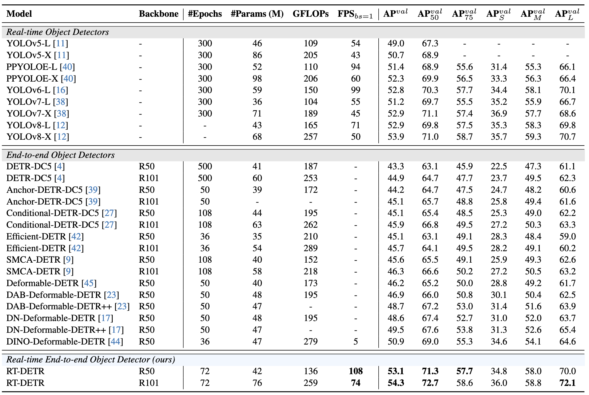

## RT DETR - real time object detection with transformers
Video about rtdetr: https://youtu.be/nfd7pJsG1rk   
Reading source code of rtdetr: https://youtu.be/e0XhVRWdCC4   
Original paper: https://arxiv.org/pdf/2304.08069  
Source code: https://github.com/lyuwenyu/RT-DETR  
## Intro
History of object detection with transformers starts with [DETR](https://arxiv.org/pdf/2005.12872) - a proof of concept object detector that is easy in concept, but a bit clunky with respect to actual implementation. It does allow to get rid of extra components like NMS. However, resulting accuracy, training stability and convergence aren't that great.   
Many models were built on top of that to target different weak areas of the model. [Deformable DETR](https://arxiv.org/pdf/2010.04159) - to make attention more efficient; [DAB Detr](https://arxiv.org/pdf/2201.12329) - to give a strong prior to attention maps in the form of "if you think there is an object here, pay attention to this area";   
[DN Detr](https://arxiv.org/pdf/2203.01305), [DINO](https://arxiv.org/pdf/2203.03605) and lately [CODETR](https://arxiv.org/pdf/2211.12860) (current SOTA) - to add extra targets to stabilize training.   

All of them, however, targeted mostly the "training" and "final accuracy" aspects of the model, not inference speed and practical implementation.   
They were all extremely slow; "deformable attention" module was only available as a custom cuda kernel, making it impossible to run such a model   
even on cpu, not to mention embedded devices.   

RT DETR is the first model in a family that aims to solve that.  
- It analyses computational complexity of different blocks and finds that majority is spent in the encoder;   
- it proposes an alternative "hybrid" encoder scheme that replaces cross-level attention between different pixel resolution feature maps  
(20x20, 40x40, 80x80), into separate "interaction" blocks (attention-based, inside-level only, appled to 20x20 level) and "fusion" (convolution-based to propagate signal between levels)
- It slightly modifies query selection process, adding BBox prediction uncertainty into query "score" along with class probabilities  

Bellow, we will look into all of these in more detail
## Computational complexity analysis
Model encoder contributes to 49% of computation, but only 11% of accuracy - this was measured in an ablation study, by training encoder-free models (feeding backbone output directly into the decoder).  
Full pairwise self-attention complexity is quadratic with respect to sequence length. Images are flattened before being passed into the transformer, i.e., and image of 40x40 resolution will yield 16x complexity compared to 20x20 image. Such attention-based models quickly become unfeasible for higher-resolution feature maps. That might not be such a big problem for classification - after all, this 20x20 feature map comes from the backbone that contains processed pixel information from a much higher resolution image, and actually represents incredibly rich feature representation of the image. However, this doesn't work well for bounding box prediction, which does require high pixel precision.    
Deformable attention partly solves this problem by attending to a constant number of points (4 points, for example), making the complexity linear with respect to sequence length. Models based on that typically use "multi-level" scheme, passing higher-resolution, semantically poor feature maps from earlier stages of the backbone into transformer along with lower-resolution, semantically-rich feature maps from later stages. I've only seen feature maps of up to 200x200 resolution, which is fine for object detection benchmarks, but nowhere close to ultra-HD (3840x2160), or human eye (roughly 100x greater than this).  
But even with deformable attention with linear complexity, with 80x80, 40x40, and 20x20 input feature maps, only about 5% of computation will be spent in attention within 20x20 level, despite it being the most semantically rich.   
## Hybrid Encoder
The proposal is simple: divide the encoder into two blocks, "interaction" - attention-based, computation-heavy block that will only be applied to the most semantically-rich 20x20 level; and "fusion" - convolution based block that propagates precise pixel information between levels.    

"Interaction" block is a simple full pairwise self-attention. Since it is applied to 20x20 level only, we don't bother with deformable attention here  

"Fusion" block: this is a light-weight, convolution-based block that propagates precise pixel information from high-res levels to other levels, and "interacted" semantic information from low-res level to high-res levels. It has an S shape (modification of U shape). "U" shape is common in many old-school convolutional models and is used for propagation of high-res pixel information from earlier layers to later, more semantically rich layers. S shape is an advancement of this that performs the second "turn".

  
As input, we get 20x20 feature map that was passed through interaction block, and 40x40 and 80x80 feature maps directly from the backbone. First we go "up" in resolution by applying a "fusion block" (more on that later) to 20x20 and 40x40 layer, then 40x40 and 80x80. Then we go "down" in resolution by applying a "fusion block" to 80x80 and 40x40 layer, then 40x40 and 20x20. The purpose of going "up" in resolution is to propagate advanced semantic information from 20x20 layer that was passed through the transformer to other levels. The purpose of going "down" is to refine high-level feature maps with precise pixel information. Output of the entire encoder will be all 3 of the feature maps (80x80, 40x40, 20x20).  
### Fusion block
There are two types of fusion blocks: upsampling and downsampling.  

In the example of upsampling block to fuse 20x20 and 40x40:
- We upsample 20x20 to 40x40 resolution using bilinear interpolation. This is a crude way that doesn't really increase the "sharpness" of the picture.
- We concatenate upsampled 20x20 feature map with 40x40 feature map along the embedding dimension, yielding 512x40x40 feature map.
- We then have a branching structure with 2 branches: a simple 1v1 conv and a more complicated block with 1x1 convolution followed by "RepVGG" block
    This branching structure stems from "PANet" style networks ([paper](https://arxiv.org/pdf/1803.01534)). It emphasizes the need to have a more "direct" connection between original high-res feature map and the output.
- In both cases, 1v1 convolution projects 512 dim embedding down to 256 dim. This is the core of "fusion": at this point information between different resolutions is fused into single embedding.
- RepVGG ([paper](https://arxiv.org/pdf/2101.03697)) is another interesting model that serves as a more efficient replacement for ResNet. 
    Core of ResNet is a "residual connection" that improves the training.
    Despite its theoretical low cost in terms of teraflops, such a connection slows down performance when measured on the actual physical hardware, because of execution graph branching and memory access to different locations.
    RepVGG alleviates this problem using "structural reparametrization": during training, RepVGG block looks exactly like "BottleNeck" block from ResNet. For inference, this block is converted into a single 3x3 convolution through the power of pure math.  

There is a second version of this fusion block for the second part of the S curve:  
   
In this one, higher-resolution feature map is downsampled with strided convolution. All the other parts are the same.   

Through ablation studies, it was shown that this "decoupling" of inter-level attention and cross-level fusion actually improves the accuracy of the model. This is a promising direction for potential SOTA improvements in quality, not just performance.  
### Query Selection
In the original DETR, queries were statically initialized, trainable vectors. This means that they do not depend on the actual image, but rather, each "query" is an expert that specializes in detection a certain thing, for example, birds in top left corner of the image.   
In Deformable DETR, queries were initialized from encoder output. Each pixel output of the encoder was projected down to bounding box and class predictions. This yields roughly 20k predictions; out of these, top 300 by class probability were used as queries for the decoder. This means that queries are now dependant on the content of the image, and are usually of better quality - they already contain pretty decent information about detected objects.   
In DINO, "mixed query selection" was introduced, which just means that bounding box part of query was taken from the encoder, while "class" part was statically initialized. This approach was shown to work better in experiments.   
In RT DETR, we further improve the process by taking IoU confidence into account. That is, the class "score" predicted by the model depicts not only class probability, but also uncertainty of the bounding box prediction.  
Precise mechanism for this is best illustrated with a picture. First, for normal query selection and cross entropy loss:   
  
The model outputs 300 predictions, for each of the input queries. Let's say that some query predicted the following probabilities for different classes:
- bird: 0.73
- cat: 0.57
- bowl: 0.31
- car: 0.43
- No object: 0.22   
During loss computation, first we will perform bipartite matching loss to connect queries to ground truth. Let's say that this query was matched to a bird. For a bird, the following 1-hot encoded vector will be constructed:   
- bird: 1.0
- cat: 0.0
- bowl: 0.0
- car: 0.0
- No object: 0.0  

These 2 vectors will be passed to CrossEntropyLoss, in effect, pushing up the prediction for the bird, and down for everything else.   
Now, for uncertainty-minimal query selection:   
  
Predictions of the model might look the same. Ground truth will be expanded into a vector like this:   
- bird: 0.77
- cat: 0.0
- bowl: 0.0
- car: 0.0
- No object: 0.0  

Where 0.77 is the IoU between predicted bounding box and ground truth.   
Thus, the model will learn not only to predict class, but also to estimate uncertainty of bounding box prediction of a different branch of the model. This allows the model to select queries with the most confident bounding box prediction during query selection stage, and improves accuracy a little bit.   
### Similarities to DINO
RT DETR is based on DINO and uses a lot of the same tricks.
- It uses "deformable attention" in cross-attention part of the decoder.
- Decoder receives multi-scale input, with 20x20, 40x40 and 80x80 feature maps.
- Reference points are obtained directly from the selected queries.
### Results
  
One thing worth mentioning from the paper is that NMS, typically used in convolutional-based detectors like YOLO, might itself take a lot of time for some cases when we want maximum accuracy, and select a lot of predictions from the model that have to be passed through NMS afterwards. RT DETR doesn't use NMS, and authors of the paper had to construct a fairer "end to end" speed benchmark to compare RT DETR with other models. On this benchmark, on the plot of "accuracy vs speed", RT DETR is better in all respects: for fixed accuracy, there is always an rt detr variant that is faster than YOLO variant.  
  
When comparing to other transformer-based detectors with the same backbone, RT DETR is both much more accurate and so much faster! For example, comparing ResNet50 RT DETR with DINO on the same backbone, RT DETR is 2.2% more accurate and 20x faster.   
This, once again, gives some promise that RT DETR-like architecture might become the next SOTA if used with heavier backbone and some more experimentation.   
To sum up, RT DETR is:  
- First realtime transformer-based object detector
- Better accuracy/speed trade-off than any other model, including YOLO that used to be the best in this
- Easy to install, simple code, convertable to ONNX, doesn't require custom CUDA kernels
