The content is also available as [Video](https://youtu.be/o9Es7FGv1W8)  

This is the first post in my "GenAI" series for image generation. Check out my other series about image recognition and object detection on [guthub](https://github.com/adensur/blog/tree/main/computer_vision_zero_to_hero) or [youtube](https://www.youtube.com/playlist?list=PL1HdfW5-F8ATdbyOpMiaKvdqGYSF19g8d) - it does introduce many important fundamentals like Convolutions and Optimization.  

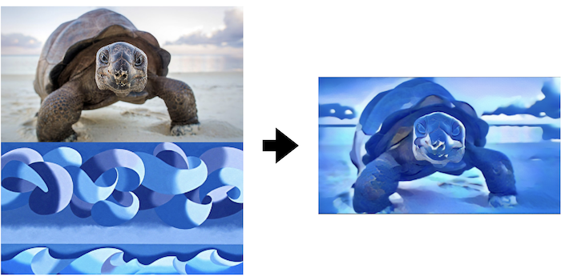  

Neural Style Transfer is based on this [paper](https://arxiv.org/pdf/1508.06576.pdf) from 2015. It allows "morphing" two images together, taking content from one image and "style" from the other. It doesn't require training any networks and doesn't need labeled dataset or any dataset to work; it does require solving optimization problem for a particular pair of images.
## The plan
In this post, we will go through the following topics:   
- Overall method of neural style transfer
- Some clarifications regarding solving optimization problem in pixel space
- Visualizing convolutions
- Content loss
- Style loss and Gram matrix
- Results

## Overall method
To do neural style transfer, we take a pretrained image recognition model, like VGG-19, and two images: content image (photo of a turtle above) and style image (painting of waves by Mark Webster). Then we generate a new image to match style of our style image and content of our content image.  

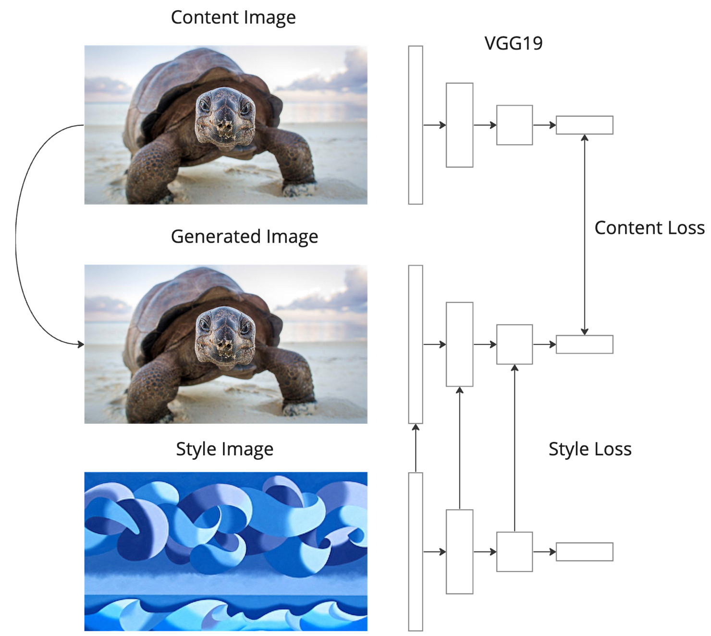   

Initially, the generated image is initialized as just a copy of content image. We pass all 3 images through our VGG-19 network, to get several versions of "processed" image in different levels of abstractions. VGG-19 consists of a series of convolutions, which can be seen as "detectors" that react to certain parts in the input; and maxpooling operations that downsample the image to lower resolution. In the process of applying the network, starting with original image with high resolution and 3 color channels, we obtain progressively smaller images (lower resolutions), but more channels, up to 512 of them.   

We compute Content Loss and Style Loss by comparing these intermediate image representations between content image and generated image and style image and generated image. We then perform gradient descent to change the pixel values of the *generated image* to minimize the loss. During the course of optimization, Content Loss will become worse (because it was zero in the beginning), but the image will look progressively more and more in accordance with the style image.   

Here are examples of several such optimization steps:  

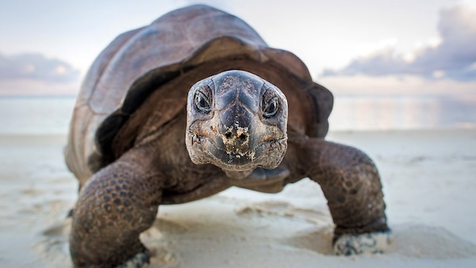   

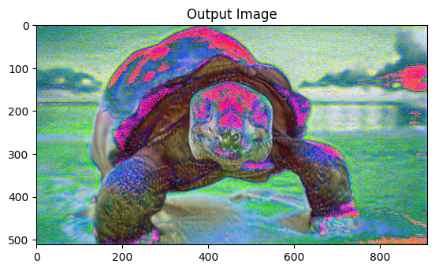   

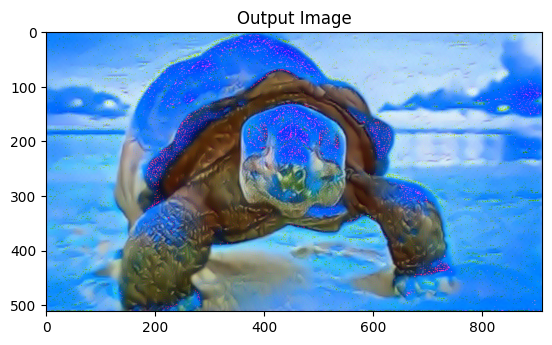   

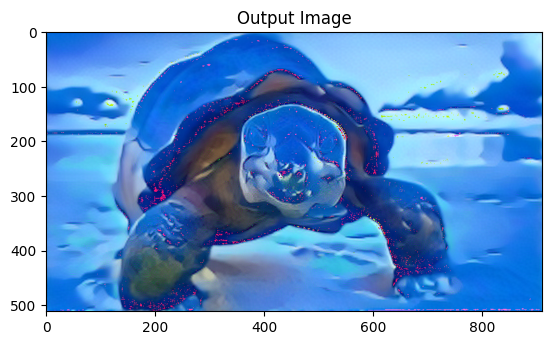   

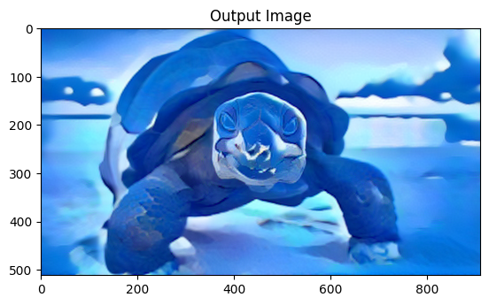   

## Some clarifications regarding solving optimization problem in pixel space
Recall that neural networks can be represented as computational graphs:  

   

Some nodes are "data" - neural network parameters, input image pixel values; some nodes are "computations" - dense layers, convolutional layers, loss functions - they take some inputs and produce some outputs.  

When training a network, we typically compute gradients of the loss with respect to network parameters. However, "parameters" and "pixel values" that go into computation are quite symmetric. For example, here is the equation for the output of the dense layer in [Einstein notation](https://en.wikipedia.org/wiki/Einstein_notation):  
$$out_i = img_j * P_{ji} + b_i$$
To get the ith element of the output, we just multiply the jth element in the image sequence $img_j$ (the image needs to be flattened to be passed to the dense layer) by an element in the parameter matrix $P_{ij}$, and sum values over an entire row j. Derivations don't care about "plus" signs, so computing partial derivatives of the output with respect to both input values or parameters is trivial.   

We can also compute gradients of the loss with respect to input image pixel values; Pytorch, being first and foremost an engine for automatic differentiation, allows us to do that automatically; when we construct the network, the computational graph is assembled, and we can simply call a method to compute gradients and then pass them to the optimizer.  
## Visualizing convolutions
Many insights about which layers to use in content and style loss come from this [paper](https://arxiv.org/pdf/1311.2901.pdf).   

It introduces a visualisation technique that allows us to see which filters (convolutions representing a certain channel within one layer) react to which patterns in the original image. They do it by performing "deconvolution", or "transposed convolution" operation - it currently gains a lot of popularity due to image generation techniques. They zero out all pixels except one in an intermediate feature map, and then "upsample" from that using a series of unpooling and transposed convolution steps to get an image in the original image space.  

Below are some of the pictures from the paper:  

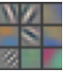   

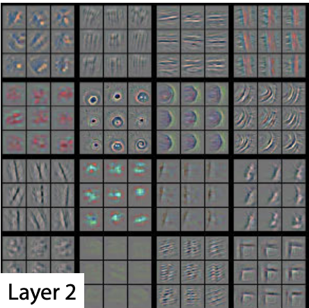   

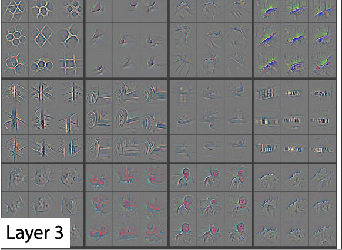   

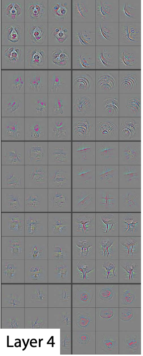   

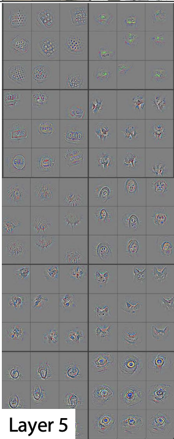   

We can see that first layers of the network are responsible for detecting simple patterns in the input image: color gradients, vertical and horizontal edges. As we move deeper, the patterns become progressively more complex: corners, circles, grid patterns, then face outlines, letters, bird silhouettes etc. 

## Content loss
Content loss is computed by connecting only the final layer of the backbone network for content image and output image. The loss itself is computed as per-pixel MSE or BCE loss.   

That way the loss cares less about precise pixel details of the objects on the image, and more about high-level picture composition: that there is a turtle, sky and sand, and where they are, but not precise details and style of them.  

## Style loss
Style loss uses more layers of the VGG-19 network to compare style image with the generated image - shallow as well as deep ones. This allows it to use information about colors, texture, brush and stroke type - all that stuff that composes the style of the image, but doesn't change the meaning of the content much.   

In addiiton to this, style loss computes the [Gram Matrix](https://en.wikipedia.org/wiki/Gram_matrix) for generated and style image:  

$$G_{f_1f_2} = \sum_{xy} F_{f_1xy} F_{f_2xy}$$

Here, $x$ and $y$ represent coordinates within the image, $f1$ and $f2$ correspond to channel index. It can be seen as per-pixel dot-product between feature map f1 and f2. Since $x$ and $y$ are no longer present as coordinates in the Gram matrix, its content doesn't depend on *where* stuff is located, only *which* stuff is located in the picture.   
For example, if in the deeper layers of the network we have feature map $f1$ responsible for detecting "dog heads", then the diagonal element $G_{f_1f_1}$ will roughly indicate "how many dog heads there are on the picture". If $f2$ represents a filter responsible for detecting "letter A", non-diagonal element $G_{f_1f_2}$ will roughly indicate cross-correlation between feature maps $f1$ and $f2$, with the meaning of "number of dog heads with the letter A on top".  

The actual loss is calculated as MSE between gram matrices of style image and generated image, summed over all layers participating in the loss.   

By using Gram matrix in loss calculation, we make sure that the loss doesn't care about precise location of stuff from the style image in the generated image; by using information from shallow as well as deep levels of VGG network, we make sure that the loss does care about more high-level objects as well as low-level stuff like colour, gradients, texture and so on.  

## Results
Here is another picture from the same paper:  

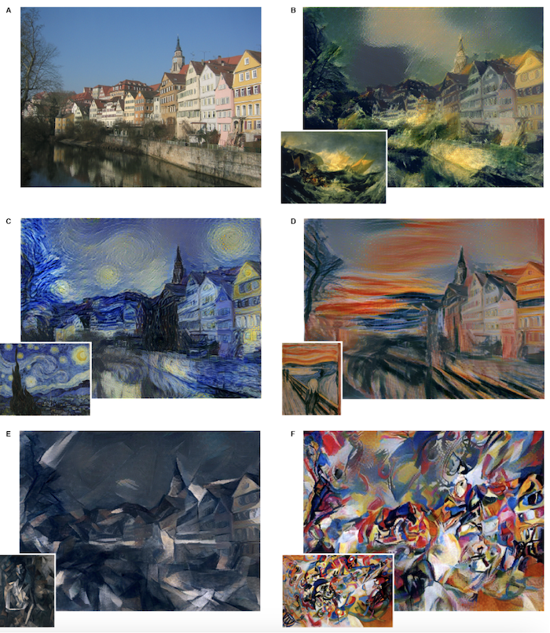   

It shows various styles applied to the same picture. We can notice that in all the generated pictures, we can still see objects from the original content images on the same places: houses, river, sky. Objects from the style picture are not necesseraly present in the generated image, and not necesserily on the same positions. Original Van Gogh's "Starry Night" had a dark tower on the left side of the image. The optimization process decided that a high tower in the right part of the content image is a good fit to be turned into a dark tower. Other houses were not darkened in this way, but got the overall VanGoghish style as well.  

Here is another example I've tried with my own selfie:  

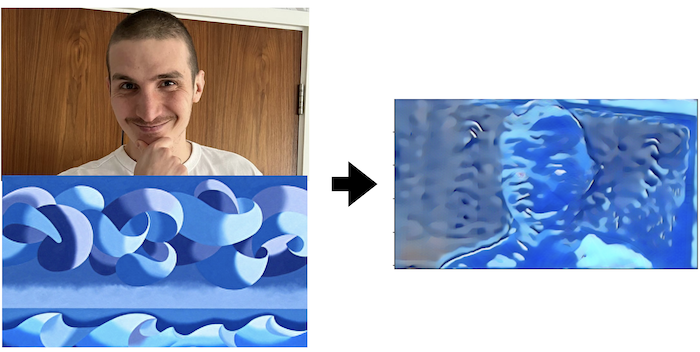   

We can still see a person's outline on the generated image, but the face is not recognizable. This can be a property of the algorithm itself: it loses a lot of Content Loss during optimization, which might cause it to lose many important details in the content picture. It can be the property of the backbone used - VGG-19 is not the strongest model for image recognition, and it is not trained on faces in particular. Maybe I could achieve better results by just tuning hyperparameters - changing relative weights of Content and Style Loss, for example.   

To sum up:   
- Neural Style Transfer doesn't require dataset, labels or training
- It is quite slow: takes few minutes on a PC, even more on a phone to run a single image pair
- It is not the best in preserving little image details   

Modern algorithms like [this one](https://arxiv.org/pdf/2401.01952.pdf) do better job at transferring style using transformers and proper image generation.  

## Next up
In the next post, I will go through the code to perform Neural Style Transfer in PyTorch. The image of a turtle and my selfie above were generated that way.