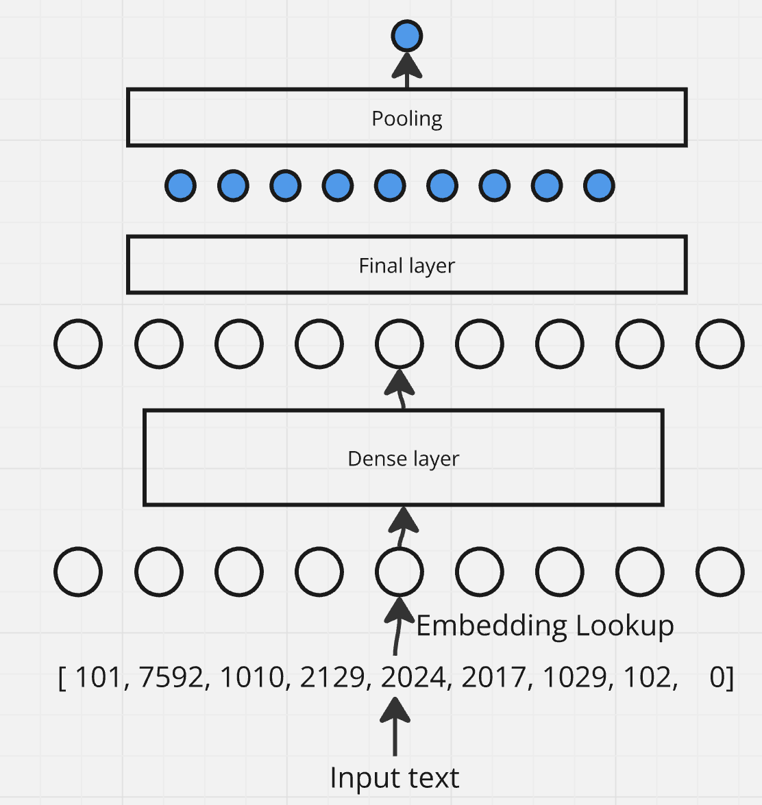

## Parallelism methods. Model and Data parallelism
Let's start with a simple example - a text processing model with a single hidden layer.    

- We take a batch of input texts
- Tokenize them. 
- The first layer of the model is "embedding lookup" that looks up embeddings for each token_id. 
- Then - a hidden (dense) layer that projects embeddings to the same dimension for every token
- Then a final layer that projects that to a single number per token. 
- Than we have some sort of pooling function that takes average over all the tokens; 
- Loss that reduces that to a single number.  




Here is the pytorch code for it:
```python
import torch
import torch.nn as nn
from transformers import AutoTokenizer

tokenizer = AutoTokenizer.from_pretrained("bert-base-uncased")
vocab_size = tokenizer.vocab_size
embedding_dim = 64

class SimpleModel(nn.Module):
    def __init__(self):
        super(SimpleModel, self).__init__()
        self.embedding = nn.Embedding(vocab_size, embedding_dim)
        self.hidden_layer = nn.Linear(embedding_dim, embedding_dim)
        self.final_layer = nn.Linear(embedding_dim, 1)
        
    def forward(self, input_ids, attention_mask=None):
        # [batch_size, seq_len] -> [batch_size, seq_len, embedding_dim]
        embeddings = self.embedding(input_ids)
        
        # [batch_size, seq_len, embedding_dim] -> [batch_size, seq_len, embedding_dim]
        out1 = self.hidden_layer(embeddings)
        
        # [batch_size, seq_len, embedding_dim] -> [batch_size, seq_len, 1]
        out2 = self.final_layer(out1)
        
        # [batch_size, seq_len, 1] -> [batch_size, 1]
        pooled = torch.mean(out2, dim=1)
        
        return pooled.squeeze(-1)

model = SimpleModel()
texts = ["Hello, how are you?", "I am fine, thank you!"]
tokens = tokenizer(texts, return_tensors="pt", padding=True, truncation=True, max_length = 10)
outputs = model(tokens["input_ids"])

# a weird loss but whatever
def loss(outputs):
    return torch.sum(outputs) # [batch_size] -> [1]
```
Refer also to [sandbox.ipynb](sandbox.ipynb).   
The dense layers (single matrix multiplication) are supposed to somewhat represent what is happening inside modern transformers, and despite their simplicity, for our "distributed" learning purposes, this example is surprisingly powerful.   

For a touch of mathematical rigor, let's also write down the equations for the forward pass, starting from first hidden layer:   
$$out1_{bsh_1} = \sum_{h_0 = 0}^{embedding\_dim} embedding_{bsh_0} \cdot layer1_{h_0h_1}$$   
The indices:  
- b - batch index, goes from 0 to batch_size
- s - token index, goes from 0 to seq_length
- h0 - embedding dimension index, goes from 0 to embedding_dim
- h1 - another embedding dimension index, goes from 0 to embedding_dim   

The "bias" term in dense layers is omitted for brevity.   
`hidden_layer` is a square matrix `embedding_dim x embedding_dim`, so we need two indices to address it.   
`out1` is a tensor with 3 dimensions, so we need three indices.   
Similar for other layers:  
$$out2_{bs} = \sum_{h_1 = 0}^{embedding\_dim} out1_{bsh_1} \cdot layer2_{h_1}$$
$$pooled_{b} = \frac{\sum_{s = 0}^{seq\_length} out2_{bs}}{seq\_length}$$
$$loss = \sum_{b = 0}^{batch\_size} pooled_{b}$$


During training and inference, we might care about the overall memory consumption, and the time it takes to process a single batch. Memory consumption, in turn, consists of memory consumption by the model itself (embedding, hidden and final layers), and memory consumption by the data (input_embeddings, out1, out2). Memory consumption by the model doesn't depend on batch size; it will also get amplified, typically by a factor of 4, because we need to store gradients, and Adam optimizer L1 and L2 moments per each model parameter. Memory consumption by the data is proportional to batch size.   
## Data Parallelism
Data Parallelism means dividing the data across multiple executors. These might be multiple gpus on a single machines, or multiple nodes, or something else entirely. Let's assume we have 4 such executors. We effectively "split" batch_size dimension into 4 chunks. On each of the executors, we perform the same operations, but on different chunks of data.    
Tokenized input now looks like `[batch_size // 4, seq_length]`. Same for all intermediate and final outputs: 
- `embeddings = [batch_size // 4, seq_length, embedding_dim]`
- `out1 = [batch_size // 4, seq_length, embedding_dim]`
- `out2 = [batch_size // 4, seq_length, 1]`
- `pooled = [batch_size // 4, 1]`

Model tensors have the same shape as before: 
- `embedding = [vocab_size, embedding_dim]`
- `hidden_layer = [embedding_dim, embedding_dim]`
- `final_layer = [embedding_dim, 1]`

There was no `batch_size` in the original dimensions, so they remain unchanged.  
Let's look at one of the matrix multiplications again. On the example of applying the first layer:  
$$out1_{bsh_0} = \sum_{h_0 = 0}^{embedding\_dim} embedding_{bsh_0} \cdot layer1_{h_0h_1}$$   
The sum is performed over one of the dimensions of the embedding input. There is no batch dimension in the sum, so we can perform it in parallel across all 4 executors, without the need for intercommunication.    

The only thing that changes is that now each executor stores tensor components corresponding to `b` of `batch_size // 4` different values.   

Okey, but when *do* we need intercommunication?   

One such place is when we compute the loss:   
$$loss = \sum_{b = 0}^{batch\_size} pooled_{b}$$   
Indeed, here `batch_size` is participating in the sum, so we will need to aggregate results from all 4 executors somehow. In practice, this is usually done in two steps:  
- Compute per-executor loss locally
- Call [torch.dist.all_reduce](https://pytorch.org/docs/stable/distributed.html#torch.distributed.all_reduce) to exchange values across all executors, after which each executor will contain a sum of all values in the `loss` tensor.  

The only practical place where we might need just the loss is to report train/validation step metrics. A more important example of when cross-communication is needed is when we compute gradients. Let's compute gradients for the second layer (it is easier since it is closer to the loss). First, let's write down loss as the function of second layer input and weights:  
$$loss = \sum_{b = 0}^{batch\_size} \sum_{h_1 = 0}^{embedding\_dim} \sum_{s = 0}^{seq\_length} \frac{ out1_{bsh_1} \cdot layer2_{h_1}}{seq\_length}$$
Partial derivatives of loss with respect to second layer weights are:  
$$\frac{\partial loss}{\partial layer2_{h1}} = \sum_{b = 0}^{batch\_size} \sum_{s = 0}^{seq\_length} \frac{out1_{bsh_1}}{seq\_length}$$    
Since matrix multiplication is linear, partial derivatives are quite simple. Partial derivative of $layer2_{h_1}$ with respect to itself is 1; with respect to $layer2_{h_1'}$ when $h1' != h1$ it is zero. So, in the $\sum_{h_1 = 0}^{embedding\_dim}$ sum, only one term will be non-zero. Other two sums - over sequence length and batch size - remain unchanged. Crucially for us, this means that once again we need to compute cross-executor sum of something across all batch indices.   
Once again, we can do it in two steps:  
- Compute per-executor gradients locally
- Do all_reduce accross all executors.   

This is thanks to the fact that gradients are cumulative, so we can aggregate them into a single number per parameter in any way we want.  

The first step is then exactly similar to "gradient computation" or "backwards pass" that we normally do in single-device training.  
Gradients for other layers, thanks to the magic of backpropagation, are computed in a similar fashion.   

Let's sum up the process of data-parallel training, and what it means for compute time and memory footprint:  
- We split data across executors. In proper training setups and data pipelines, there is no need to synchronization here and each executor can read and preprocess its portion of data independently. 
- We compute forward pass on each executor independently. 
- We compute loss and gradients on each executor independently. 
- We do all_reduce across all executors to get the loss and gradients. This is the only step requiring inter-executor communication. The amount of data being passed around is proportional to model size.  
- Model weights are copied to each executor. Model-dependant memory consumption stays the same. 
- Each node processes only a fraction of global batch. Batch-dependant memory consumption, and overall processing time, is reduced by a factor of number of executors, though there is extra time overhead added due to cross-communication.   

In practice, DataParallel is the most popular method of parallelism, and it is used to speed up training of models on huge datasets. It doesn't help with model-dependant memory consumption, so for large models (LLMs, for example), we will need model parallelism. Data parallelism allows to also increase batch sizes, which is usually beneficial for convergence.   
## Model parallelism
Now instead of splitting the batch dimension, let's split the hidden dimension. It is a bit more complex now; for `[embedding_dim, embedding_dim]` square matrix, do we split on the first dimension, second dimension, or both? Both is ideal for our toyish example because then everything would be symmetrical. But does that mean that we need to have some sort of 2d topology of executors, and copy some of the dimensions across executors, while sharding others?  
In general, model parallelism is much more complex than data parallelism. For now, let's assume that we split one of the dimensions of the model in 4 chunks:  
- `embedding = [vocab_size, embedding_dim]`
- `hidden_layer = [embedding_dim, embedding_dim // 4]`
- `final_layer = [embedding_dim // 4, 1]`

And intermediate outputs:
- `embeddings = [batch_size, seq_length, embedding_dim]`
- `out1 = [batch_size, seq_length, embedding_dim // 4]`
- `out2 = [batch_size, seq_length, 1]`
- `pooled = [batch_size, 1]`   

For LLMs/transformers, hidden layers will usually be the biggest. `hidden_layer` got split into 4 chunks, each executor storing only its own chunk. `final_layer` was also cut in 4 pieces, while `embedding` layer dimensions are unchanged - meaning it will be copied across all executors.

Now for the intermediate outputs. `embeddings` is unchanged, `out1` is cut in 4 chunks, `out2` and `pooled` outputs are unchanged.

All the previous equation still stand, but the conclusions are different. For the second layer output:  
$$out2_{bs} = \sum_{h_1 = 0}^{embedding\_dim} out1_{bsh_1} \cdot layer2_{h_1}$$
The sum goes over the hidden dimension, which is sharded accross executors. This means that we need all_reduce operation after applying the layer to get *every output value*. For the gradients:   
$$\frac{\partial loss}{\partial layer2_h1} = \sum_{b = 0}^{batch\_size} \sum_{s = 0}^{seq\_length} \frac{out1_{bsh_1}}{seq\_length}$$    
Now there is no embedding dimension, so we don't need cross-communication to compute gradients. Conclusions:  
- Input data is copied across all executors
- For some layers, model weights are copied across all executors. Some are sharded into 4 chunks
- Model-based memory consumption is decreased (though non-uniformly because only some of the layers are sharded. That's why it might be a good idea to have 2d sharding)
- For sharded layers, we need inter-executor communication after the layer, exchanging outputs. Beyond our toy example, for deep transformers, this would mean many blocking intercommunication steps during one forward pass - probably much slower than what we had in data parallelism.
- For sharded layers, during gradient computation step, there is no need for all_reduce - only current executor is aware of its own chunk of weights.
- For copied layers, cross-communication is needed during gradient computation.   

We might choose different cutting strategy, for example cutting many dimensions at once. But in general, we can see trade-offs between model and data parallelism:
- For small models, data-parallelism is ideal. It allows executors to consume data in parallel, and cross-executor communication is minimal.
- For medium sized models, batch sizes go down, amount of data being passed around for data parallel goes up. Model parallelism starts to sound like a better alternative. Exchanging intermediate outputs between executors might become cheaper than model weights, because their size is now smaller.  
- For large models that don't fit into single gpu, data parallel won't work. We need model parallelism to be able to fit the model into memory, but we might go for a mixed approach to speed it up as well.  

Note that model parallel in general sounds slower, because there are many intercommunication steps during forward pass - one per matrix multiplication, and transformers have lots of those! This is why there is an alternative approach - pipeline parallelism, that puts entire bunches of layers on each device.   

## What's next?
The entire first part of the series will be about data parallelism - this is the most popular and the easiest method, which nevertheless lets us understand some important concepts. Then, we'll start to deal with model parallelism.


